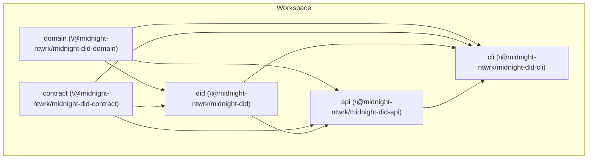

# Midnight DID

This GitHub repository contains the Midnight DID method specification and reference implementation in TypeScript.

The main purpose of creating a new DID method is to make it a first-class citizen of the Midnight blockchain and solve the following challenges:
- provide a W3C DID Core specification-compliant method that is compatible with other DID methods and Self-Sovereign Identity platforms.
- support Midnight platform cryptography (JubJub + Poseidon hash)
- enable DID resolution via the Midnight JS library and smart contract.
- support signing and signature verification both within and outside smart contracts.

## Repository structure

- w3c-spec - the Midnight DID method specification
- contract - smart-contract implementation of the Midnight DID
- domain - common classes, interfaces, and implementations for DID, DIDDocument, and DIDResolver
- did - conversion helpers between the domain model and contract-managed ledger
- api - programmatic API to create, update, resolve Midnight DIDs (unit + integration tests)
- cli - Node.js console application to manage the Midnight DID

## Package Dependency Diagram

Why these dependencies
- domain is the source of truth for DID schemas and codecs (shared by others)
- contract depends on domain for types and codecs
- did links domain types with contract-managed types
- api uses both contract and domain to provide a high-level interface; tests and infra live here
- cli is a thin wrapper over api and does not reimplement logic

## Development

- Node 24 is required (see `.nvmrc`); npm >= 10
- Recommended: `nvm use` before running scripts
- One-shot pipeline: `./run.sh` (builds, lints, tests, coverage)
- Strict pipeline: `npm run run:strict` or `./run.sh --strict` (no auto-fix pass)
- Fast pipeline: `npm run run:fast` (skip coverage steps)
- Timing pipeline: `npm run run:metrics` or `./run.sh --metrics` (per-step timing)
- Circuit compilation uses the [`@midnight-ntwrk/compact`](https://github.com/midnightntwrk/compact) CLI via `compact compile`; the workspace scripts invoke it automatically.
- `./run.sh` automatically patches `@midnight-ntwrk/onchain-runtime` with a CommonJS shim (see `docs/runtime-shim.md`) so contract tooling continues to work until upstream ships a CJS entrypoint.

See [Repository Boundary and Workspace Policy](docs/repository-boundary.md) for the active package scope and local artifact policy.

### Testing

- Prerequisite: Docker Desktop (or Docker Engine) must be running for integration tests.
- Install dependencies once: `npm ci`

- API tests:
  - Unit/integration suite: `npm run test -w api`
  - API-only integration target: `npm run test-api -w api`

- Resolver tests:
  - Unit suite: `npm run test -w did-resolver-service`
  - Integration suite: `npm run test:integration -w did-resolver-service`

- Run both API and resolver tests:
  - `npm run test -w api && npm run test -w did-resolver-service && npm run test:integration -w did-resolver-service`
- Full repository pipeline (recommended): `./run.sh`
- Boundary checks (before broad refactors): `npm run check:boundaries`
- Local state cleanup: `npm run clean:local-state`
- Repo audit: `npm run audit:repo`
- run.sh contract checks: `npm run test:run-sh`

### LICENSE

Apache 2.0.

### README.md

Provides a brief description for users and developers who want to understand the purpose, setup, and usage of the repository.

### SECURITY.md

Provides a brief description of the Midnight Foundation's security policy and how to properly disclose security issues.

### CONTRIBUTING.md

Provides guidelines for how people can contribute to the Midnight project.

### CODEOWNERS

Defines repository ownership rules.

### ISSUE_TEMPLATE

Provides templates for reporting various types of issues, such as: bug report, documentation improvement and feature request.

### PULL_REQUEST_TEMPLATE

Provides a template for a pull request.

### CLA Assistant

The Midnight Foundation appreciates contributions, and like many other open source projects asks contributors to sign a contributor
License Agreement before accepting contributions. We use CLA assistant (https://github.com/cla-assistant/cla-assistant) to streamline the CLA
signing process, enabling contributors to sign our CLAs directly within a GitHub pull request.

### Dependabot

The Midnight Foundation uses GitHub Dependabot feature to keep our projects dependencies up-to-date and address potential security vulnerabilities. 

### Checkmarx

The Midnight Foundation uses Checkmarx for application security (AppSec) to identify and fix security vulnerabilities.
All repositories are scanned with Checkmarx's suite of tools including: Static Application Security Testing (SAST), Infrastructure as Code (IaC), Software Composition Analysis (SCA), API Security, Container Security and Supply Chain Scans (SCS).

### Unito

Facilitates two-way data synchronization, automated workflows, and streamlined processes between: Jira, GitHub issues and Github project Kanban board. 

# TODO - New Repo Owner

### Software Package Data Exchange (SPDX)
Include the following Software Package Data Exchange (SPDX) short-form identifier in a comment at the top headers of each source code file.
