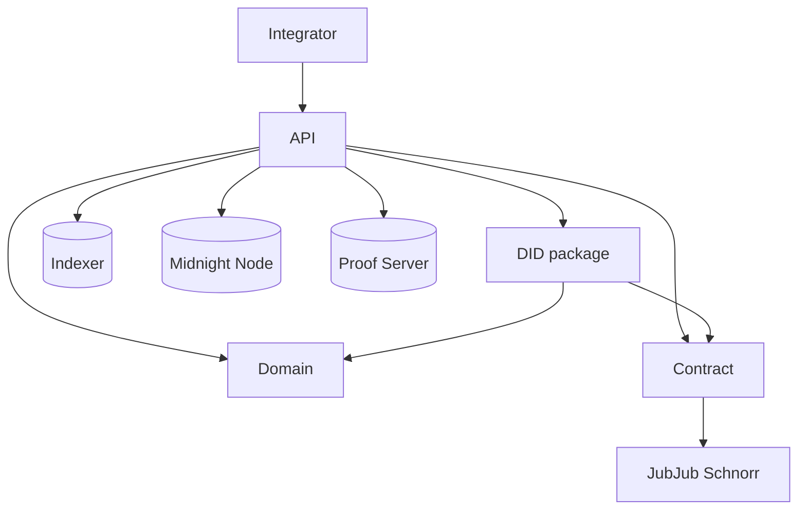
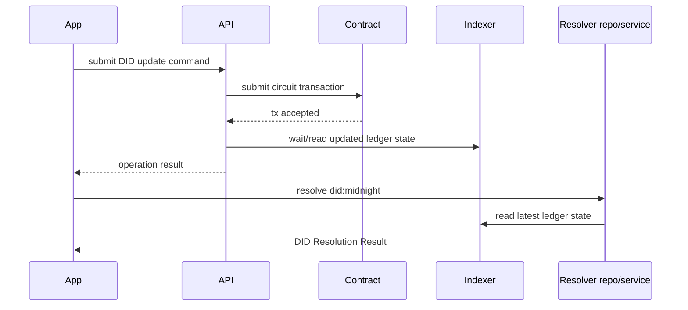

# Midnight DID

Midnight DID is the reference implementation of the `did:midnight` method.
This repository owns the core DID contract, domain model, ledger mapping, and TypeScript API orchestration.

Resolver services, DID manager UI/backend, and reusable secret storage now live in [`midnight-did-resolver`](https://github.com/midnightntwrk/midnight-did-resolver).
VC packages and use cases live in [`midnight-verifiable-credentials`](https://github.com/midnightntwrk/midnight-verifiable-credentials).

## Workspace Components

| Component | Package | Responsibility |
| --- | --- | --- |
| [`packages/contract`](packages/contract/README.md) | `@midnight-ntwrk/midnight-did-contract` | On-ledger DID state and circuit rules |
| [`packages/jubjub-schnorr`](packages/jubjub-schnorr/README.md) | `@midnight-ntwrk/midnight-did-jubjub-schnorr` | Shared Compact/TypeScript JubJub Schnorr transcript and signature helpers |
| [`packages/domain`](packages/domain/README.md) | `@midnight-ntwrk/midnight-did-domain` | DID schemas, validation, canonicalization |
| [`packages/did`](packages/did/README.md) | `@midnight-ntwrk/midnight-did` | Ledger to domain mapping and DID resolution helpers |
| [`packages/api`](packages/api/README.md) | `@midnight-ntwrk/midnight-did-api` | Programmatic DID operations, wallet/provider orchestration, and network profiles |
| [`docs-site`](docs-site/) | `docs-site` | VitePress documentation and generated API reference |

## Architecture



## DID Update and Resolution Sequence



## Running

Prerequisites:

- Node.js 24 and npm 10.
- Docker for standalone API integration tests.
- Midnight Compact toolchain.

Install dependencies:

```bash
npm ci
compact update 0.30.0
```

Local validation:

```bash
./run.sh targets
./run.sh --light --strict
./run.sh core --strict
./run.sh api --light --strict
./run.sh docs
```

Runner notes:

- Local PR validation contract: `./run.sh --light --strict` or `npm run ci`.
- `npm run ci:packages` keeps the legacy package-only lint/build/test lane.
- `./run.sh` and `./run.sh full` validate DID core and API lanes.
- `./run.sh docs` validates the documentation site.
- `run-core.sh`, `run-api.sh`, and `run-docs.sh` remain implementation details behind cataloged `./run.sh` targets.
- Root `./run.sh` validates only DID core/API/docs. Resolver service, manager service, and secret-storage validation moved to `midnight-did-resolver`.
- `--skip-coverage` is still accepted for older local command history, but current split lanes do not run coverage by default.
- `./run.sh clean-artifacts` removes generated outputs, nested local log
  directories, local Midnight runtime/test state (`.midnight-db/`,
  `.midnight-test/`, `midnight-level-db/`), and disposable historical
  top-level package/service shells left by
  pre-`packages/` layouts; tracked or non-disposable shell contents are reported
  and preserved as whole directories until a human confirms they are safe to
  delete.
- Inspect cleanup candidates without deleting anything with
  `node scripts/clean-artifacts.mjs --dry-run --json`; unknown cleaner flags
  fail before any filesystem changes.

Metrics example:

```bash
./run.sh --light --strict --metrics --metrics-json /tmp/midnight-did-run.json
```

Surface guards:

```bash
npm run check:did-surface-discipline
npm run check:run-target-catalog
npm run check:integration
```

## Artifact Packaging

Use `artifacts/npm/` as the stable local tarball output for unpublished DID packages.

```bash
npm run artifacts:pack
./upgrade-libs.sh --destination /path/to/downstream-repo
```

Packed packages:

- `@midnight-ntwrk/midnight-did-api`
- `@midnight-ntwrk/midnight-did-domain`
- `@midnight-ntwrk/midnight-did`
- `@midnight-ntwrk/midnight-did-jubjub-schnorr`
- `@midnight-ntwrk/midnight-did-contract`

The generated tarballs are gitignored under [`artifacts/`](./artifacts/README.md).

## Developer Entry Points

1. `./start-docs.sh`
2. `./run.sh --light --strict` or `npm run ci`
3. `./run.sh core --strict` or `./run.sh api --light --strict` for focused work
4. Use the split repositories for resolver/manager/secret-storage or VC work

Docs helpers:

- `./run.sh docs` runs the docs preparation and build workflow.
- `./start-docs.sh` starts the local VitePress site.
- See [`docs/did-surface-change-discipline.md`](docs/did-surface-change-discipline.md) before changing contract circuits, package exports, runner behavior, or generated artifacts.
- See [`docs/repository-audit-backlog.md`](docs/repository-audit-backlog.md) for the current simplification backlog.

Direct package documentation:

- `packages/api/README.md`
- `packages/domain/README.md`
- `packages/did/README.md`
- `packages/jubjub-schnorr/README.md`
- `packages/contract/README.md`

## Notes

- Compact circuits are compiled via workspace scripts in `packages/contract` and `packages/jubjub-schnorr`.
- Integration tests use Testcontainers and Docker compose topologies from the API package.
- CI is split into a core job and an API job.
- Shared JubJub Schnorr transcript and the 96-byte signature wire format are documented in [`packages/jubjub-schnorr/README.md`](packages/jubjub-schnorr/README.md).
- DID Resolution responses follow the DID Core shape: `didDocument`, `didResolutionMetadata`, and `didDocumentMetadata`.

## Related Repositories

- [`midnight-did-resolver`](https://github.com/midnightntwrk/midnight-did-resolver): resolver services, DID manager, and secret storage.
- [`midnight-verifiable-credentials`](https://github.com/midnightntwrk/midnight-verifiable-credentials): VC/VP packages and use cases.
- [`midnight-trust-registry`](https://github.com/midnightntwrk/midnight-trust-registry): trust registry and governance integrations.

## License

Apache-2.0
