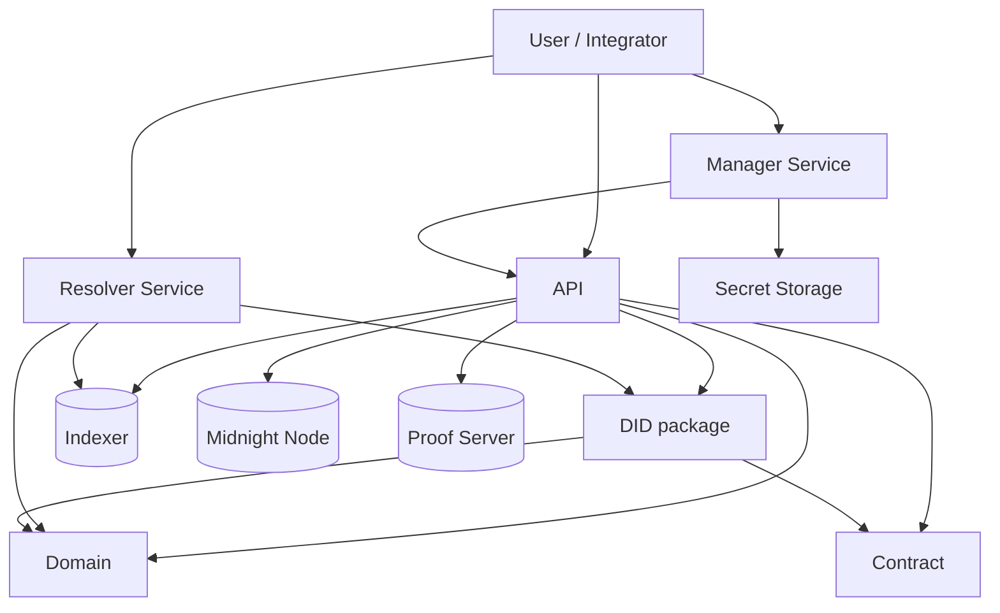
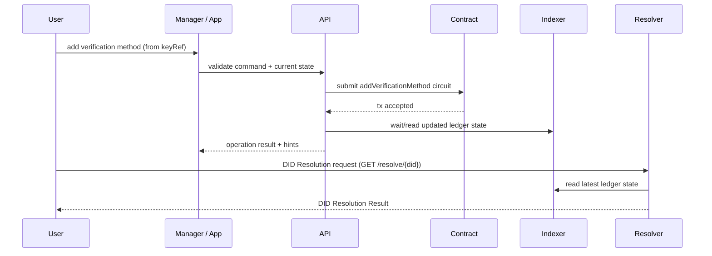
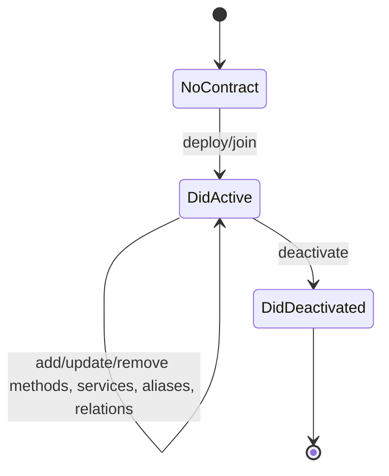

# Midnight DID

Midnight DID is a reference implementation of the `did:midnight` method.
This repository contains the smart contract, domain model, resolver/conversion logic, API, web services, and reusable secret storage.

## Workspace Components

| Component | Package | Responsibility |
|---|---|---|
| [`contract`](contract/README.md) | `@midnight-ntwrk/midnight-did-contract` | On-ledger DID state and circuit rules |
| [`domain`](domain/README.md) | `@midnight-ntwrk/midnight-did-domain` | DID schemas, validation, canonicalization |
| [`did`](did/README.md) | `@midnight-ntwrk/midnight-did` | Ledger ↔ domain mapping and resolver helpers |
| [`api`](api/README.md) | `@midnight-ntwrk/midnight-did-api` | Programmatic DID operations and orchestration |
| [`secret-storage`](secret-storage/README.md) | `@midnight-ntwrk/midnight-did-secret-storage` | Encrypted key storage + sign/verify/HD derivation |
| [`did-resolver-service`](did-resolver-service/README.md) | `@midnight-ntwrk/midnight-did-resolver-service` | REST/Swagger/UI DID resolver service |
| [`did-manager-service`](did-manager-service/README.md) | `@midnight-ntwrk/midnight-did-manager-service` | Web DID management backend + minimal UI |

## Architecture

## DID Update and Resolution Sequence

## DID Lifecycle State Machine

## Running

Prerequisites:
- Node 24+
- npm 10+
- Docker (for integration tests)

Install:
- `npm ci`

Pipelines:
- Full workspace: `./run.sh`
- API only: `./run-api.sh`
- Resolver only: `./run-resolver.sh`
- DID manager only: `./run-manager.sh`
- Docs pipeline: `./run-docs.sh`
- Manager app: `./start-manager.sh [--standalone|--preprod]`
- Resolver app: `./start-resolver.sh [--standalone|--preprod]`
- Docs dev server: `./start-docs.sh`

Docs site local URL:
- `http://127.0.0.1:4173`

## Developer Entry Points

If you are new to the repository, start here:

1. `./start-docs.sh`
2. `SKIP_LONG_RUNNING=1 ./run.sh`
3. the component-specific runner for the area you are changing

Docs helpers:

- `./run-docs.sh` runs the full docs preparation and build workflow
- `./start-docs.sh` starts the local VitePress site

When you need direct package/service documentation:

- `api/README.md`
- `domain/README.md`
- `did/README.md`
- `secret-storage/README.md`
- `did-resolver-service/README.md`
- `did-manager-service/README.md`

## Notes

- Compact circuits are compiled via workspace scripts in `contract`.
- Integration tests use Testcontainers and docker-compose based topologies.
- Teardown logic now performs best-effort `docker compose down --volumes --remove-orphans` to reduce leaked resources.
- HD seed derivation for `Ed25519`, `Jubjub`, and `P-256` is documented in [`secret-storage/README.md`](secret-storage/README.md).
- DID Resolution responses follow the DID Core shape:
  - `didDocument`
  - `didResolutionMetadata`
  - `didDocumentMetadata`

## License

Apache-2.0
