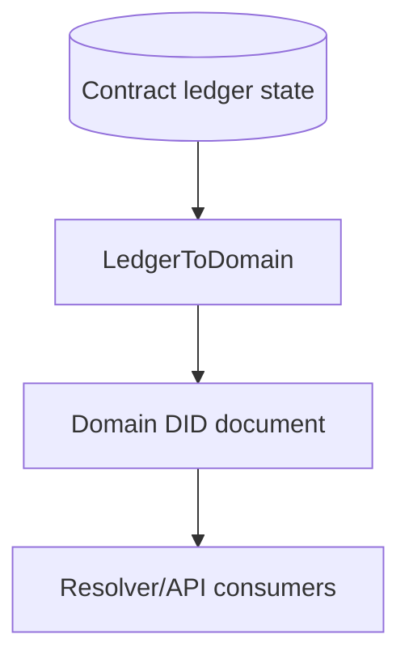
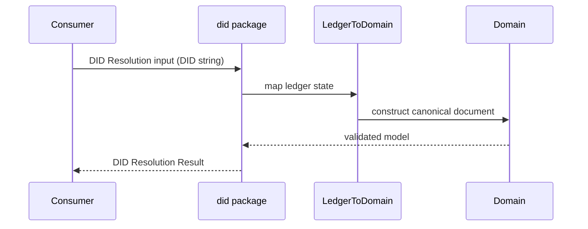
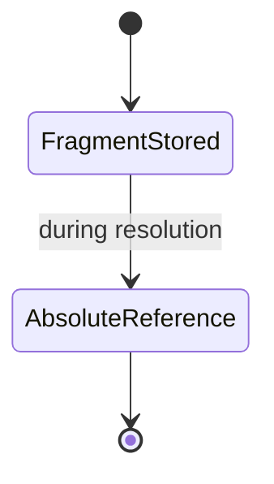

# @midnight-ntwrk/midnight-did

Mapping layer between on-ledger contract state and DID Core-compatible domain documents.

## Responsibilities

- Convert contract ledger data to domain DID documents
- Resolve canonical absolute DID URLs from stored fragment identifiers
- Provide network/identifier utilities for `did:midnight`

## Architecture

## Resolution Sequence

## Resolution Result Shape

The package resolver returns the DID Core abstract resolution shape: a DID
Document plus DID Document metadata. Resolver services that expose the full DID
Resolution Result envelope should add `didResolutionMetadata` as a separate
object. For successful abstract `resolve` calls, that metadata object must not
include `contentType`.

Use `contentType` only for `resolveRepresentation`-style responses where the
body is a DID Document byte stream. Midnight DID Document representations should
be reported as `application/did+ld+json` for JSON-LD streams or
`application/did+json` for DID Core JSON streams.

## Identifier Canonicalization

Resolution output uses absolute DID URL references where required by DID Core,
while compact fragment identifiers may still be used in ledger storage.

## Build & Test

- Build: `pnpm --filter ./packages/did build`
- Test: `pnpm --filter ./packages/did test -- --pool=threads`
- Coverage: `pnpm --filter ./packages/did coverage`
