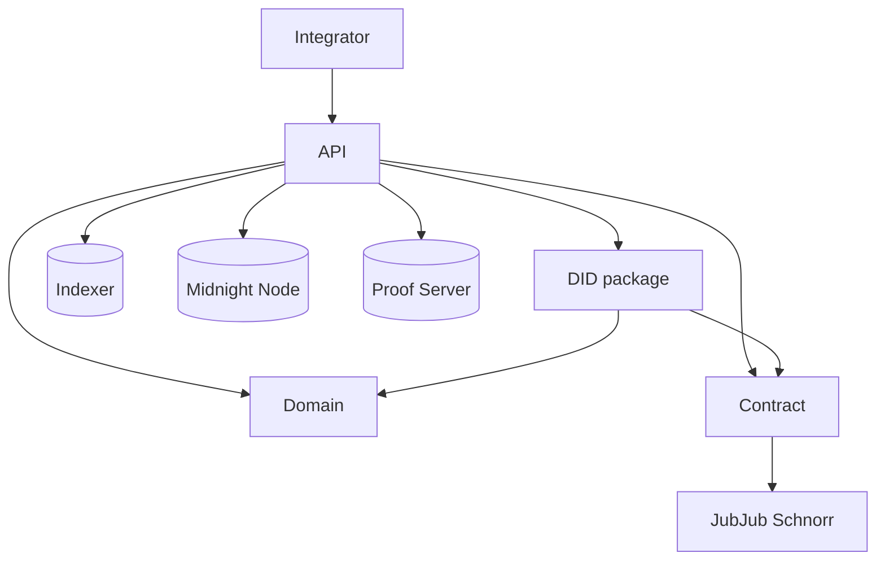
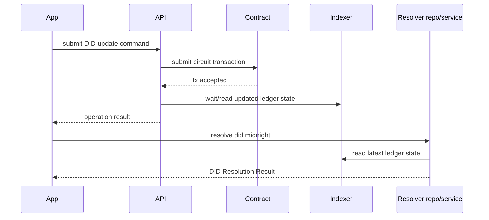

# Midnight DID

[](https://github.com/midnightntwrk/midnight-did/actions/workflows/ci.yml)
[](https://github.com/midnightntwrk/midnight-did/actions/workflows/quality.yml)
[](https://github.com/midnightntwrk/midnight-did/actions/workflows/docs.yml)
[](https://github.com/midnightntwrk/midnight-did/actions/workflows/publish.yml)
[](https://securityscorecards.dev/viewer/?uri=github.com/midnightntwrk/midnight-did)
[](https://github.com/midnightntwrk/midnight-did/blob/main/LICENSE)
[](https://github.com/midnightntwrk/midnight-did/releases/latest)

Midnight DID is the reference implementation of the `did:midnight` method.
This repository owns the core DID contract, domain model, ledger mapping, and TypeScript API orchestration.

Resolver services, DID manager UI/backend, and reusable secret storage now live in [`midnight-did-resolver`](https://github.com/midnightntwrk/midnight-did-resolver).
VC packages and use cases live in [`midnight-verifiable-credentials`](https://github.com/midnightntwrk/midnight-verifiable-credentials).

## Workspace Components

| Component                                                      | Package                                       | Responsibility                                                                   |
| -------------------------------------------------------------- | --------------------------------------------- | -------------------------------------------------------------------------------- |
| [`packages/contract`](packages/contract/README.md)             | `@midnight-ntwrk/midnight-did-contract`       | On-ledger DID state and circuit rules                                            |
| [`packages/jubjub-schnorr`](packages/jubjub-schnorr/README.md) | `@midnight-ntwrk/midnight-did-jubjub-schnorr` | Shared Compact/TypeScript JubJub Schnorr transcript and signature helpers        |
| [`packages/domain`](packages/domain/README.md)                 | `@midnight-ntwrk/midnight-did-domain`         | DID schemas, validation, canonicalization                                        |
| [`packages/did`](packages/did/README.md)                       | `@midnight-ntwrk/midnight-did`                | Ledger to domain mapping and DID resolution helpers                              |
| [`packages/api`](packages/api/README.md)                       | `@midnight-ntwrk/midnight-did-api`            | Programmatic DID operations, wallet/provider orchestration, and network profiles |
| [`docs-site`](docs-site/)                                      | `docs-site`                                   | VitePress documentation site                                                     |

## Architecture



## DID Update and Resolution Sequence



## Resolution Media Types

Midnight follows DID Core's distinction between abstract resolution and
representation resolution. Abstract `resolve` responses return
`didResolutionMetadata`, `didDocument`, and `didDocumentMetadata`; successful
abstract responses do not set `didResolutionMetadata.contentType`.
Representation responses set `didResolutionMetadata.contentType` to the DID
Document stream media type, currently `application/did+ld+json` or
`application/did+json`. HTTP or service envelopes can still use
`application/json` for the whole DID Resolution Result without copying that
envelope type into DID resolution metadata.

Resolution failures set `didResolutionMetadata.error` to a DID Core keyword such
as `invalidDid`, `notFound`, `representationNotSupported`,
`methodNotSupported`, or `internalError`. Resolver-specific extension keywords
are allowed when they are a single ASCII keyword. Resolution error keywords must
start with a letter.

## Running

Prerequisites:

- Node.js 24 and pnpm 10. Run `corepack enable` once so Node uses the
  repository-pinned package manager from `packageManager`.
- Docker for standalone API integration tests.
- Midnight Compact toolchain.

Install dependencies:

```bash
pnpm install
compact update 0.30.0
```

Local validation:

```bash
./run.sh targets
./run.sh --light --strict
./run.sh core --strict
./run.sh api --light --strict
./run.sh docs
./run.sh artifact-status
./run.sh check-managed-artifacts
./run.sh integration-report-schema
```

Runner notes:

- Local PR validation contract: `./run.sh --light --strict` or `pnpm run ci`.
- `pnpm run ci:packages` keeps the legacy package-only lint/build/test lane.
- `./run.sh` and `./run.sh full` validate DID core and API lanes.
- `./run.sh docs` validates the documentation site. The Nix shell provides the
  Playwright Chromium browser used by rendered layout checks; outside Nix, run
  `pnpm exec playwright install chromium` once before the docs lane.
- `run-core.sh`, `run-api.sh`, and `run-docs.sh` remain implementation details behind cataloged `./run.sh` targets.
- Root `./run.sh` validates only DID core/API/docs. Resolver service, manager service, and secret-storage validation moved to `midnight-did-resolver`.
- `--skip-coverage` is still accepted for older local command history, but current split lanes do not run coverage by default.
- `./run.sh clean-artifacts` removes generated outputs, nested local log
  directories, local Midnight runtime/test state (`.midnight-db/`,
  `.midnight-test/`, `midnight-level-db/`), and disposable historical
  top-level package/service shells left by
  pre-`packages/` layouts; tracked or non-disposable shell contents are reported
  and preserved as whole directories until a human confirms they are safe to
  delete.
- Inspect cleanup candidates without deleting anything with
  `node scripts/clean-artifacts.mjs --dry-run --json`; unknown cleaner flags
  fail before any filesystem changes.

Metrics example:

```bash
./run.sh --light --strict --metrics --metrics-json /tmp/midnight-did-run.json
```

Surface guards:

```bash
pnpm run check:did-surface-discipline
pnpm run test:did-surface-discipline
pnpm run check:run-target-catalog
pnpm run check:managed-artifacts
pnpm run artifacts:status
pnpm run report:integration
pnpm run report:integration:schema
pnpm run check:integration
```

API examples:

```bash
pnpm run build:api-prereqs
pnpm --filter ./packages/api typecheck:examples
```

The example guard compiles package-level snippets against built package exports
so runnable docs do not silently drift from the published API surface.

The workspace manifest guard keeps package distribution metadata aligned:

```bash
pnpm run test:workspace-manifests
pnpm run check:workspace-manifests
pnpm run packages:check-contents
pnpm run packages-smoke-tests
```

It validates the root workspace list, package names, export maps, tarball
`files`, npmjs registry metadata, repository ownership, and README ownership
for the DID-owned packages. The package content check dry-runs npm
packing and rejects development-only files such as compiled `dist/test/**`
output.

The package smoke suite builds the publishable packages, imports every package
entry point in Node.js, and bundles the browser-safe API entry point with Vite.
CI runs it in the core lane to catch export-map drift and browser-incompatible
imports before downstream WebView integrations hit them.

The integration report checks the sibling
`../midnight-verifiable-credentials` checkout for file-based DID package
references and matching vendored tarballs. Fixture tests can override the
default roots with `MIDNIGHT_DID_REPO_ROOT`, `MIDNIGHT_DID_SIBLING_VC_ROOT`,
and `MIDNIGHT_DID_INTEGRATION_NOW`. JSON consumers should read
`schemaId`/`schemaVersion` first; `pnpm run report:integration:schema` prints the
current reference-kind and summary-counter contract. The first versioned schema
is `midnight-did-integration-report@1`; earlier unversioned reports carried
human-readable `summary.notes`, which now live only in the schema output.
The same schema is available through `./run.sh integration-report-schema` for
runner workflows or `pnpm run report:integration:schema` for pnpm-only
automation.

## Artifact Packaging

Use `artifacts/npm/` as the stable local tarball output for unpublished DID packages.

```bash
pnpm run artifacts:pack
./upgrade-libs.sh --destination /path/to/downstream-repo
```

Packed packages:

- `@midnight-ntwrk/midnight-did-api`
- `@midnight-ntwrk/midnight-did-domain`
- `@midnight-ntwrk/midnight-did`
- `@midnight-ntwrk/midnight-did-jubjub-schnorr`
- `@midnight-ntwrk/midnight-did-contract`

The generated tarballs are gitignored under [`artifacts/`](./artifacts/README.md).
Use `./run.sh artifact-status` or `pnpm run artifacts:status` to inspect
generated Compact output readiness and source manifests for `contract` and
`jubjub-schnorr`. Use `./run.sh check-managed-artifacts` or
`pnpm run check:managed-artifacts` to fail on missing or stale generated
artifacts after a local build.

Release CI publishes the same packages to npmjs. Snapshot versions are
published automatically from `develop` as
`x.y.z-snapshot.<run>.<sha>` with the `snapshot` npm tag. Manual workflow
dispatch can publish `x.y.z-rc{index}` with the `rc` npm tag from `main` or
`develop`, and `x.y.z` with the `latest` npm tag from `main` only.
The concrete release-train examples below are validated against the root
`package.json` version so package and artifact documentation changes together.

ZK keys are distributed separately as a validated archive:

```bash
export VERSION="0.4.0-snapshot.local"
export ZK_ARCHIVE="artifacts/zk/midnight-did-zk-artifacts-${VERSION}.tar.gz"

pnpm run zk-artifacts:bundle -- --version "${VERSION}"
pnpm run zk-artifacts:check -- "${ZK_ARCHIVE}"
pnpm run published-artifacts:smoke -- --skip-npm --zk-archive "${ZK_ARCHIVE}"
```

The archive preserves the Midnight JS provider layout:
`keys/<circuit>.prover`, `keys/<circuit>.verifier`, and
`zkir/<circuit>.bzkir`. Publish CI smoke-tests the exact npm package version
from npmjs and fetches the published ZK archive through `FetchZkConfigProvider`
over runtime HTTP after pulling/downloading it from GHCR or GitHub Release
assets. Reruns skip npm packages whose exact immutable version already exists.

Release engineers can run a heavier standalone smoke against an RC or release.
It installs the exact package version from npmjs, downloads the
matching GitHub Release ZK archive, unpacks those keys for
`NodeZkConfigProvider`, deploys a DID contract, mutates it, and resolves the
updated DID document:

```bash
export VERSION="0.4.0-rc1"
export GH_TOKEN="<github-token-with-repo-read>"

pnpm run published-standalone:smoke -- \
  --version "${VERSION}" \
  --github-release-tag "v${VERSION}"
```

Set `MIDNIGHT_DID_ZK_CONFIG_PATH` to an unpacked ZK bundle when bootstrapping
published packages manually. The API also prefers the installed contract
package's `dist/managed/did` directory when bundled managed artifacts are
available.

The GHCR path uses ORAS because ZK bundles are generic OCI artifacts, not
container images or npm packages. The publish workflow installs the configured
`ORAS_VERSION`, pushes the archive and manifest to GHCR, pulls the artifact back,
and then runs the same bundle validation and provider smoke test. Local
developers only need the `oras` CLI when manually testing GHCR publication or
retrieval; the Nix development shell includes ORAS for that path. GitHub Release
asset checks do not require it.

`@midnight-ntwrk/midnight-did-api` exports package-version artifact metadata:

```ts
import {
  MIDNIGHT_DID_API_VERSION,
  createMidnightDidZkArtifactLocations,
} from "@midnight-ntwrk/midnight-did-api";

const locations = createMidnightDidZkArtifactLocations(MIDNIGHT_DID_API_VERSION);
```

Use `locations.ghcr.reference` for the matching GHCR OCI artifact. RC and final
release versions also expose `locations.githubRelease.archiveUrl`; snapshots do
not have GitHub Release assets.

Published consumers can also use the Node helper exported by the API package:

```ts
import { downloadMidnightDidGithubReleaseZkArtifacts } from "@midnight-ntwrk/midnight-did-api";

const bundle = await downloadMidnightDidGithubReleaseZkArtifacts({
  version: "0.4.0-rc1",
  outputDir: ".midnight-did-zk",
});
```

The helper downloads the GitHub Release archive, manifest, and SHA file, verifies
the archive digest and per-circuit manifest checksums, then returns
`bundle.zkConfigPath` for `NodeZkConfigProvider`. Serve that same directory as an
HTTP root when using `FetchZkConfigProvider`; its layout is
`keys/<circuit>.prover`, `keys/<circuit>.verifier`, and
`zkir/<circuit>.bzkir`. Use `pullMidnightDidGhcrZkArtifacts()` with the `oras`
CLI when consuming the matching GHCR OCI artifact instead.

## Developer Entry Points

1. `./start-docs.sh`
2. `./run.sh --light --strict` or `pnpm run ci`
3. `./run.sh core --strict` or `./run.sh api --light --strict` for focused work
4. Use the split repositories for resolver/manager/secret-storage or VC work

Docs helpers:

- `./run.sh docs` runs the docs preparation and build workflow.
- `./start-docs.sh` starts the local VitePress site.
- See [`docs/did-surface-change-discipline.md`](docs/did-surface-change-discipline.md) before changing contract circuits, package exports, runner behavior, or generated artifacts.

Direct package documentation:

- `packages/api/README.md`
- `packages/domain/README.md`
- `packages/did/README.md`
- `packages/jubjub-schnorr/README.md`
- `packages/contract/README.md`

## Notes

- Compact circuits are compiled via workspace scripts in `packages/contract` and `packages/jubjub-schnorr`.
- Integration tests use Testcontainers and Docker compose topologies from the API package.
- CI is split into a core job and an API job.
- Shared JubJub Schnorr transcript and the 96-byte signature wire format are documented in [`packages/jubjub-schnorr/README.md`](packages/jubjub-schnorr/README.md).
- DID Resolution responses follow the DID Core shape: `didDocument`, `didResolutionMetadata`, and `didDocumentMetadata`.

## Related Repositories

- [`midnight-did-resolver`](https://github.com/midnightntwrk/midnight-did-resolver): resolver services, DID manager, and secret storage.
- [`midnight-verifiable-credentials`](https://github.com/midnightntwrk/midnight-verifiable-credentials): VC/VP packages and use cases.
- [`midnight-trust-registry`](https://github.com/midnightntwrk/midnight-trust-registry): trust registry and governance integrations.

## License

Apache-2.0
