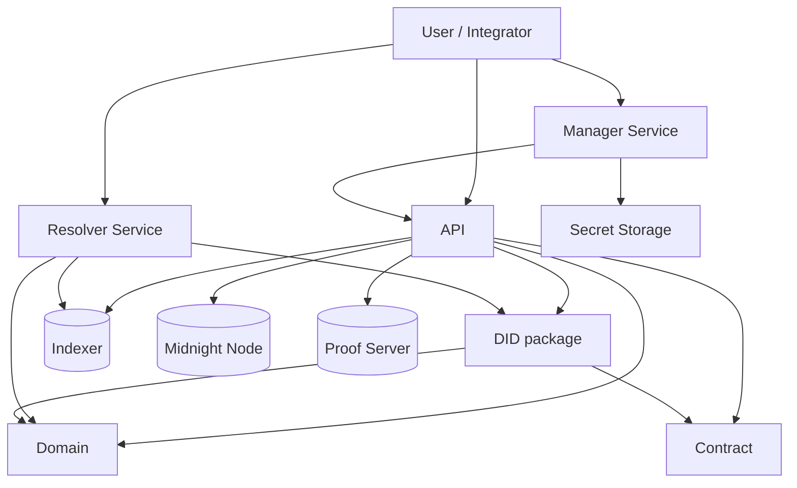
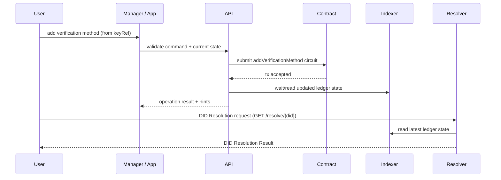
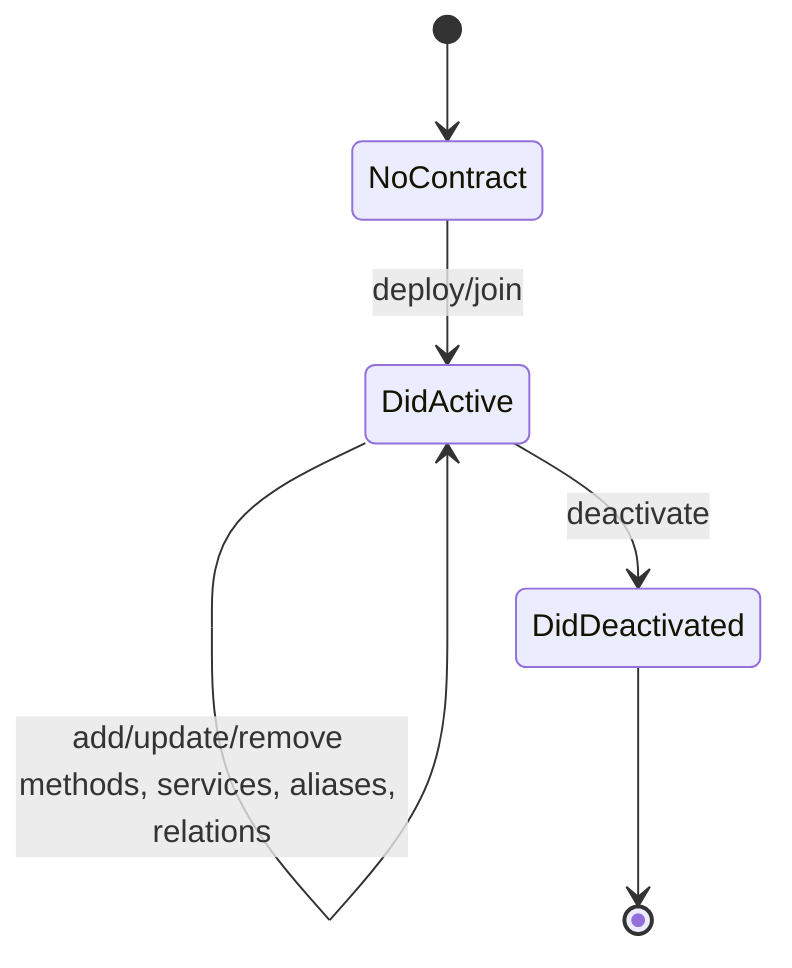

# Midnight DID

Midnight DID is a reference implementation of the `did:midnight` method.
This repository contains the smart contract, domain model, resolver/conversion logic, API, web services, and reusable secret storage.

## Workspace Components

| Component | Package | Responsibility |
|---|---|---|
| [`contract`](contract/README.md) | `@midnight-ntwrk/midnight-did-contract` | On-ledger DID state and circuit rules |
| [`domain`](domain/README.md) | `@midnight-ntwrk/midnight-did-domain` | DID schemas, validation, canonicalization |
| [`did`](did/README.md) | `@midnight-ntwrk/midnight-did` | Ledger ↔ domain mapping and resolver helpers |
| [`api`](api/README.md) | `@midnight-ntwrk/midnight-did-api` | Programmatic DID operations and orchestration |
| [`secret-storage`](secret-storage/README.md) | `@midnight-ntwrk/midnight-did-secret-storage` | Encrypted key storage + sign/verify/HD derivation |
| [`did-resolver-service`](did-resolver-service/README.md) | `@midnight-ntwrk/midnight-did-resolver-service` | REST/Swagger/UI DID resolver service |
| [`did-manager-service`](did-manager-service/README.md) | `@midnight-ntwrk/midnight-did-manager-service` | Web DID management backend + minimal UI |

## Architecture

## DID Update and Resolution Sequence

## DID Lifecycle State Machine

## Running

Prerequisites:
- [Nix](https://nixos.org/download) (with [flakes enabled](https://nixos.wiki/wiki/Flakes))
- Docker (for integration tests)

Enter the development shell:
- `nix develop` (Provides Node.js 24, Docker tooling, Playwright browser binaries, and the **Compact compiler 0.5.1**)

Install dependencies:
- `npm ci`
- `compact update 0.30.0`

Pipelines:
- Root DID workspace: `./run.sh`
- Core pipeline only: `SKIP_LINT_FIX=1 ./run-core.sh`
- API only: `./run-api.sh`
- Resolver only: `./run-resolver.sh`
- DID manager only: `./run-manager.sh`
- Root `./run.sh` validates only the DID/API/resolver/manager workspace. It does not execute VC or Passport pipelines.
- Docs pipeline: `./run-docs.sh`
- Manager app: `./start-manager.sh [--standalone|--preprod|--mainnet]`
- Resolver app: `./start-resolver.sh [--standalone|--preprod|--mainnet]`
- Docs dev server: `./start-docs.sh`

Network defaults:
- `standalone` uses local Docker indexer endpoints (`/api/v3/graphql`)
- `preprod` and `mainnet` use public indexer v4 endpoints (`/api/v4/graphql`)
- manager `--mainnet` defaults to local proof server (`http://127.0.0.1:6300`) and expects a funded seed (no faucet)

## Artifact Packaging

Use `artifacts/npm/` as the stable local tarball output for unpublished DID packages.

Commands:
- `npm run artifacts:pack`
- `./upgrade-libs.sh --destination /path/to/downstream-repo`

What gets packed:
- `@midnight-ntwrk/midnight-did-api`
- `@midnight-ntwrk/midnight-did-domain`
- `@midnight-ntwrk/midnight-did`
- `@midnight-ntwrk/midnight-did-jubjub-schnorr`
- `@midnight-ntwrk/midnight-did-contract`
- `@midnight-ntwrk/midnight-did-secret-storage`

The generated tarballs are intentionally gitignored under [`artifacts/`](./artifacts/README.md).

Fast mode:
- Skip long-running integration/e2e targets: `SKIP_LONG_RUNNING=1 ./run.sh`

Related repositories:
- Midnight Verifiable Credentials and the Passport prototype now live outside this repository.
- Use the separate identity workspace sandbox or the split repositories directly for VC and Passport work.

Docs site local URL:
- `http://127.0.0.1:4173`

Bootstrapped proof server image (faster Docker-backed runs):
- `export PROOF_SERVER_IMAGE=proof-server-bootstrap:8.0.3`
- used by standalone/preprod compose flows and CI (when configured as a repo variable)

## Developer Entry Points

If you are new to the repository, start here:

1. `./start-docs.sh`
2. `SKIP_LONG_RUNNING=1 ./run.sh`
3. the component-specific runner for the area you are changing
4. if you are working on credentials or Passport, use the split-repo runners instead of expecting root `./run.sh` to cover them

Docs helpers:

- `./run-docs.sh` runs the full docs preparation and build workflow
- `./start-docs.sh` starts the local VitePress site

When you need direct package/service documentation:

- `api/README.md`
- `domain/README.md`
- `did/README.md`
- `jubjub-schnorr/README.md`
- `secret-storage/README.md`
- `did-resolver-service/README.md`
- `did-manager-service/README.md`

## Notes

- Compact circuits are compiled via workspace scripts in `contract`.
- Integration tests use Testcontainers and docker-compose based topologies.
- Teardown logic now performs best-effort `docker compose down --volumes --remove-orphans` to reduce leaked resources.
- CI is split into one `core` job and a parallel service matrix (`run-api.sh`, `run-resolver.sh`, `run-manager.sh`) to reduce wall-clock duration.
- CI uses cache layers for npm, Compact toolchain, and Playwright browsers (manager pipeline).
- Service runners now prepare missing generated artifacts/dependencies explicitly so standalone service jobs are reproducible.
- HD seed derivation for `Ed25519`, `Jubjub`, and `P-256` is documented in [`secret-storage/README.md`](secret-storage/README.md).
- Shared JubJub Schnorr transcript and the 96-byte signature wire format are documented in [`jubjub-schnorr/README.md`](jubjub-schnorr/README.md).
- DID Resolution responses follow the DID Core shape:
  - `didDocument`
  - `didResolutionMetadata`
  - `didDocumentMetadata`

## License

Apache-2.0
