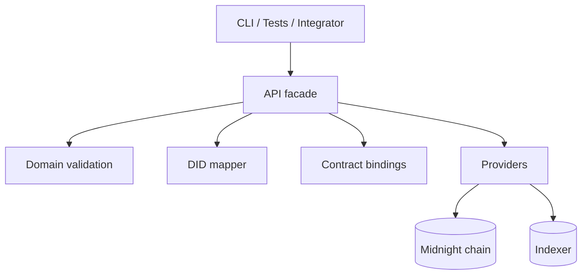
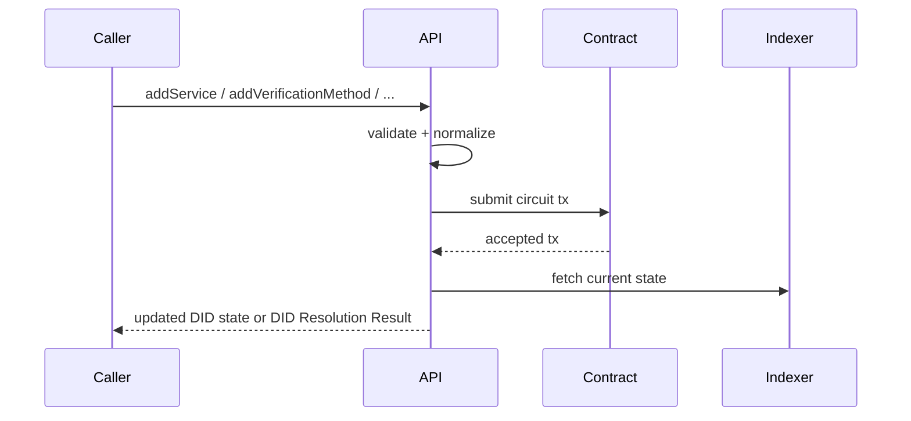

# @midnight-ntwrk/midnight-did-api

Programmatic API for creating, updating, deactivating, and resolving Midnight DIDs.

## Responsibilities

- Build/connect providers (node, indexer, proof server)
- Submit contract circuits for DID operations
- Map inputs/outputs between app/domain and ledger/runtime
- Provide integration test topology and helpers
- Return DID Resolution Result objects (`didDocument`, `didResolutionMetadata`, `didDocumentMetadata`)

## Architecture

## Update Sequence

## State Model

API enforces lifecycle rules around:
- active DID: allows updates
- deactivated DID: mutating operations rejected

(Exact schema/canonicalization rules live in `domain`.)

## Build & Test

- Build: `npm run build -w api`
- Unit tests: `npm run test -w api`
- Integration tests: `npm run test-api -w api`

## Integration Teardown

`api/src/test/commons.ts` now uses:
- unique compose project names per run
- `env.down({ removeVolumes: true })`
- fallback `docker compose down --volumes --remove-orphans`

This reduces container/volume leaks when tests fail mid-run.
