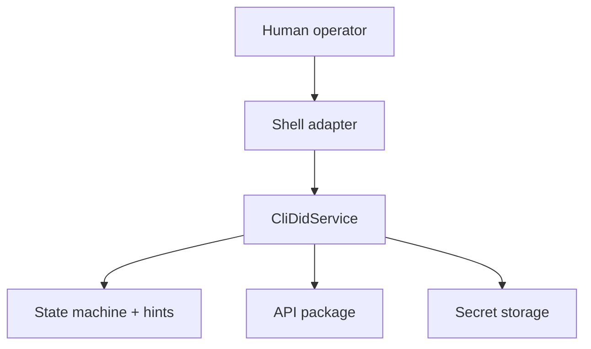
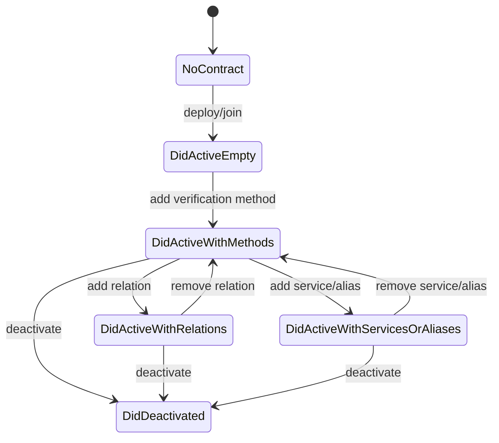
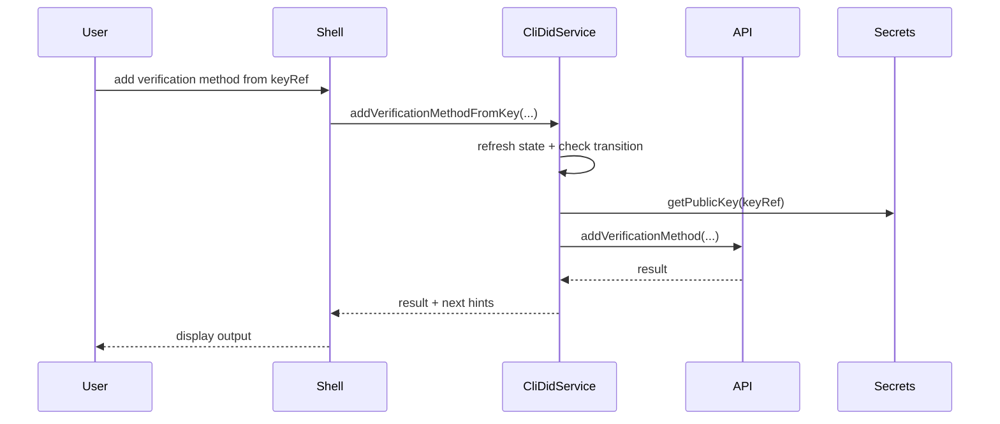

# @midnight-ntwrk/midnight-did-cli

Interactive and testable CLI for `did:midnight` lifecycle management.

## Responsibilities

- Shell UX (menus/prompts)
- CLI API service orchestration
- State-machine guardrails and next-step hints
- Key management through `secret-storage` (keyRef-first operations)

## Architecture

## CLI State Machine

## Command Flow

## Key/Secret Handling

- Default backend: encrypted file store
- Optional backend: veramo adapter path
- Supported key curves:
  - Ed25519
  - P-256
  - Jubjub

Environment:
- `CLI_SECRET_BACKEND=file|veramo`
- `CLI_SECRET_FILE_PATH`
- `CLI_SECRET_PASSPHRASE`

## Build & Test

- Build: `npm run build -w cli`
- CLI API + secret-storage tests: `npm run test:cli-api -w cli`
- Full CLI tests (includes docker-backed tests): `npm run test-api -w cli`

## Notes

- `src/cli-api/*` contains business logic.
- `src/shell/*` contains terminal interaction only.
- This split keeps logic deterministic and easy to test.
