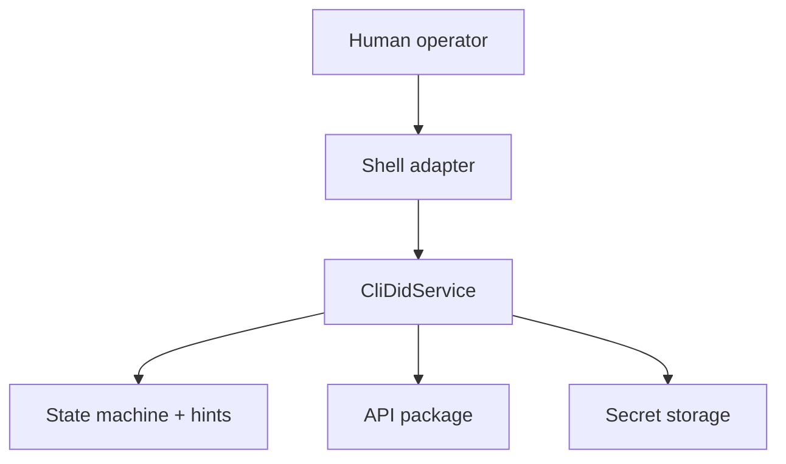
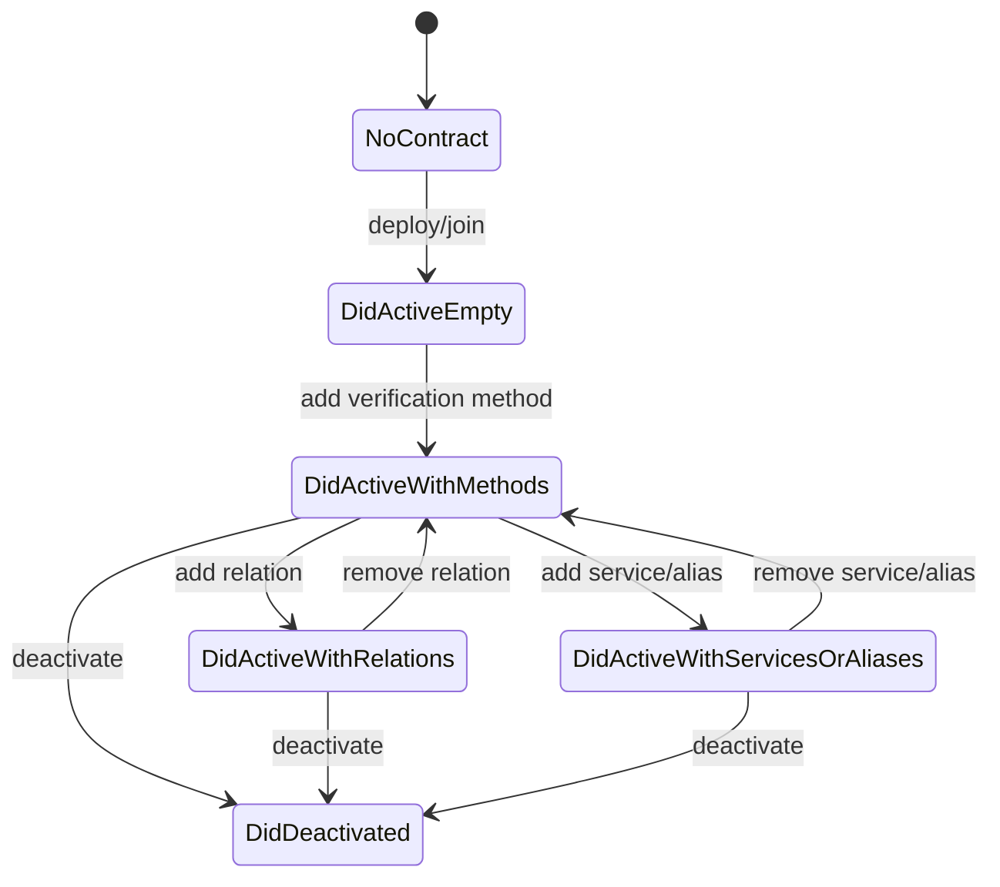
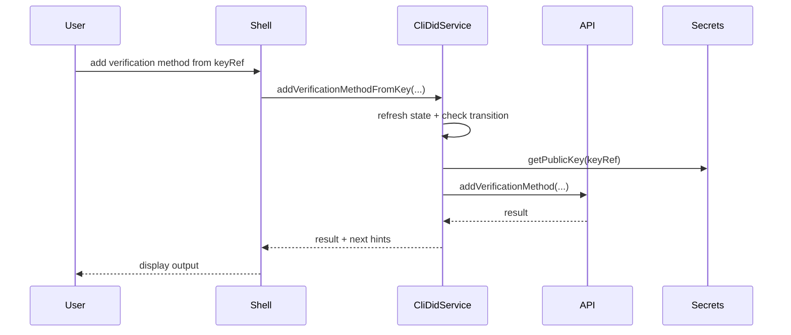

# @midnight-ntwrk/midnight-did-cli

Interactive and testable CLI for `did:midnight` lifecycle management.

## Responsibilities

- Shell UX (menus/prompts)
- CLI API service orchestration
- State-machine guardrails and next-step hints
- Key management through `secret-storage` (keyRef-first operations)

## Architecture

## CLI State Machine

## Command Flow

## Key/Secret Handling

- Default backend: encrypted file store
- Optional backend: veramo adapter path
- Supported key curves:
  - Ed25519
  - P-256
  - Jubjub

Environment:
- `CLI_SECRET_BACKEND=file|veramo`
- `CLI_SECRET_FILE_PATH`
- `CLI_SECRET_PASSPHRASE`
- `CLI_SESSION_FILE_PATH` (default `~/.midnight-did/cli-session.json`)

## Session Resume (Local + Preprod)

The CLI now persists per-environment session state:
- wallet seed
- last active DID contract address
- update timestamp

On next start, the CLI detects an existing profile session and offers:
- reuse stored wallet seed
- create a new wallet
- restore from another seed

If you reuse the stored seed, the CLI also attempts to rejoin the previously used DID contract automatically.

## End-to-End Scenario

Local (standalone):
- `npm run standalone -w cli`

Preprod:
- `npm run preprod -w cli`

Recommended flow:
1. Create or reuse a wallet seed.
2. Deploy a DID contract.
3. Generate/import keys and add/update verification methods.
4. Add/update service entries.
5. Exit CLI.
6. Start CLI again in the same environment and reuse stored session.

## Build & Test

- Build: `npm run build -w cli`
- CLI API + secret-storage tests: `npm run test:cli-api -w cli`
- Full CLI tests (includes docker-backed tests): `npm run test-api -w cli`

## Notes

- `src/cli-api/*` contains business logic.
- `src/shell/*` contains terminal interaction only.
- This split keeps logic deterministic and easy to test.
