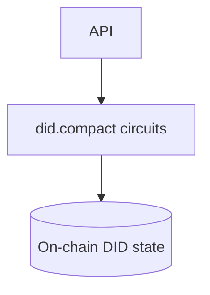
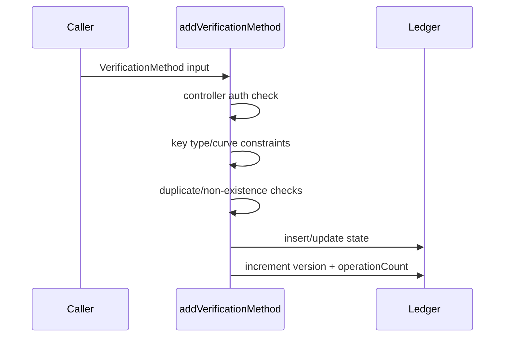
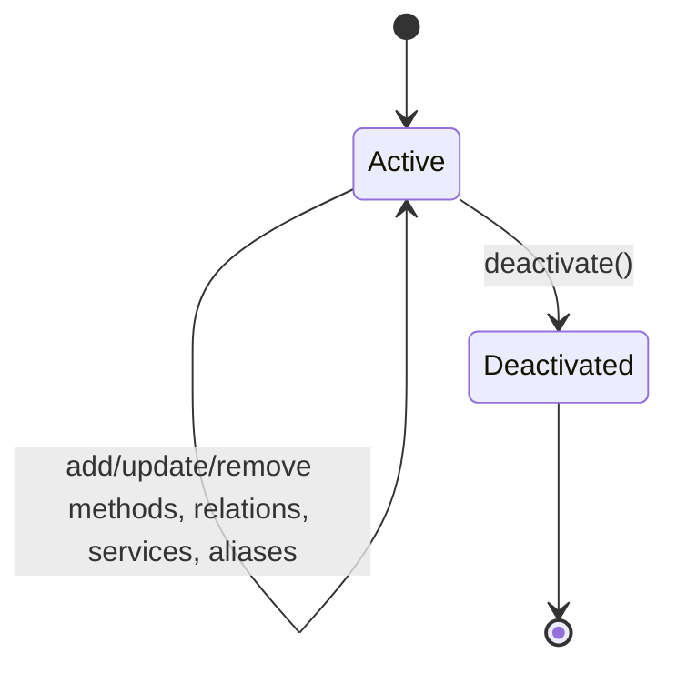

# @midnight-ntwrk/midnight-did-contract

Compact smart-contract implementation for Midnight DID ledger state.

## Responsibilities

- Store DID state on-ledger (methods, relations, services, aliases, metadata)
- Enforce on-chain invariants and authorization checks
- Expose circuits for DID lifecycle operations
- Provide pure circuit helpers (including Jubjub signature verification)

## Architecture

## Circuit Flow (example: add verification method)

## On-ledger State Lifecycle

## Build & Test

- Compile compact artifacts: `npm run contract -w contract`
- Build TS artifacts: `npm run build -w contract`
- Tests: `npm run test -w contract -- --pool=threads`
- Coverage: `npm run coverage -w contract`

## Notes

- Contract-level checks focus on enforceable on-chain invariants.
- Some full DID conformance checks are intentionally handled at SDK/domain layers.
- Jubjub verifier circuit is available for domain/contract compatibility testing.
