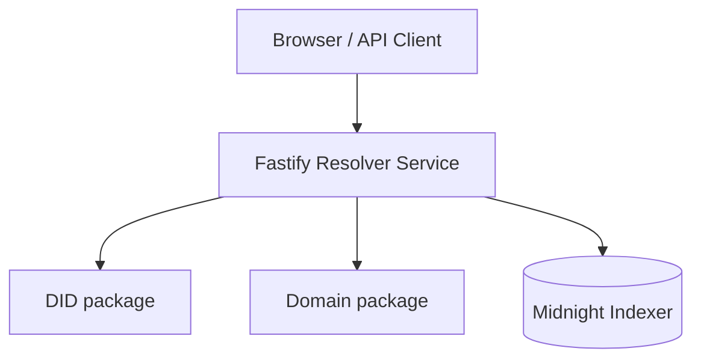
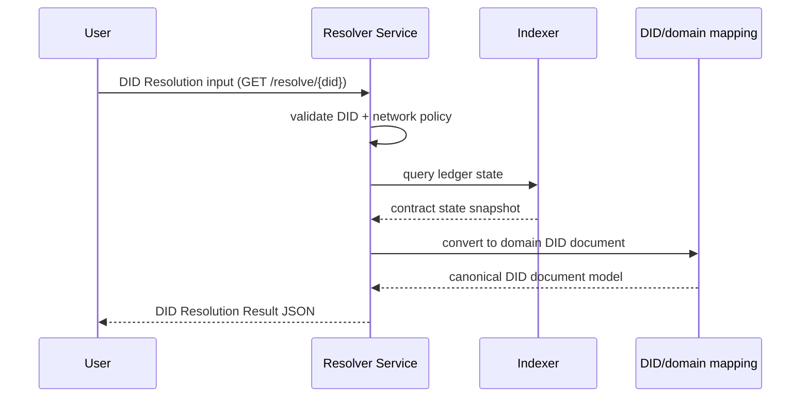
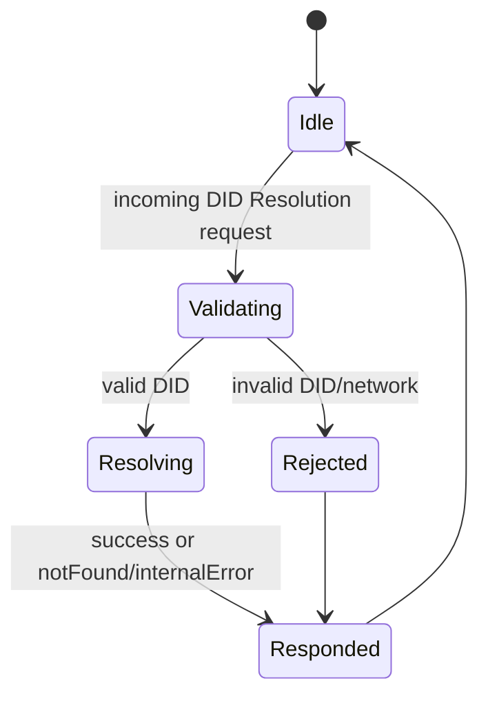

# @midnight-ntwrk/midnight-did-resolver-service

Standalone DID resolver service with REST API, Swagger UI, and a minimal web UI.

## Responsibilities

- Resolve `did:midnight` into DID Resolution Results
- Return DID Resolution Results as defined by DID Core:
  - `didDocument`
  - `didResolutionMetadata`
  - `didDocumentMetadata`
- Expose HTTP endpoints for resolution and health checks
- Support runtime-configurable indexer endpoints

## Architecture

## DID Resolution Sequence

## Service State (request lifecycle)

## Endpoints

- `GET /health`
- `GET /resolve/:did` (DID Resolution)
- `POST /resolve` with `{ "did": "did:midnight:..." }` (DID Resolution)
- `GET /docs` (Swagger UI)
- `GET /` (simple HTML UI)

## Configuration

- `RESOLVER_HOST` (default `127.0.0.1`)
- `RESOLVER_PORT` (default `3001`)
- `MIDNIGHT_INDEXER_HTTP_URL`
- `MIDNIGHT_INDEXER_WS_URL`
- `MIDNIGHT_NETWORK` (`undeployed|devnet|testnet|mainnet|preview|preprod`)
- `RESOLVER_DEBUG=true` (optional verbose errors)

## Run

- Build: `npm run build -w did-resolver-service`
- Dev: `npm run dev -w did-resolver-service`
- Start: `npm run start -w did-resolver-service`
- Unit tests: `npm run test -w did-resolver-service`
- Integration tests: `npm run test:integration -w did-resolver-service`

## Docker Integration Tests

Integration tests use compose + Testcontainers and now enforce cleanup via:
- `env.down({ removeVolumes: true })`
- fallback `docker compose down --volumes --remove-orphans`

This reduces dangling containers/volumes after failures.
