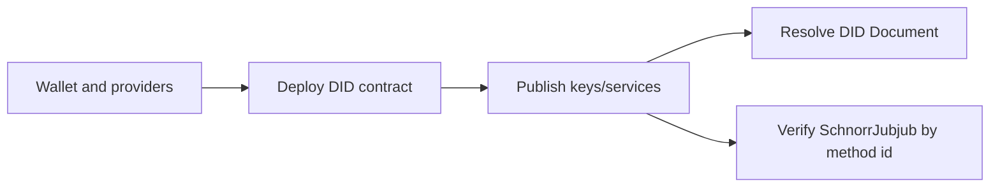

# API Reference

The public API is the stable TypeScript surface for creating, updating, and
resolving Midnight DIDs. It wraps the Compact contract, wallet/provider setup,
ledger-state mapping, and DID Document reconstruction.

## Main Flow



## Primary APIs

| Task                               | API                                                                                                                    |
| ---------------------------------- | ---------------------------------------------------------------------------------------------------------------------- |
| Build standalone providers         | `StandaloneConfig`, `buildFreshWallet`, `configureProviders`                                                           |
| Initialize controller state        | `initPrivateState`, `restorePrivateState`, `requirePrivateState`                                                       |
| Create or attach to a DID contract | `deploy`, `createDID`, `joinContract`                                                                                  |
| Resolve DID state                  | `resolve`, `getMidnightDIDLedgerState`                                                                                 |
| Rotate controller key              | `rotateControllerKey`                                                                                                  |
| Manage JWK verification methods    | `addVerificationMethod`, `updateVerificationMethod`, `removeVerificationMethod`, `VerificationMethodReferencedError`   |
| Manage SchnorrJubjub methods       | `addSchnorrJubjubVerificationMethod`, `updateSchnorrJubjubVerificationMethod`, `removeSchnorrJubjubVerificationMethod` |
| Manage verification relationships  | `addVerificationMethodRelation`, `removeVerificationMethodRelation`                                                    |
| Verify native signatures           | `verifySchnorrJubjubDigestSignature`                                                                                   |
| Manage services and aliases        | `addService`, `updateService`, `removeService`, `addAlsoKnownAs`, `removeAlsoKnownAs`                                  |
| Deactivate a DID                   | `deactivate`                                                                                                           |

## Runnable Example

The issuer bootstrap example is the shortest full TypeScript path for real key
material. It creates a DID, publishes Ed25519 authentication and SchnorrJubjub
`assertionMethod` keys, resolves the DID Document, and writes a keystore for a
downstream issuer.

Start with [API Examples](/packages/api-examples#bootstrap-an-issuer-did) or
read the source at
[`packages/api/examples/bootstrap-issuer-did.ts`](https://github.com/midnightntwrk/midnight-did/blob/main/packages/api/examples/bootstrap-issuer-did.ts).

## Package Split

- `@midnight-ntwrk/midnight-did-api` is the high-level runtime facade.
- `@midnight-ntwrk/midnight-did` maps ledger state to DID Resolution Results.
- `@midnight-ntwrk/midnight-did-domain` validates DID model objects and method ids.
- `@midnight-ntwrk/midnight-did-contract` exposes the Compact contract runtime.

Use [Libs](/packages/) for package selection details and
[Quickstart](/guide/quickstart) for a complete create/update/resolve flow.

## Key Rules

Use `addVerificationMethod` for Ed25519, X25519, P-256, secp256k1,
BLS12381G1, and BLS12381G2 JWKs.
Use `addSchnorrJubjubVerificationMethod` for native Midnight SchnorrJubjub keys.
The resolver merges both stores into one DID Document. See
[Key Model](/guide/key-model) before choosing a key profile.

Verification-method deletion is explicit and non-atomic with relationship
cleanup. Remove selected relationships one transaction at a time, re-read state
after ambiguous failures, and then remove the method. Method removal never
purges relationships implicitly and throws `VerificationMethodReferencedError`
(with `code`, `methodId`, and ordered `relations`) while references remain.
Missing relationship removals continue to fail explicitly.

`@midnight-ntwrk/midnight-js-contracts` 4.0.2 calls
`setContractAddress(target)`, then awaits the initial-state and signing-key
writes after ledger deployment success but before `deployContract` returns.
`deploy` intercepts that synchronous bind to canonicalize and reserve the target
under its already-owned source lease before the dependency mutates the provider.
The lease covers the dependency's complete return or rejection and has no unsafe
elapsed-time expiry; the interceptor is deactivated on settlement and cannot
reuse the released lease. The dependency already performs the bind and both
writes, so the API does not duplicate them or overwrite a concurrently rotated
controller key.

A target reservation, either post-finality persistence failure, or returned
contract-handle construction failure becomes
`DIDContractDeploymentFinalizedPrivateStateIncompleteError`. Its strict shape is
a stable `code`/`name`, canonical `contractAddress`, and controlled `setupStage`
(`target_reservation`, `private_state_persistence`,
`signing_key_persistence`, or `contract_handle_construction`). The observed
address tells callers that the dependency reported ledger success; the stage
identifies incomplete local setup. Handle construction begins after both writes
complete and includes `deployContract`'s second address bind, which cannot reset
the stage to reservation or persistence. The error discards the source error,
contract handle, deployment and
transaction/finality objects, provider name/message, and all public/private
evidence. It has no `cause`. Pre-target failures, including
`DeployTxFailedError`, remain unchanged.

Do not redeploy blindly. Preserve private state separately, reconcile storage
and ledger state by the canonical address, and verify the stage's write before
retrying because a rejected write can have committed. Resolve binding ownership
and join using state that matches the current ledger controller rather than
overwriting a namespace that may have rotated. Inspect access-controlled
external provider logs separately for source diagnostics; never log or expose
the source error through this typed object.

Controller rotation and recovery retain the pending replacement secret whenever
finalized transaction data is not returned. A later or overlapping attempt fails
with the typed pending-controller-state error instead of overwriting it.
Reconcile `controllerPublicKey` from ledger state, then explicitly promote the
candidate after confirmed finalization or discard any retained record (including
malformed state) after confirmed non-finalization. An absent discard and a
missing or malformed promotion fail with the stable typed unavailable error.
Public rotation/recovery auto-bind or assert the canonical contract address;
public reconciliation requires `contractAddress`. API-bound calls for one DID
are serialized from preflight until the owner settles. Acquisition is fail-fast,
including when the owner hangs. An unresolved owner remains busy until its work
is cancelled and the operation settles, the operation otherwise terminates or
settles, or the process exits. Lease expiry is deliberately unsafe: stale
provider or transaction work could later overwrite, promote, or remove another
operation's state. After cancellation or termination, reconcile ledger/private
state. Provider-object fallback is internal/deep-unbound only. Direct provider
mutation, independently unbound wrappers, and cross-process writers remain
outside the guarantee and require external per-DID coordination.

## Generated TypeDoc

Generated TypeDoc pages are available locally when you need symbol-level API
detail:

```bash
pnpm run docs:api
```

That command writes `docs-site/api/reference/`. It is intentionally excluded
from the default GitHub Pages build so docs-only changes do not compile Compact
contracts or package outputs.
