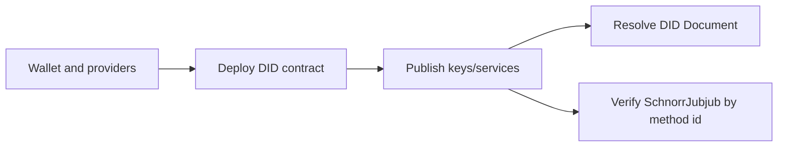

# API Reference

The public API is the stable TypeScript surface for creating, updating, and
resolving Midnight DIDs. It wraps the Compact contract, wallet/provider setup,
ledger-state mapping, and DID Document reconstruction.

## Main Flow



## Primary APIs

| Task | API |
| --- | --- |
| Build standalone providers | `StandaloneConfig`, `buildFreshWallet`, `configureProviders` |
| Initialize controller state | `initPrivateState`, `restorePrivateState`, `requirePrivateState` |
| Create or attach to a DID contract | `deploy`, `createDID`, `joinContract` |
| Resolve DID state | `resolve`, `getMidnightDIDLedgerState` |
| Rotate controller key | `rotateControllerKey` |
| Manage JWK verification methods | `addVerificationMethod`, `updateVerificationMethod`, `removeVerificationMethod`, `VerificationMethodReferencedError` |
| Manage SchnorrJubjub methods | `addSchnorrJubjubVerificationMethod`, `updateSchnorrJubjubVerificationMethod`, `removeSchnorrJubjubVerificationMethod` |
| Manage verification relationships | `addVerificationMethodRelation`, `removeVerificationMethodRelation` |
| Verify native signatures | `verifySchnorrJubjubDigestSignature` |
| Manage services and aliases | `addService`, `updateService`, `removeService`, `addAlsoKnownAs`, `removeAlsoKnownAs` |
| Deactivate a DID | `deactivate` |

## Runnable Example

The issuer bootstrap example is the shortest full TypeScript path for real key
material. It creates a DID, publishes Ed25519 authentication and SchnorrJubjub
`assertionMethod` keys, resolves the DID Document, and writes a keystore for a
downstream issuer.

Start with [API Examples](/packages/api-examples#bootstrap-an-issuer-did) or
read the source at
[`packages/api/examples/bootstrap-issuer-did.ts`](https://github.com/midnightntwrk/midnight-did/blob/main/packages/api/examples/bootstrap-issuer-did.ts).

## Package Split

- `@midnight-ntwrk/midnight-did-api` is the high-level runtime facade.
- `@midnight-ntwrk/midnight-did` maps ledger state to DID Resolution Results.
- `@midnight-ntwrk/midnight-did-domain` validates DID model objects and method ids.
- `@midnight-ntwrk/midnight-did-contract` exposes the Compact contract runtime.

Use [Libs](/packages/) for package selection details and
[Quickstart](/guide/quickstart) for a complete create/update/resolve flow.

## Key Rules

Use `addVerificationMethod` for Ed25519, X25519, P-256, secp256k1,
BLS12381G1, and BLS12381G2 JWKs.
Use `addSchnorrJubjubVerificationMethod` for native Midnight SchnorrJubjub keys.
The resolver merges both stores into one DID Document. See
[Key Model](/guide/key-model) before choosing a key profile.

Verification-method deletion is explicit and non-atomic with relationship
cleanup. Remove selected relationships one transaction at a time, re-read state
after ambiguous failures, and then remove the method. Method removal never
purges relationships implicitly and throws `VerificationMethodReferencedError`
(with `code`, `methodId`, and ordered `relations`) while references remain.
Missing relationship removals continue to fail explicitly.

Controller rotation and recovery retain the pending replacement secret whenever
finalized transaction data is not returned. Reconcile `controllerPublicKey`
from ledger state before retrying; promote the pending secret only after
confirming the replacement key finalized.

## Generated TypeDoc

Generated TypeDoc pages are available locally when you need symbol-level API
detail:

```bash
pnpm run docs:api
```

That command writes `docs-site/api/reference/`. It is intentionally excluded
from the default GitHub Pages build so docs-only changes do not compile Compact
contracts or package outputs.
