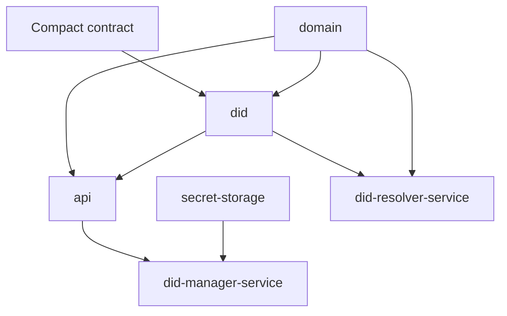

# Architecture

The Midnight DID repository is organized into reusable TypeScript packages, a Compact smart contract, and two operational web services.

## Layers

1. `contract/`
   Compact smart-contract implementation and contract-focused tests.
2. `domain/`
   canonical DID document/domain model and validation logic.
3. `did/`
   ledger-to-domain conversion and resolver-oriented logic.
4. `api/`
   runtime integration with node, indexer, proof server, and contract deployment/update flows.
5. `secret-storage/`
   reusable encrypted secret store and HD derivation logic.
6. `did-resolver-service/`
   resolver HTTP service and browser UI.
7. `did-manager-service/`
   manager HTTP service and browser UI.

## Runtime relationships

## Main repository references

- `README.md`
- `docs/midnight-did-use-cases.md`
- `w3c-spec/midnight-method.md`
- `w3c-spec/midnight-did-traits.md`

## Architecture decisions

- [ADR: Shared Seed and Local Profiles](/architecture/adr-shared-seed-and-profiles)
- [ADR: SDK and Contract Boundary](/architecture/adr-sdk-contract-boundary)
- [ADR: Resolver vs Manager Service Split](/architecture/adr-service-split)
- [DID Manager Architecture](/architecture/did-manager-service)

## Reading path

1. read this overview
2. read the DID Manager architecture page for runtime/state-flow detail
3. read the ADR pages for tradeoff context
4. use the package and service pages for implementation details
5. use the generated API reference for exact exports and signatures
