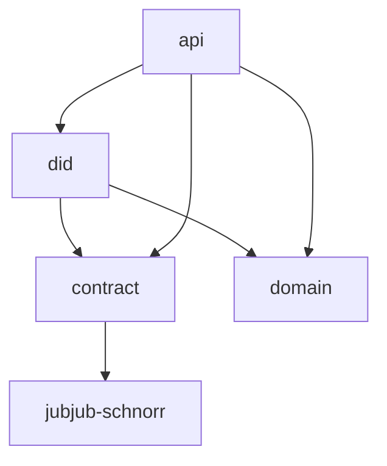

# Architecture

The DID repository owns the method implementation layers that downstream services consume.



Resolver service, DID manager, and local secret custody architecture lives in
[`midnight-did-resolver`](https://github.com/midnightntwrk/midnight-did-resolver).

## Boundaries

The Compact contract keeps the on-ledger surface intentionally small. It
enforces controller authorization, active/deactivated state, identifier
uniqueness, relation membership, service membership, supported key-profile enum
values, native SchnorrJubjub storage, and the ledger-bound SchnorrJubjub
verification circuit.

The TypeScript layers enforce rules that Compact cannot express safely today:
DID URL subject binding, fragment normalization, DID Document shape, service
endpoint JSON shape, public JWK base64url canonicality, key-coordinate lengths,
and the split between opaque JWK keys and native SchnorrJubjub keys.

## Runtime Artifacts

TypeScript packages and ZK proving artifacts are distributed separately. The
packages expose the contract/API surface. The ZK bundle carries the provider
layout required by Midnight JS:

```text
keys/<circuit>.prover
keys/<circuit>.verifier
zkir/<circuit>.bzkir
```

Release metadata in `@midnight-ntwrk/midnight-did-api` derives the matching
GitHub Release and GHCR artifact locations for the installed package version.

## Trust Model

Controller-gated contract calls use wallet-local Jubjub Schnorr signatures over
a domain-separated authorization digest containing the DID contract id and the
current ledger version. The ledger and resolvers see only the controller public
key, and delegated proof servers receive signature material rather than the
controller secret.

## Pages

- [ADR: SDK and Contract Boundary](/architecture/adr-sdk-contract-boundary)
- [ADR: Controller Authorization Signatures](/architecture/adr-controller-authorization-signatures)
