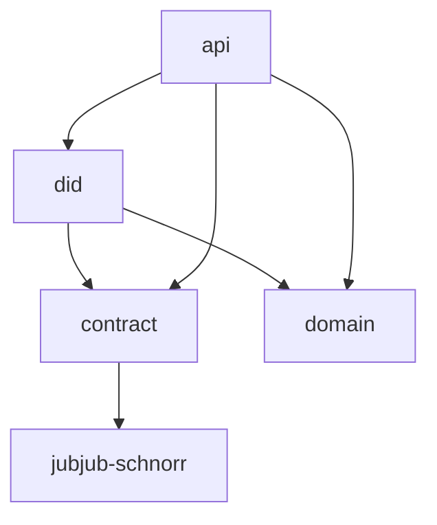

# Architecture

The DID repository owns the method implementation layers that downstream services consume.

Resolver service, DID manager, and local secret custody architecture lives in
[`midnight-did-resolver`](https://github.com/midnightntwrk/midnight-did-resolver).

## Pages

- [ADR: SDK and Contract Boundary](/architecture/adr-sdk-contract-boundary)
