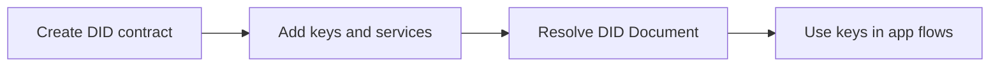

# Guide

Midnight DID lets an application publish DID method state to a Midnight smart
contract, resolve that state into a W3C DID Document, and use the published keys
for authentication, credentials, services, and Midnight-native SchnorrJubjub
verification.

## Choose Your Path

| Goal | Start here |
| --- | --- |
| Try the main flow in a standalone environment | [Quickstart](/guide/quickstart) |
| Choose network endpoint defaults | [Network Endpoints](/guide/network-endpoints) |
| Bootstrap an issuer DID with real Ed25519 and SchnorrJubjub keys | [API Examples](/packages/api-examples#bootstrap-an-issuer-did) |
| Understand supported keys and signing paths | [Key Model](/guide/key-model) |
| Learn the DID method rules | [DID Method](/spec/midnight-method) |
| Work on Compact circuits | [Compact Contract Surface](/compact/) |
| Pick the right TypeScript package | [Libs](/packages/) |
| Contribute to this repository | [Development](/development/) |

## What Lives Here

This repository owns the DID method implementation:

- Compact DID contract and generated runtime package.
- TypeScript domain validation and DID Document normalization.
- Ledger-to-domain mapping and in-process resolver helpers.
- API helpers for DID contract lifecycle and updates.

Deployable resolver services, DID manager UI/backend, reusable secret storage,
and local key-custody workflows live in
[`midnight-did-resolver`](https://github.com/midnightntwrk/midnight-did-resolver).
VC/VP protocol work lives in
[`midnight-verifiable-credentials`](https://github.com/midnightntwrk/midnight-verifiable-credentials).

## Security Note

Controller-gated DID updates use wallet-local Jubjub Schnorr signatures over a
domain-separated digest containing the DID contract id and current version. A
delegated proof server receives signature material, not the controller secret.
See [Key Model](/guide/key-model#controller-authorization-signature-model) for
the current trust boundary.
