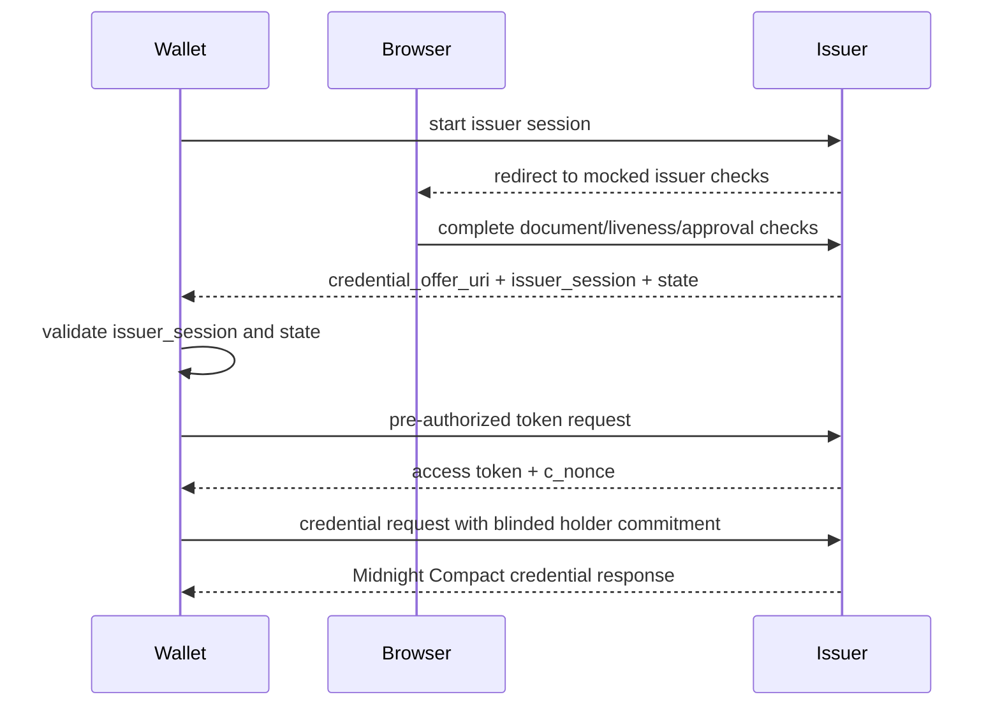

# Credentials OpenID Package

Package: `@midnight-ntwrk/midnight-did-credentials-openid`

Status: prototype support package

## Purpose

`credentials-openid` provides transport-neutral TypeScript schemas for
OID4VCI/OID4VP-inspired Midnight Credentials flows.

It does not implement an OAuth server, DIDComm transport, JWT proof generation,
or cryptographic verification. Those responsibilities stay in application
services, wallet integrations, and Compact credential packages.

## What It Models

| Area | Objects | Purpose |
|---|---|---|
| Issuer metadata | `CredentialIssuerMetadata` | Describe supported Midnight credential configurations |
| Credential offers | `CredentialOffer` | Carry issuer and credential configuration identifiers |
| Token exchange | `TokenRequest`, `TokenResponse` | Model pre-authorized-code issuance flows |
| Credential issuance | `CredentialRequest`, `CredentialResponse` | Carry Midnight holder-binding extensions and Compact VC payloads |
| Presentation request | `PresentationDefinition`, `VpAuthorizationRequest` | Describe verifier requirements and Midnight predicate hints |
| Presentation response | `VpAuthorizationResponse`, `PresentationSubmission` | Carry Midnight Compact VP payloads and descriptor maps |
| Compact payload framing | `EncodedCompactValue` | Move generated Compact runtime values through JSON envelopes without lossy JSON conversion |

## Compact Payload Transport

Compact-generated TypeScript values should not be hand-serialized as plain JSON
when the value contains runtime-specific shapes such as byte arrays, field
values, or generated descriptors.

The package uses `compact-value-v1.base64url`:

1. convert a generated Compact value with the descriptor `toValue(...)`
2. frame the runtime `Value` chunks into bytes
3. base64url-encode the bytes for an HTTP/JSON envelope
4. decode and reconstruct the typed value with the descriptor `fromValue(...)`

Credential-family packages expose typed wrappers so application code does not
depend on generated descriptor internals. Current examples include:

- `encodeSecretPassportCredential(...)`
- `encodeSecretPassportProof(...)`
- `encodeSecretPassportPresentation(...)`
- `encodeSanctionScreeningPresentation(...)`

## Current Prototype Usage

The Passport prototype uses this package in the Digital National ID issuer flow:



The checks are mocked. The protocol message shapes and wallet callback
validation are real prototype code.

## Commands

Run package checks directly:

```bash
npm run all -w @midnight-ntwrk/midnight-did-credentials-openid
```

Run the Passport prototype that consumes it:

```bash
PROOF_SERVER_IMAGE=proof-server-bootstrap:8.0.3 ./run-passport-prototype.sh
```

