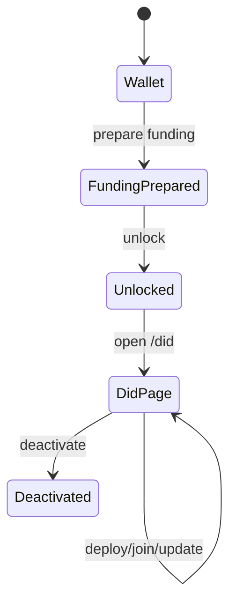

# DID Manager Service

The DID manager is a single-user Node.js web application for wallet preparation and Midnight DID lifecycle operations.

## Scope

- prepare funding using the same shared seed used for DID ownership
- unlock and persist local profiles
- deploy or join a DID contract
- manage verification methods, relations, services, aliases, and deactivation

## Main pages

- `/wallet`
- `/did`
- `/docs`

## User flow



## Main configuration

| Variable | Purpose |
|---|---|
| `DID_MANAGER_SETUP` | Runtime setup: `standalone` or `preprod` |
| `DID_MANAGER_HOST` | Bind host |
| `DID_MANAGER_PORT` | Bind port |
| `DID_MANAGER_DATA_DIR` | Persistent local data directory |
| `DID_MANAGER_SESSION_FILE` | Optional explicit session file path |
| `DID_MANAGER_SECRET_FILE` | Optional explicit secret store file path |
| `DID_MANAGER_SECRET_PASSPHRASE` | Secret store passphrase |
| `DID_MANAGER_LOG_FILE` | Log output file |

## Run

```bash
npm run dev -w did-manager-service
./run-manager.sh
./run-manager-preprod.sh
```

## Main repository paths

- `did-manager-service/src/index.ts`
- `did-manager-service/src/app.ts`
- `did-manager-service/src/manager.ts`
- `did-manager-service/README.md`

## Full source doc

- [Embedded Manager README](/source/did-manager-service-readme)
