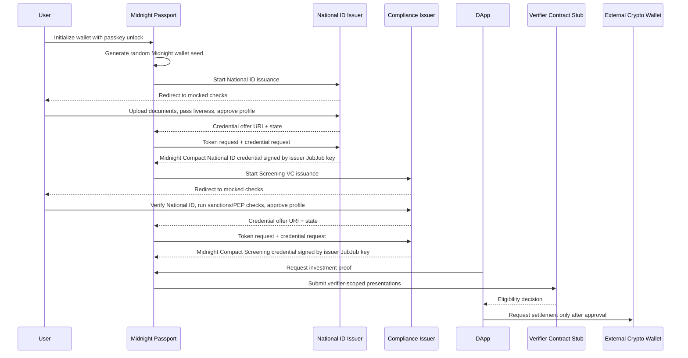

# Midnight Passport Prototype

Status: executable prototype

The Midnight Passport prototype demonstrates how a wallet can hold Midnight
Credentials, request issuer checks, prepare selective disclosures, and satisfy a
DApp verifier without exposing raw identity attributes.

The prototype lives in `midnight-passport-prototype/`.

## Architecture

The first implementation is a standalone browser app with a TypeScript backend.
This keeps all actors local and testable while preserving explicit seams for
future wallet, issuer, and DApp separation.

| Actor | Prototype implementation | Notes |
|---|---|---|
| Wallet / Midnight Passport | `src/actors/wallet.ts` | Stores credentials, encrypts local stores with passkey-derived keys, generates the Midnight wallet seed, and creates verifier-scoped presentations |
| Wallet bridge | `src/bridge/wallet-bridge.ts` | Boundary a future extension or mobile wallet can replace |
| Digital National ID issuer | `src/issuers/national-id-issuer-service.ts` + `app/national-id-issuer.html` | Redirect-based issuer UI with mocked checks, OID4VCI-shaped exchange, and a Midnight DID/JubJub signing method |
| Screening VC issuer | `src/issuers/screening-issuer-service.ts` + `app/screening-issuer.html` | Redirect-based issuer UI with mocked compliance checks, OID4VCI-shaped exchange, and a Midnight DID/JubJub signing method |
| DApp | `src/actors/dapp.ts` | Requests eligibility proof for the investment product |
| Verifier contract stub | `src/actors/investment-verifier.ts` | Simulates smart-contract verification decisions |
| External crypto wallet | `src/actors/crypto-wallet.ts` | Keeps payment/settlement separate from identity wallet |

## Flow



## Issuer Checks

The National ID issuer UI intentionally mocks the human-verification work:

- document upload
- liveness check
- profile approval

The protocol boundary is still exercised:

- pre-authorized credential offer
- access token exchange
- credential request with blinded holder commitment
- Compact credential response
- wallet callback validation with `issuer_session` and `state`

The issuer has an explicit prototype Midnight DID:

- `did:midnight:prototype:national-id-issuer`
- JubJub verification method `#nid-jubjub-1`

The credential fixture is signed with that JubJub key, and the credential body
references the issuer verification method. The mocked document/liveness checks
do not replace the issuer signature; they only gate whether the issuer returns a
credential offer.

The Screening VC issuer UI intentionally mocks compliance-provider work:

- National ID presentation verification
- sanctions screening
- PEP screening
- compliance profile approval

The protocol boundary is the same OID4VCI-shaped flow, but it depends on the
wallet already holding a National ID credential. The screening issuer has its
own prototype Midnight DID:

- `did:midnight:prototype:screening-issuer`
- JubJub verification method `#screening-jubjub-1`

The Screening VC fixture is signed with that issuer key and remains bound to the
same hidden holder secret. The verifier later checks that National ID and
Screening credentials are controlled by the same holder without learning the
holder DID.

## Passkey Unlock And Wallet Seed

The wallet flow now separates three concepts:

| Concept | Prototype behavior | Production direction |
|---|---|---|
| Passkey credential | deterministic `passkey:alice:device-1` fixture | WebAuthn credential or platform secure element |
| PRF output | deterministic test output from `src/crypto/passkey.ts` | WebAuthn PRF / secure-element-derived secret |
| Midnight wallet seed | random 32-byte seed generated during wallet initialization | generated locally, persisted only in encrypted secure storage |

The seed is used to derive holder secret material for hidden-holder proofs. The
UI shows only the seed hash/fingerprint, never the seed.

## What The Prototype Proves

- Credentials can be represented as Compact-first structures.
- JSON envelopes can carry Compact payloads safely through a framed
  `compact-value-v1.base64url` encoding.
- A wallet can store credential bodies and issuer proofs locally.
- A wallet can seal and reopen local stores through passkey-derived material.
- Holder material can be derived from a locally generated wallet seed.
- A National ID credential can be issued by a concrete Midnight DID/JubJub
  signing method.
- A Screening VC can be issued by a separate Midnight DID/JubJub signing method
  after validating the National ID credential context.
- Presentations can be verifier scoped.
- The holder can prove eligibility without revealing raw passport data, legal
  name, passport number, birth date, or holder DID.
- Identity proofing and payment settlement can remain separate.

## Commands

Start the browser prototype:

```bash
./start-passport-prototype.sh
```

Open:

- `http://127.0.0.1:5174`

Run the full prototype pipeline:

```bash
PROOF_SERVER_IMAGE=proof-server-bootstrap:8.0.3 ./run-passport-prototype.sh
```

Run only browser tests:

```bash
npm run test:e2e -w midnight-passport-prototype
```

Run only local TypeScript/session tests:

```bash
npm run test:ci:local -w midnight-passport-prototype
```

## Current Limitations

- Issuer checks are mocked.
- OAuth authorization server behavior is not implemented.
- JWT proof validation is represented by prototype placeholders.
- The app runs all actors in one local service for speed.
- The verifier contract is a simulator, not a deployed Compact contract.

These are intentional prototype constraints. The next production-oriented step
is to replace one boundary at a time while preserving the same domain objects
and tests.
