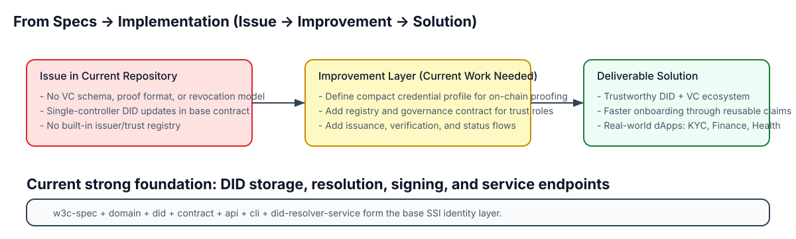
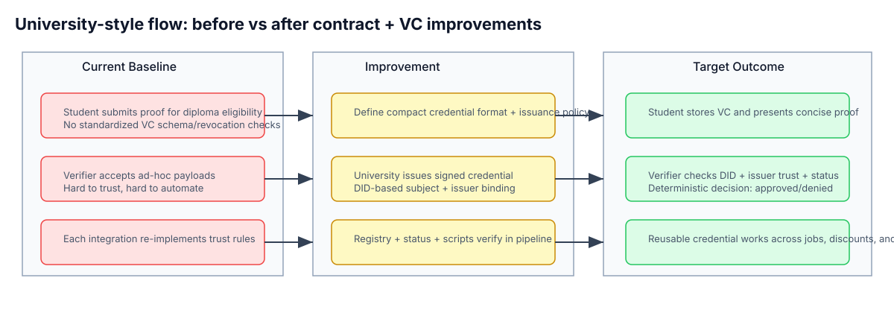
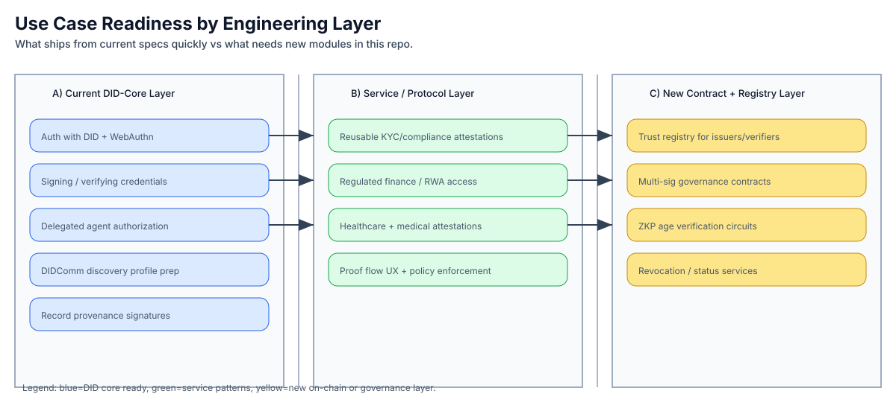
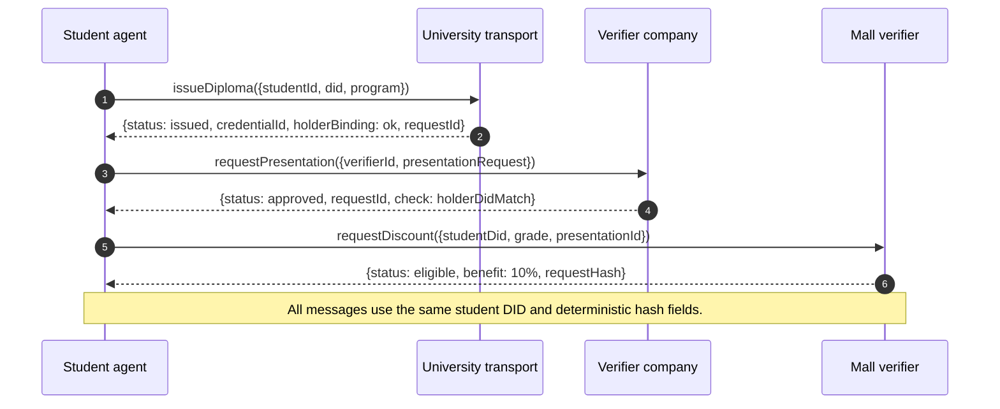
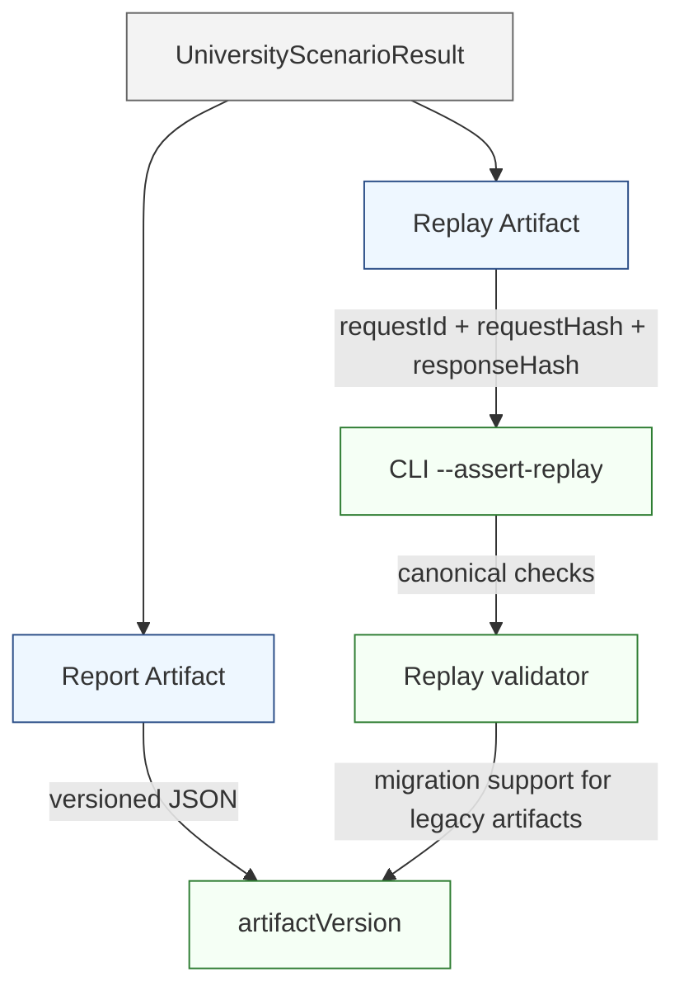

# Midnight DID + VC: Book for Dummies

This guide is a simplified reading of the formal use-case specs in
[`docs/midnight-did-use-cases.md`](./midnight-did-use-cases.md).

The goal is to make it easy for product owners and developers to answer:

- What is actually available today?
- What is only documented as a design direction?
- What must be implemented before production adoption?

## What the specs do well

The spec is strong on system framing. It clearly separates:

- Identity-layer guarantees that are already stable.
- Application-layer flows that can be built today.
- Contract-layer capabilities that still need additions.

It uses practical examples from finance, compliance, healthcare, and university-like workflows. That is good because readers can map each section to real products.

The best part is that it avoids pretending this repo is already a full SSI platform.

## What is currently missing (spec-to-product gaps)

The current repository provides a solid DID base, but several critical pieces are still absent in spec scope:

- canonical VC schema and proof format for this repo
- VC status/revocation primitives
- issuer and verifier trust-role registry
- generalized contract-to-contract DID proof composability
- cross-implementation presentation and transport protocol profile
- reusable BDD acceptance matrix for each use case

Those are not blockers for experimentation, but they are blockers for a repeatable production path.

## Issue / Improvement / Solution review

This section converts the spec into a decision-oriented map.







### Snapshot by use case

| Use case | Current issue | Improvement target | Practical solution |
|---|---|---|
| Authentication with DID and WebAuthn | Login logic is app-specific and outside DID core | Add standard account and policy handling for P-256 keys | Keep WebAuthn backend outside the DID contract, keep keys/resolution anchored on Midnight |
| VC signing and verification | VC payload format is not standardized in repo | Define compact profile and canonical hashing | Introduce a small credential family with explicit issuance and verification steps |
| Multi-sig collaborative voting | DID contract is single-controller | Add companion governance layer | Keep DID as identity anchor; use a governance contract for threshold rules |
| Trust registry for issuers/verifiers | No shared role registry in core | Add registry contract + governance model | Register and query trusted roles, role expiry, and assignees |
| ZKP age verification | No complete proof path or full on-chain verification | Add age credential + status + allow-list + circuits | Use staged architecture with oracle-assisted path first, then full ZKP proof path |
| Delegated agent authorization | Operational and legal roles are not separated by default | Publish service endpoints and delegation relationships | Publish explicit operational key roles using capabilityDelegation/Invocation |
| DIDComm and agent discovery | Messaging profile is not defined | Define transport and key-agreement profile | Publish service endpoints + keyAgreement and implement the protocol profile |
| Regulated finance / RWA access | Trust checks are duplicated across apps | Centralize trust role checks and schema policy | Use registry + consistent status checks in verifier gateway and dApp adapters |
| Reusable KYC and compliance | Credentials are re-run per application | Issue portable compliance credentials | Define scope codes and validity intervals to make reusable attestations safe |
| Healthcare attestations | Sensitive fields and roles are mixed in ad-hoc flows | Separate minimal claim predicates from private payloads | Use minimal claim set + selective disclosure plan + traceable consent patterns |
| Record provenance | No standard workflow for signed compliance evidence | Normalize signer role + evidence format | Define record templates for signature + role + policy context |

## Practical read model for this repo

Use this loop for every feature request:

1. Is this identity anchoring only? If yes, implement in DID core or API layer.
2. Is this reusable trust logic? If yes, build a service layer and contract-backed registry.
3. Is this collective control or legal governance? If yes, use companion governance contracts.
4. Is this selective disclosure or ZKP? If yes, plan circuit + policy + proof verification milestones.

This reduces design churn because each request is mapped to the smallest owning layer.

## University flow documentation bundle

The University Diploma scenario currently has a complete simulator execution path with a transport abstraction that includes a placeholder branch for standalone.
This section keeps the operational view visible to non-specialist reviewers.

### Mermaid flow overview

```mermaid
flowchart LR
  U["University issuer"]
  S["10 graduate students"]
  C["3 verifier companies"]
  M["Mall verifier"]
  T["Test fixture + filters"]
  B["Batch issuance engine"]
  P["Presentation engine"]
  D["Discount engine"]
  R["Scenario artifact + replay"]

  T -->|load roster and IDs| U
  U -->|issue diploma| B
  B -->|issued VCs| S
  S -->|request job presentation| P
  P -->|approved/rejected| C
  S -->|request mall discount| D
  D -->|discounted/declined| M
  C -->|presenter checks| R
  M -->|discount checks| R

  classDef actor fill:#e5efff,stroke:#254d9d,stroke-width:1px;
  classDef engine fill:#eaf7eb,stroke:#2c8f4b,stroke-width:1px;
  classDef out fill:#fff6df,stroke:#946800,stroke-width:1px;
  class U,C,M,S actor;
  class B,P,D engine;
  class T,R out;
```



### Request/reply sample diagrams



### Compact artifact diagram



### Screenshot bundle quick reference

Use this JSON fixture sample to validate generated output:

```json
{
  "artifactVersion": "1.1.0",
  "summary": {
    "issued": 10,
    "approved": 3,
    "discounted": 5
  },
  "filters": {
    "studentsTargeted": ["student-001", "student-002", "student-003"],
    "companiesTargeted": ["company-01", "company-02", "company-03"]
  }
}
```

Bundle this section together with:

- flow overview diagram above
- request/reply sequence diagram above
- compact artifact diagram above
- CLI output from `npm run university-bdd:run -- --mode simulator --summary`

## Simple implementation roadmap from current spec

Phase 1: near-term foundation

1. finalize compact credential profiles for identity, role, and compliance
2. standardize issuance payload and presentation request format
3. publish a reference issuer-verifier exchange test kit
4. document revocation status handling (starting with soft status)

Phase 2: trust and reuse

1. add trust registry schema for issuer/verifier roles
2. add holder/holder-agent delegation workflows
3. align service endpoints with verifier onboarding and policy docs
4. publish reusable credential templates and acceptance criteria

Phase 3: advanced privacy and governance

1. add multi-sig governance contract patterns
2. design ZKP-compatible age / compliance predicates
3. add proof verification contract path and circuit metrics
4. add operational runbooks for incidents, revoked credentials, and role expiry

## A dummies checklist for every use case

- Does the issuer key sit under assertionMethod?
- Can the verifier discover issuer status from one registry source?
- Is the credential payload deterministic and hashable?
- Is the holder DID bound and signed once, then reused?
- Is status checked for old credentials as well as new credentials?
- Is the role, validity window, and source authority explicit?
- Is failure handling documented (invalid signature, expired credential, revoked status)?

If two or more answers are No, that use case is still in design draft, not production-ready.

## Suggested “book chapter” flow for onboarding new developers

1. Read this guide end-to-end.
2. Read [`docs/midnight-did-use-cases.md`](./midnight-did-use-cases.md) section by section.
3. Pick one use case and implement a tiny proof-of-concept.
4. Define test vectors before implementation.
5. Capture expected errors and status transitions before wiring the UI.

## Suggested glossary (dumbed down)

- **DID**: identity handle anchored to Midnight that can be resolved.
- **Assertion method**: key dedicated to signing claims.
- **Capability delegation**: permission for helpers to act for a DID.
- **Status list / revocation**: a trust signal that says “this credential is still valid now.”
- **Trust registry**: a searchable list of which DIDs are approved for specific roles.
- **Compact profile**: a compact, fixed-shape credential format that compiles and verifies efficiently.

## How to validate you are not overbuilding

- Do not create new contract logic until DID core can carry all needed identifiers.
- Do not ship one-off verifier checks before trust registry contracts and schema checks exist.
- Do not treat wallet demos as production semantics without status and governance tests.

This repository’s current strongest claim is:

- it is a strong **identity anchor**, not yet a complete **credential platform**.

Use it that way, and you avoid scope drift.

## Part II: Strict review annex (for implementation planning)

This section converts the existing use-case document into a review format used by engineering leads and reviewers.

### Scope and scoring rules

- **Severity**
  - **Critical**: missing capability blocks correctness/security or prevents production flow.
  - **High**: blocks reliable delivery but can be temporarily mitigated.
  - **Medium**: affects speed, interoperability, or testing quality.
  - **Low**: documentation or developer-experience debt.
- **Status**
  - **Red** = hard blocker, must be delivered before launch.
  - **Yellow** = important dependency; acceptable only with explicit risk notes.
  - **Green** = already covered by repo baseline or spec clarity.

### Review matrix (strict)

| Area | Severity | Status | Finding | Why it matters | Concrete acceptance check |
|---|---|---|---|---|---|
| VC profile in `docs/midnight-did-use-cases.md` (`Recommended compact-friendly profile` section) | High | Yellow | Canonical schema file exists, but proof format and revocation model are still pending. | Deterministic hash and cross-service reuse is improved, but verification workflows are still incomplete. | `schemas/compact-vc` exports registry + fixtures + deterministic hash vectors; reuse this package in upcoming issuer/verifier flows. |
| Revocation/status model in use cases (`What still needs to be added` under VC) | High | Yellow | A soft revocation workflow now exists, but hard enforcement and issuer registry rotation policy are still outside this slice. | Replay/overlapping credential windows become less likely once revocation is checked through a shared helper. | `api/src/vc-status.ts` and `api/src/test/fixtures/vc-status/*.json` validate revoked states in verifier tests. |
| Trust registry intent (`DID registry for issuer/verifier` section) | High | Yellow | Shared role registry helpers now exist, but governance execution is still a follow-up item. | One-off trust onboarding logic will multiply per application. | `api/src/trust-registry.ts` provides grant/revoke transitions, expiry windows, and ordered history for issuer/verifier roles with role-state tests. |
| Delegated agent/service lifecycle (`Delegated agent authorization` section) | Medium | Yellow | Delegation templates and lifecycle helpers now exist, but delegated-method key rotation and revoke are still policy-config and service-specific. | Without explicit rotation/revoke policy, production services can keep stale keys past incident windows. | `api/src/did-delegation.ts` plus `api/src/test/fixtures/delegation/*.json` and `api/src/test/did-delegation-contract.test.ts` cover template loading, rotation, and revoke cases. |
| Multi-sig requirement in DID governance | High | Red | Spec is explicit that base contract is single-controller, but no ready companion contract template is linked. | Any collaborative onboarding done inside one-party patterns fails legal/governance expectations. | Publish and test a `2-of-3` governance contract for one representative flow. |
| ZKP age verification flow (`How it can work` + `What still blocks`) | Medium | Yellow | Flow mentions oracle/relayer interim path and long-term ZKP path, but no explicit acceptance split for each stage. | Teams can ship non-final path unknowingly while calling it complete. | Create explicit "Phase A/B" acceptance tests with explicit verifier assumptions and output commitments. |
| DIDComm profile alignment (`DIDComm or secure agent discovery`) | Medium | Yellow | Messaging dependencies are named conceptually but not bound to one protocol stack in this repo. | Cross-project interop stops at proof-of-concept and breaks migration plans. | Add a concrete protocol profile + endpoint schema and a smoke test between two agents. |
| Medical/healthcare claims (`Healthcare and medical attestations`) | Medium | Yellow | Sensitive/PHI separation is suggested, not codified with data minimization policy. | High risk of over-collection and compliance defects. | Add policy file that enumerates minimum claims and redacted optional claim map. |
| Compliance and KYC reuse (`Reusable KYC and compliance`) | High | Red | Same checks are still repeated per app by default in current baseline. | User friction and audit variance remain unsolved despite strong spec intent. | Implement one shared credential contract and one shared verifier helper across two dApps. |
| Runbook depth (`How to check if production-ready`) | Low | Yellow | Practical incident handling (revoked credential propagation, role expiry, key compromise) is not formalized in the spec. | Operational teams can lose recovery speed and produce inconsistent behavior. | Add runbook entries and automated drill commands into docs and CI checks. |
| Presentation logging verbosity | Low | Green | BDD-style request/response capture is already encouraged in many use-case narratives. | Supports debugging and auditability for complex flows. | Keep structured logs for request/response objects in at least one acceptance scenario. |

### Findings summary

- **Critical to launch blockers (Red):** multi-sig companion governance.
- **Near-term risks (Yellow):** trust registry API, KYC/cross-app reuse, DIDs for communication profile, health data minimization, incident workflows.
- **Already okay but incomplete (Green):** DID base, authentication, basic role delegation concepts, logging and request tracing intent.
- **In progress:** documented delegation templates, key rotation paths, and revoke behavior for agents/services in `api/src/did-delegation.ts`.

## Part II-B: Cross-repo alignment and next 10 actionable improvements

Recommended implementation backlog to align docs, tests, and stackable PRs:

1. **Create `vc-profile` canonical schema package**
   - Scope: define shared types for identity/role/compliance payloads.
   - Evidence: one compile-time schema + JSON sample set + deterministic hash test vectors.

2. **Add `vc-status` reference implementation**
   - Scope: introduce credential status reference and status-check helper.
   - Evidence: verifier test where revoked credential is rejected consistently.

3. **Design issuer/verifier trust registry contract**
   - Scope: roles, validity windows, governance updates, role history.
   - Evidence: `issuer` and `verifier` lookups used in one policy scenario.

4. **Publish governance companion contract template**
   - Scope: `2-of-3` or `N-of-M` approval workflow for trust-role changes.
   - Evidence: integration test showing proposal -> approvals -> execution.

5. **Standardize VC request/response DTOs for presentation**
   - Scope: minimal stable schema for request, holder reply, and verifier decision.
   - Progress: University flow now includes reusable request/response DTOs in `api/src/university-bdd.ts`, with a transport adapter abstraction for simulator/standalone mode selection.

6. **Add university-style end-to-end BDD fixture bundle**
   - Scope: student, issuer, verifier, and merchant flows with timing capture.
   - Evidence: implemented scenario with deterministic fixtures and tests in `api/src/test/fixtures/university-diploma/university-bdd.fixture.json` + `api/src/test/university-bdd-flow.test.ts`.

7. **Build DIDComm profile shim for local interoperability**
   - Scope: endpoint metadata + keyAgreement publishing + integration smoke test.
   - Evidence: two agents exchange a challenge-response with DID resolution check.

8. **Add phased age-verification story**
   - Scope: oracle-assisted mode + ZKP-ready transition plan with explicit acceptance deltas.
   - Evidence: scenario includes explicit `verification_assumption` flags and expected failure modes.

9. **Add policy-first compliance minimization for healthcare**
   - Scope: claim minimization matrix, redaction policy, and consent audit marker.
   - Evidence: no full clinical payload leaves the same trust boundary as VC core.

10. **Formalize incident runbooks and stale-state drills**
    - Scope: runbook for revoked DIDs, expired roles, and stale cache mismatches.
    - Evidence: CI checks runbook checklist presence + scripted dry-run in docs.

## Part II-C: How to read this annex during PR review

Use this rule before every pull request on use-case or VC flow work:

1. Check if each touched behavior maps to an existing matrix item.
2. If a PR introduces new behavior but not a new matrix item, ask for a short spec note.
3. If a PR changes scope, ensure the risk status is updated (`Red/Yellow/Green`) in this book.
4. Require one deterministic artifact (`.json` or `.csv` test vector) for any VC or registry change.

This keeps the repo moving from “use-case narrative” to “repeatable implementation path.”
