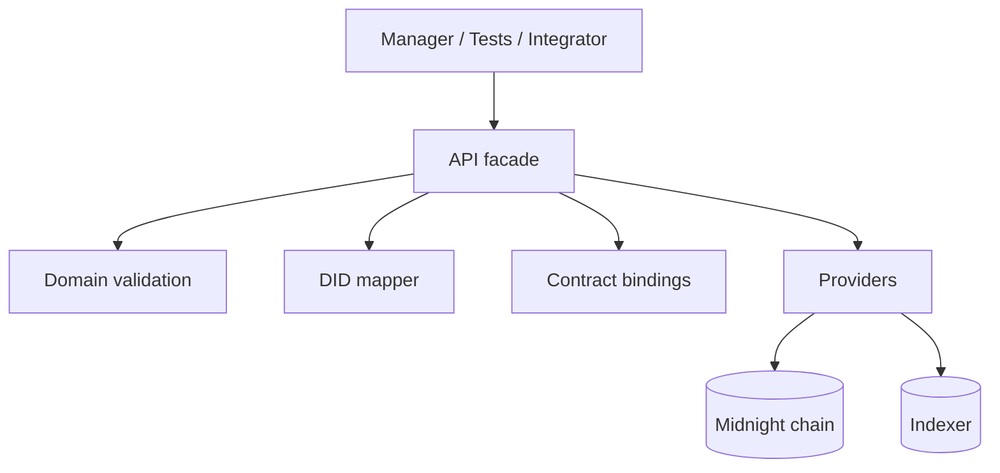
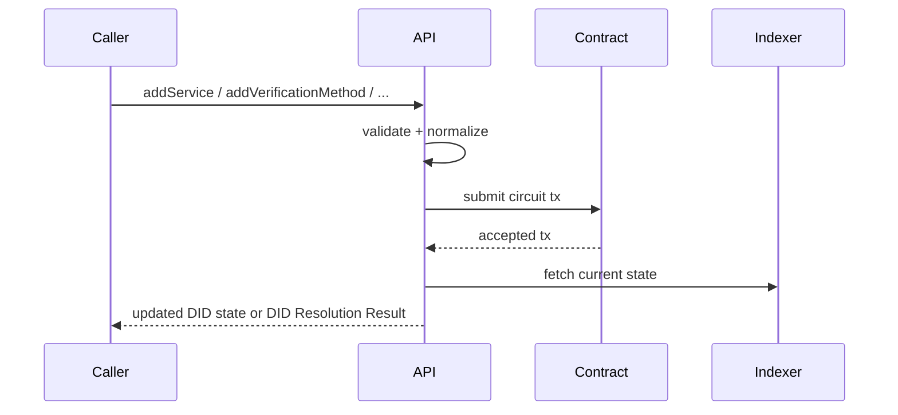

# @midnight-ntwrk/midnight-did-api

Programmatic API for creating, updating, deactivating, and resolving Midnight DIDs.

## Responsibilities

- Build/connect providers (node, indexer, proof server)
- Submit contract circuits for DID operations
- Map inputs/outputs between app/domain and ledger/runtime
- Generate and persist DID controller private state for create/rotation flows
- Provide integration test topology and helpers
- Return DID resolution data (`didDocument`, `didDocumentMetadata`) for API callers

## Use It When

- you need programmatic DID deployment or mutation flows
- you need provider bootstrap for standalone, preprod, or env-driven mainnet
- you are building a higher-level application and do not want to manage raw contract/runtime wiring

## Architecture



## Update Sequence



## State Model

API enforces lifecycle rules around:

- active DID: allows updates
- deactivated DID: mutating operations rejected
- controller rotation: generates a new wallet-local secret, derives the next controller public key locally, submits the rotation circuit, and stores the new secret after the transaction succeeds

(Exact schema/canonicalization rules live in `domain`.)

## Resolution Responses

The API package exposes both convenience and DID Core envelope helpers.
`resolve` returns the ledger-derived DID Document and DID Document metadata, or
`null` when the contract state is missing. `resolveDIDResolutionResult` returns
the full DID Core Resolution Result envelope with `didResolutionMetadata`.
Successful abstract `resolve` responses must not set
`didResolutionMetadata.contentType`; that field is reserved for
`resolveRepresentation` responses where the body is a DID Document byte stream.

## Build & Test

- Build: `pnpm --filter ./packages/api build`
- Typecheck examples: `pnpm --filter ./packages/api typecheck:examples`
- API import discipline: `pnpm run check:api-source-imports`
- DID package import discipline: `pnpm run check:source-imports`
- Unit tests: `pnpm --filter ./packages/api test`
- Integration tests: `pnpm --filter ./packages/api test-api`

API TypeScript source and tests use explicit `.js` or `.json` extensions for
relative imports, including Vitest mocks. This keeps the package aligned with
the emitted ESM graph and avoids resolver-only test behavior.
The wider `check:source-imports` guard applies the same rule to all DID-owned
TypeScript package sources outside generated `src/managed` artifacts.

## Runtime Profiles

- `StandaloneConfig`
- `TestnetLocalConfig`
- `TestnetRemoteConfig`
- `PreprodConfig`
- `MainnetConfig`
- `ProfileConfig`

Defaults:

- all profile defaults live in `src/config-profiles.ts`
- `PreprodConfig` and `MainnetConfig` use public indexer v4 endpoints (`/api/v4/graphql` + `/ws`).
- `MainnetConfig` defaults to local proof server (`http://127.0.0.1:6300`) so it can be used with local proving while targeting mainnet indexer/node.
- constructing any profile config calls `setNetworkId()` through `applyMidnightNetworkProfile()`, so wallet and contract operations see the correct Midnight network before they start.

The docs site publishes the generated endpoint matrix at
<https://midnightntwrk.github.io/midnight-did/guide/network-endpoints>; it is
generated from `src/config-profiles.ts` during docs preparation and validation.

You can still override `MainnetConfig` endpoints explicitly when needed. New
tooling should use `ProfileConfig` when the profile name is data-driven rather
than hard-coded in a class constructor. Every `ProfileConfig` instance exposes
the resolved `profileName` so logs and operator tooling can report the active
profile without inferring it from URLs.

## Network Mapping Helpers

Use the typed mapping helpers when converting between Midnight runtime network
ids and DID-domain network names:

- `RuntimeToDomain.NetworkMap`: maps runtime `NetworkId` values to DID-domain
  `MidnightNetwork` values.
- `DomainToRuntime.NetworkMap`: maps DID-domain `MidnightNetwork` values back
  to runtime `NetworkId` values.
- `RuntimeToDomainNetworkMap` and `DomainToRuntimeNetworkMap`: readonly public
  type aliases exported from the package barrel for downstream configuration
  and test helpers.

The older `NetworkMapping` export is a compatibility alias for
`RuntimeToDomain.NetworkMap`. New code should prefer the direction-specific
helpers so map intent is visible at the call site.

Provider adapters for proof, indexer, and ZK configuration are loaded lazily by
`configureProviders()`. Importing the API package barrel for mapping helpers,
types, or examples does not load those runtime adapters.

## Release Artifact Metadata

The package embeds ZK artifact locations for its own published version:

```ts
import {
  MIDNIGHT_DID_API_VERSION,
  createMidnightDidZkArtifactLocations,
} from "@midnight-ntwrk/midnight-did-api";

const locations = createMidnightDidZkArtifactLocations(MIDNIGHT_DID_API_VERSION);
```

Use `locations.ghcr.reference` to pull the matching GHCR OCI artifact in Node or
CI tooling. RC and final release versions also include
`locations.githubRelease.archiveUrl`; snapshot versions publish workflow
artifacts and GHCR artifacts only, so `locations.githubRelease` is `null`.

When the ZK bundle is unpacked outside the installed package, set
`MIDNIGHT_DID_ZK_CONFIG_PATH` to the directory containing `manifest.json`,
`keys/`, and `zkir/` before importing `@midnight-ntwrk/midnight-did-api`.
Without this override, the API uses the managed artifacts bundled with the
installed contract package when available.

`setLogger()` is optional for embedders. Until it is called, API helpers use a
no-op logger so wallet/provider setup can run in minimal scripts without
preconfiguring logging.

## Main Source Files

- `src/index.ts`
- `src/lib.ts` public compatibility facade
- `src/config-profiles.ts` network profile catalog and network-id application
- `src/deploy.ts` contract deployment, join, and private-state initialization
- `src/providers.ts` provider composition for DID runtime dependencies
- `src/private-state-storage.ts` private-state storage account/password wiring
- `src/transaction-intents.ts` manual unshielded intent signing workaround
- `src/wallet-context.ts` SDK wallet construction and restore context assembly
- `src/wallet-dust.ts` dust-registration workflow helper
- `src/wallet-provider.ts` wallet facade to Midnight wallet/provider adapter
- `src/wallet-state.ts` wallet snapshot, sync, balance, and funding wait helpers
- `src/wallet.ts` wallet construction and restore facade
- `src/wallet-keys.ts` seed parsing, HD key derivation, and unshielded address helpers
- `src/wallet-sdk-config.ts` shared wallet SDK configuration builders
- `src/lightweight.ts` stateless crypto helpers only; wallet wait behavior lives
  in `src/wallet-state.ts`
- `src/did-subject.ts` DID subject and bound fragment normalization
- `src/ledger-mappers.ts` DID document domain-to-ledger DTO mapping helpers
- `src/update.ts` DID document update, deactivate, and resolve orchestration
- `src/types.ts`
- `src/test/`

Type-safety policy:

- production API source must not use `as any` casts
- `as unknown as` casts must be explicitly allowlisted in
  `pnpm run check:did-surface-discipline`
- keep SDK type mismatches localized behind narrow adapter helpers and update
  the surface-discipline guard when an intentional compatibility escape hatch is
  unavoidable

Legacy deep source files `src/contract-lifecycle.ts` and `src/did-operations.ts`
remain as short-lived deprecation shims for external deep source-path imports.
Internal code should use the split modules above, and package consumers should
import from `@midnight-ntwrk/midnight-did-api`.

## Deploy And Update Example

See `examples/README.md`, `examples/deploy-did.ts`, and
`examples/update-did.ts` for package-local deploy/update flows that use only API
package exports. Resolver services, DID manager UI, and reusable secret storage
stay in `midnight-did-resolver`.

## Integration Teardown

`packages/api/src/test/commons.ts` now uses:

- unique compose project names per run
- `env.down({ removeVolumes: true })`
- fallback `docker compose down --volumes --remove-orphans`

This reduces container/volume leaks when tests fail mid-run.
