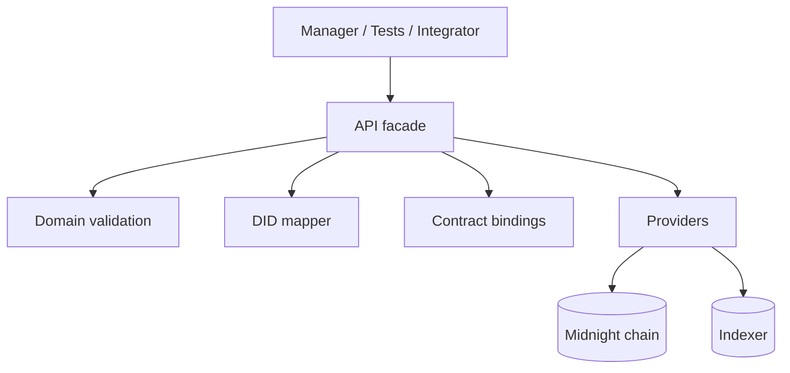
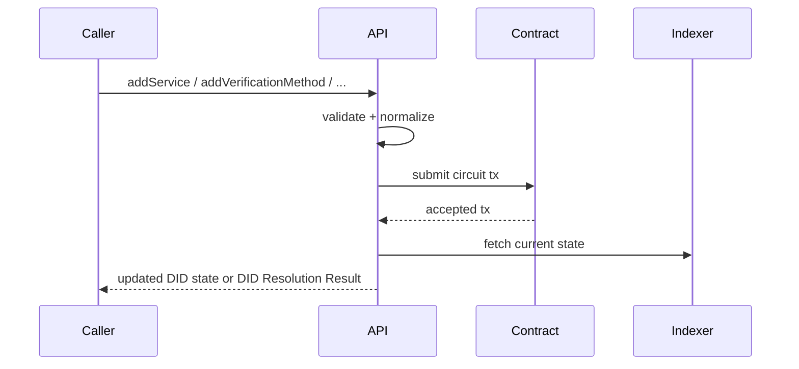

# @midnight-ntwrk/midnight-did-api

Programmatic API for creating, updating, deactivating, and resolving Midnight DIDs.

## Responsibilities

- Build/connect providers (node, indexer, proof server)
- Submit contract circuits for DID operations
- Map inputs/outputs between app/domain and ledger/runtime
- Provide integration test topology and helpers
- Return DID Resolution Result objects (`didDocument`, `didResolutionMetadata`, `didDocumentMetadata`)

## Use It When

- you need programmatic DID deployment or mutation flows
- you need provider bootstrap for standalone, preprod, or env-driven mainnet
- you are building a higher-level application and do not want to manage raw packages/contract/runtime wiring

## Architecture

## Update Sequence

## State Model

API enforces lifecycle rules around:
- active DID: allows updates
- deactivated DID: mutating operations rejected

(Exact schema/canonicalization rules live in `domain`.)

## Build & Test

- Build: `npm run build -w ./packages/api`
- Unit tests: `npm run test -w ./packages/api`
- Integration tests: `npm run test-api -w ./packages/api`

## Runtime Profiles

- `StandaloneConfig`
- `PreprodConfig`
- `MainnetConfig`

Defaults:
- `PreprodConfig` and `MainnetConfig` use public indexer v4 endpoints (`/api/v4/graphql` + `/ws`).
- `MainnetConfig` defaults to local proof server (`http://127.0.0.1:6300`) so it can be used with local proving while targeting mainnet indexer/node.

You can still override `MainnetConfig` endpoints explicitly when needed.

## Main Source Files

- `src/index.ts`
- `src/lib.ts`
- `src/types.ts`
- `src/test/`

## Integration Teardown

`packages/api/src/test/commons.ts` now uses:
- unique compose project names per run
- `env.down({ removeVolumes: true })`
- fallback `docker compose down --volumes --remove-orphans`

This reduces container/volume leaks when tests fail mid-run.
