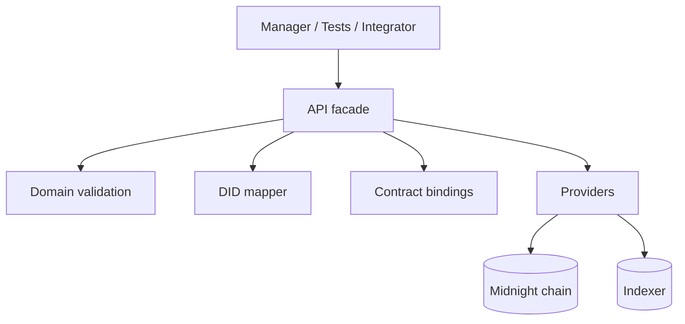
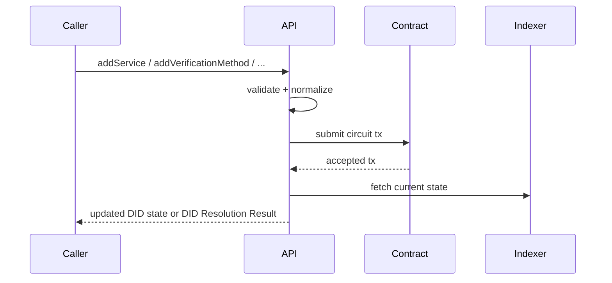

# @midnight-ntwrk/midnight-did-api

Programmatic API for creating, updating, deactivating, and resolving Midnight DIDs.

## Responsibilities

- Build/connect providers (node, indexer, proof server)
- Submit contract circuits for DID operations
- Map inputs/outputs between app/domain and ledger/runtime
- Provide integration test topology and helpers
- Return DID Resolution Result objects (`didDocument`, `didResolutionMetadata`, `didDocumentMetadata`)

## Use It When

- you need programmatic DID deployment or mutation flows
- you need provider bootstrap for standalone, preprod, or env-driven mainnet
- you are building a higher-level application and do not want to manage raw contract/runtime wiring

## Architecture

## Update Sequence

## State Model

API enforces lifecycle rules around:

- active DID: allows updates
- deactivated DID: mutating operations rejected

(Exact schema/canonicalization rules live in `domain`.)

## Build & Test

- Build: `npm run build -w ./packages/api`
- Typecheck examples: `npm run typecheck:examples -w ./packages/api`
- Unit tests: `npm run test -w ./packages/api`
- Integration tests: `npm run test-api -w ./packages/api`

## Runtime Profiles

- `StandaloneConfig`
- `PreprodConfig`
- `MainnetConfig`

Defaults:

- `PreprodConfig` and `MainnetConfig` use public indexer v4 endpoints (`/api/v4/graphql` + `/ws`).
- `MainnetConfig` defaults to local proof server (`http://127.0.0.1:6300`) so it can be used with local proving while targeting mainnet indexer/node.

You can still override `MainnetConfig` endpoints explicitly when needed.

## Main Source Files

- `src/index.ts`
- `src/lib.ts` public compatibility facade
- `src/deploy.ts` contract deployment, join, and private-state initialization
- `src/providers.ts` wallet-to-provider wiring
- `src/private-state-storage.ts` private-state storage account/password wiring
- `src/transaction-intents.ts` manual unshielded intent signing workaround
- `src/wallet-dust.ts` dust-registration workflow helper
- `src/wallet-state.ts` wallet snapshot, sync, balance, and funding wait helpers
- `src/wallet.ts` wallet construction and restore facade
- `src/wallet-keys.ts` seed parsing, HD key derivation, and unshielded address helpers
- `src/wallet-sdk-config.ts` shared wallet SDK configuration builders
- `src/did-subject.ts` DID subject and bound fragment normalization
- `src/ledger-mappers.ts` DID document domain-to-ledger DTO mapping helpers
- `src/update.ts` DID document update, deactivate, and resolve orchestration
- `src/types.ts`
- `src/test/`

Legacy deep source files `src/contract-lifecycle.ts` and `src/did-operations.ts`
remain as short-lived deprecation shims for external deep source-path imports.
Internal code should use the split modules above, and package consumers should
import from `@midnight-ntwrk/midnight-did-api`.

## Deploy And Update Example

See `examples/README.md`, `examples/deploy-did.ts`, and
`examples/update-did.ts` for package-local deploy/update flows that use only API
package exports. Resolver services, DID manager UI, and reusable secret storage
stay in `midnight-did-resolver`.

## Integration Teardown

`packages/api/src/test/commons.ts` now uses:

- unique compose project names per run
- `env.down({ removeVolumes: true })`
- fallback `docker compose down --volumes --remove-orphans`

This reduces container/volume leaks when tests fail mid-run.
