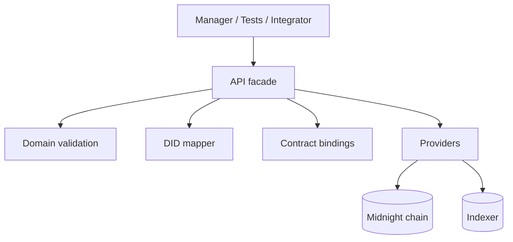
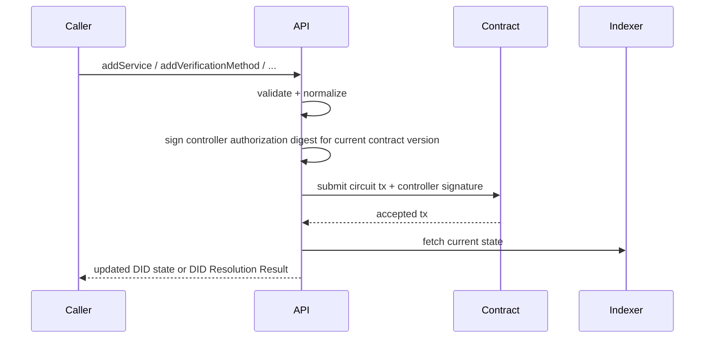

# @midnight-ntwrk/midnight-did-api

Programmatic API for creating, updating, deactivating, and resolving Midnight DIDs.

## Responsibilities

- Build/connect providers (node, indexer, proof server)
- Submit contract circuits for DID operations
- Map inputs/outputs between app/domain and ledger/runtime
- Generate and persist DID controller private state for create/rotation flows
- Provide integration test topology and helpers
- Return DID resolution data (`didDocument`, `didDocumentMetadata`) for API callers

## Use It When

- you need programmatic DID deployment or mutation flows
- you need provider bootstrap for standalone, preprod, or env-driven mainnet
- you are building a higher-level application and do not want to manage raw contract/runtime wiring

## Architecture



## Update Sequence



## State Model

API enforces lifecycle rules around:

- active DID: allows updates
- deactivated DID: mutating operations rejected
- controller authorization: signs a domain-separated digest containing contract id, current version, operation name, and operation arguments before each controller-gated mutation
- controller rotation: generates a new wallet-local secret, persists it in a pending slot, derives the next controller public key locally, and submits the rotation circuit with a current-version controller signature. The pending secret is promoted and cleared only after finalized transaction data returns; ambiguous submission/finality failures retain it for ledger reconciliation
- controller recovery: a dedicated `recoveryAuthorityPublicKey` can authorize `recoverControllerKey` to rotate the active controller key; ordinary controller-gated operations require only the active controller secret, while recovery requires the matching recovery secret

(Exact schema/canonicalization rules live in `domain`.)

## Explicit Verification-Method Removal

`removeVerificationMethod` and `removeSchnorrJubjubVerificationMethod` each
submit at most one removal circuit call. They never remove DID verification
relationships implicitly. If the method is still referenced, the API rejects
before signing or submission with `VerificationMethodReferencedError`:

- `code` is `verification_method_referenced`;
- `methodId` is the selected physical ledger identifier;
- `relations` lists current references in canonical DID relation order.

Applications choose the cleanup order by calling
`removeVerificationMethodRelation` once per relationship and then calling the
method-removal helper. These independently finalized transactions are not
atomic. After an ambiguous or partial failure, re-read ledger/DID state, skip
operations already reflected on-chain, and submit only the outstanding steps.
Removing an absent relationship remains an explicit error rather than an
idempotent no-op. The Compact removal circuits independently reject referenced
methods, so API preflight is useful typed feedback but not the authority for
direct callers or concurrent updates.

## Controller Secret Recovery Posture

The API package can initialize, persist, rotate, recover, and restore private
state that authorizes DID updates. It cannot recover secrets from ledger state,
but it can submit `recoverControllerKey` when private state contains, or the
caller explicitly supplies, the `recoverySecretKey` matching the on-ledger
`recoveryAuthorityPublicKey`. Explicitly supplied recovery secrets are used for
that recovery call and are not newly persisted into active private state, though
an already stored recovery secret that matches the on-ledger recovery authority
is preserved when the new controller secret is promoted.

If rotation or recovery submission throws without finalized transaction data, the
API retains the pending replacement secret because receipt loss cannot prove that
the on-chain operation failed. Re-read the on-ledger `controllerPublicKey` before
retrying. If the replacement public key is active, promote the retained secret
with
`recoverPendingControllerPrivateState(providers, { rotationFinalized: true })`.
If the old public key is still active, discard that candidate explicitly with
`discardPendingControllerPrivateState(providers, { rotationFinalized: false })`
before starting another attempt. That explicit assertion also permits removal of
a malformed non-null pending record, avoiding a persistent lockout; an absent
record still throws `PendingControllerPrivateStateUnavailableError`. Promotion
requires a valid pending controller state, so a missing or malformed record
throws the same stable typed error without writing active state or removing the
record. If promotion succeeds but pending cleanup fails, the helper warns,
returns the promoted state, and retains the candidate for a safe idempotent
reconciliation retry.

A new attempt made after any non-null candidate is persisted fails with
`PendingControllerPrivateStateExistsError`. A rotation, recovery, promotion, or
discard racing an in-flight pending-state lifecycle fails with
`PendingControllerPrivateStateBusyError`; neither error can replace, promote, or
remove that operation's candidate.

`bindPrivateStateProvider` records the canonical contract address as the
process-local lock identity. Calls through different provider wrappers bound by
this API to the same DID therefore share one pending-controller critical section
from before active/recovery private-state and ledger preflight through candidate
persistence, authorization, transaction-call attempt, active promotion, and
pending cleanup. While either the provider's current lock
identity or the requested DID identity is reserved, `bindPrivateStateProvider`
(and therefore `joinContract`) fails closed with
`PendingControllerPrivateStateBusyError` before changing the provider address;
this also rejects same-address rebinding during the lifecycle. Calling
`privateStateProvider.setContractAddress` directly bypasses this API coordination
and MUST NOT occur during rotation, recovery, promotion/discard reconciliation,
or pending cleanup. Explicitly unbound custom/test wrappers fall back to provider
object identity. The provider API exposes no cross-process compare-and-set
primitive: separate processes and independently unbound wrappers writing one DID
private-state store MUST use an external per-DID single-writer lock. The API does
not claim cross-process CAS, and its reservations cannot protect direct provider
mutation or operations in another process.

Applications should back up controller and recovery private state alongside
their wallet backup material, protect it with custody controls appropriate for
production signing keys, and test restore/recovery flows before relying on a DID.
Private state created before the recovery-authority contract surface contains no
recovery secret; it can still authorize ordinary controller-gated operations when
paired with a compatible contract, but it cannot submit `recoverControllerKey`
unless the recovery secret is imported or supplied explicitly. If both the active
controller secret and recovery secret are lost, the DID remains publicly
resolvable but cannot be updated, rotated, recovered, or deactivated by this
method version. Organizational operators that need multi-person approval or
social recovery should implement that policy before the API call that signs a
controller or recovery authorization; the contract still receives one signature
for the selected operation.

## Resolution Responses

The API package exposes both convenience and DID Core envelope helpers.
`resolve` returns the ledger-derived DID Document and DID Document metadata, or
`null` when the contract state is missing. `resolveDIDResolutionResult` returns
the full DID Core Resolution Result envelope with `didResolutionMetadata`.
Successful abstract `resolve` responses must not set
`didResolutionMetadata.contentType`; that field is reserved for
`resolveRepresentation` responses where the body is a DID Document byte stream.

The API package also exports `resolveRepresentation(providers, didContract,
options)`. It delegates to the shared `MidnightDIDResolver` and returns
`didDocumentStream` as a `Uint8Array | null` (null on resolution errors),
`didDocumentMetadata`, and `didResolutionMetadata`. This is the package boundary intended for
`midnight-did-resolver`: the downstream service owns HTTP routing and status
codes, while this package owns ledger access, representation selection, and DID
resolution errors.

## Build & Test

- Build: `pnpm --filter ./packages/api build`
- Typecheck examples: `pnpm --filter ./packages/api typecheck:examples`
- API import discipline: `pnpm run check:api-source-imports`
- DID package import discipline: `pnpm run check:source-imports`
- Unit tests: `pnpm --filter ./packages/api test`
- Integration tests: `pnpm --filter ./packages/api test-api`

API TypeScript source and tests use explicit `.js` or `.json` extensions for
relative imports, including Vitest mocks. This keeps the package aligned with
the emitted ESM graph and avoids resolver-only test behavior.
The wider `check:source-imports` guard applies the same rule to all DID-owned
TypeScript package sources outside generated `src/managed` artifacts.

## Runtime Profiles

- `StandaloneConfig`
- `TestnetLocalConfig`
- `TestnetRemoteConfig`
- `PreprodConfig`
- `MainnetConfig`
- `ProfileConfig`

Defaults:

- all profile defaults live in `src/config-profiles.ts`
- `PreprodConfig` and `MainnetConfig` use public indexer v4 endpoints (`/api/v4/graphql` + `/ws`).
- `MainnetConfig` defaults to local proof server (`http://127.0.0.1:6300`) so it can be used with local proving while targeting mainnet indexer/node.
- constructing any profile config calls `setNetworkId()` through `applyMidnightNetworkProfile()`, so wallet and contract operations see the correct Midnight network before they start.

The docs site publishes the generated endpoint matrix at
<https://midnightntwrk.github.io/midnight-did/guide/network-endpoints>; it is
generated from `src/config-profiles.ts` during docs preparation and validation.

You can still override `MainnetConfig` endpoints explicitly when needed. New
tooling should use `ProfileConfig` when the profile name is data-driven rather
than hard-coded in a class constructor. Every `ProfileConfig` instance exposes
the resolved `profileName` so logs and operator tooling can report the active
profile without inferring it from URLs.

## Network Mapping Helpers

Use the typed mapping helpers when converting between Midnight runtime network
ids and DID-domain network names:

- `RuntimeToDomain.NetworkMap`: maps runtime `NetworkId` values to DID-domain
  `MidnightNetwork` values.
- `DomainToRuntime.NetworkMap`: maps DID-domain `MidnightNetwork` values back
  to runtime `NetworkId` values.
- `RuntimeToDomainNetworkMap` and `DomainToRuntimeNetworkMap`: readonly public
  type aliases exported from the package barrel for downstream configuration
  and test helpers.

The older `NetworkMapping` export is a compatibility alias for
`RuntimeToDomain.NetworkMap`. New code should prefer the direction-specific
helpers so map intent is visible at the call site.

Provider adapters for proof, indexer, and ZK configuration are loaded lazily by
`configureProviders()`. Importing the API package barrel for mapping helpers,
types, or examples does not load those runtime adapters.

## Release Artifact Metadata

The package embeds ZK artifact locations for its own published version:

```ts
import {
  MIDNIGHT_DID_API_VERSION,
  createMidnightDidZkArtifactLocations,
} from "@midnight-ntwrk/midnight-did-api";

const locations = createMidnightDidZkArtifactLocations(MIDNIGHT_DID_API_VERSION);
```

Use `locations.ghcr.reference` to pull the matching GHCR OCI artifact in Node or
CI tooling. RC and final release versions also include
`locations.githubRelease.archiveUrl`; snapshot versions publish workflow
artifacts and GHCR artifacts only, so `locations.githubRelease` is `null`.

Node consumers can download, verify, and unpack GitHub Release assets directly:

```ts
import {
  downloadMidnightDidGithubReleaseZkArtifacts,
  MIDNIGHT_DID_API_VERSION,
} from "@midnight-ntwrk/midnight-did-api";

const bundle = await downloadMidnightDidGithubReleaseZkArtifacts({
  version: MIDNIGHT_DID_API_VERSION,
  outputDir: ".midnight-did-zk",
});

process.env.MIDNIGHT_DID_ZK_CONFIG_PATH = bundle.zkConfigPath;
```

`bundle.zkConfigPath` is the directory to pass to `NodeZkConfigProvider` or to
expose from an HTTP server for `FetchZkConfigProvider`. The helper verifies the
release `.sha256` file, checks that the downloaded manifest matches the embedded
archive manifest, and validates every circuit file checksum before returning.
When `outputDir`, `tempDir`, or `pullDir` are omitted, helper-created
directories are retained because `bundle.archivePath` and `bundle.zkConfigPath`
point into them. Callers that need deterministic cleanup should pass explicit
directories and remove them after the ZK provider no longer needs the files.
For GHCR OCI artifacts, use `pullMidnightDidGhcrZkArtifacts()` in an environment
with the `oras` CLI available.

When the ZK bundle is unpacked outside the installed package, set
`MIDNIGHT_DID_ZK_CONFIG_PATH` to the directory containing `manifest.json`,
`keys/`, and `zkir/` before importing `@midnight-ntwrk/midnight-did-api`.
Without this override, the API uses the managed artifacts bundled with the
installed contract package when available.

`setLogger()` is optional for embedders. Until it is called, API helpers use a
no-op logger so wallet/provider setup can run in minimal scripts without
preconfiguring logging.

## Main Source Files

- `src/index.ts`
- `src/lib.ts` public compatibility facade
- `src/config-profiles.ts` network profile catalog and network-id application
- `src/deploy.ts` contract deployment, join, and private-state initialization
- `src/providers.ts` provider composition for DID runtime dependencies
- `src/private-state-storage.ts` private-state storage account/password wiring
- `src/transaction-intents.ts` manual unshielded intent signing workaround
- `src/wallet-context.ts` SDK wallet construction and restore context assembly
- `src/wallet-dust.ts` dust-registration workflow helper
- `src/wallet-provider.ts` wallet facade to Midnight wallet/provider adapter
- `src/wallet-state.ts` wallet snapshot, sync, balance, and funding wait helpers
- `src/wallet.ts` wallet construction and restore facade
- `src/wallet-keys.ts` seed parsing, HD key derivation, and unshielded address helpers
- `src/wallet-sdk-config.ts` shared wallet SDK configuration builders
- `src/lightweight.ts` stateless crypto helpers only; wallet wait behavior lives
  in `src/wallet-state.ts`
- `src/did-subject.ts` DID subject and bound fragment normalization
- `src/ledger-mappers.ts` DID document domain-to-ledger DTO mapping helpers
- `src/update.ts` DID document update, deactivate, and resolve orchestration
- `src/types.ts`
- `src/test/`

Type-safety policy:

- production API source must not use `as any` casts
- `as unknown as` casts must be explicitly allowlisted in
  `pnpm run check:did-surface-discipline`
- keep SDK type mismatches localized behind narrow adapter helpers and update
  the surface-discipline guard when an intentional compatibility escape hatch is
  unavoidable

Legacy deep source files `src/contract-lifecycle.ts` and `src/did-operations.ts`
remain as short-lived deprecation shims for external deep source-path imports.
Internal code should use the split modules above, and package consumers should
import from `@midnight-ntwrk/midnight-did-api`.

## Deploy And Update Example

See `examples/README.md`, `examples/deploy-did.ts`, and
`examples/update-did.ts` for package-local deploy/update flows that use only API
package exports. Resolver services, DID manager UI, and reusable secret storage
stay in `midnight-did-resolver`.

## Integration Teardown

`packages/api/src/test/commons.ts` now uses:

- unique compose project names per run
- `env.down({ removeVolumes: true })`
- fallback `docker compose down --volumes --remove-orphans`

This reduces container/volume leaks when tests fail mid-run.
