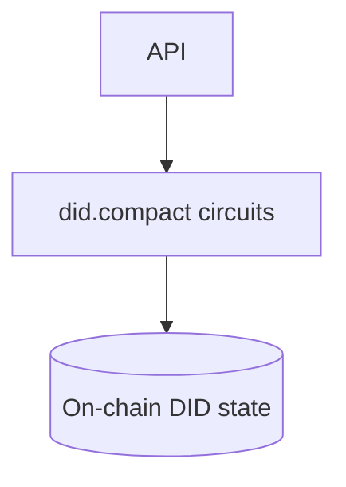
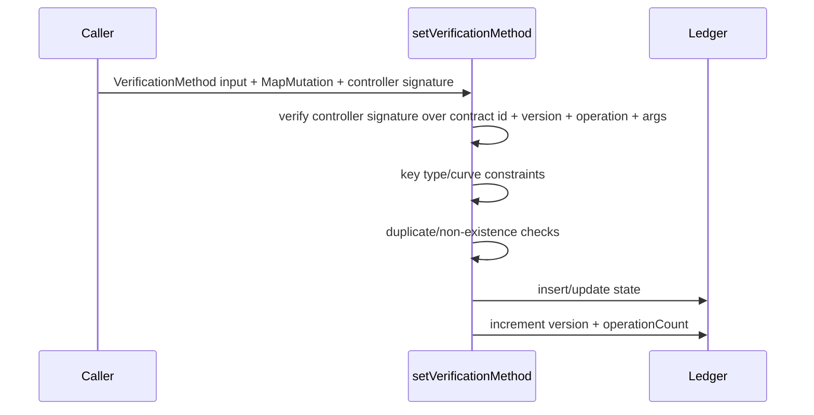
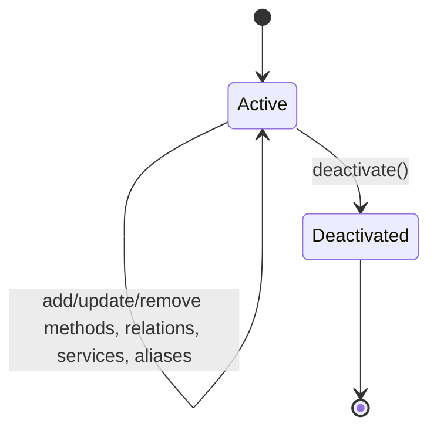

# @midnight-ntwrk/midnight-did-contract

Compact smart-contract implementation for Midnight DID ledger state.

## Responsibilities

- Store DID state on-ledger (methods, relations, services, aliases, metadata)
- Enforce on-chain invariants and authorization checks
- Expose circuits for DID lifecycle operations

## Architecture

## Circuit Flow (example: set verification method)

## On-ledger State Lifecycle

## Build & Test

- Compile compact artifacts only: `pnpm --filter ./packages/contract contract`
- Build prepared package outputs: `pnpm --filter ./packages/contract build:prepared`
- Tests: `pnpm --filter ./packages/contract test -- --pool=threads`
- Coverage: `pnpm --filter ./packages/contract coverage`

## Notes

- Contract-level checks focus on enforceable on-chain invariants.
- Some full DID conformance checks are intentionally handled at SDK/domain layers.
- Controller public keys can be derived locally with `deriveControllerPublicKey(secretKey)` as Jubjub points. Controller-gated circuits verify wallet-local signatures over a domain-separated digest containing the DID contract id, current version, operation name, and operation arguments.
- Set/update circuits use explicit `MapMutation` and `SetMutation` enums so the exported circuit surface stays small without boolean intent flags.
- Jubjub signing helpers and reusable Schnorr transcript logic live in `@midnight-ntwrk/midnight-did-jubjub-schnorr`.
- The DID contract exposes one ledger-bound SchnorrJubjub verification circuit. It accepts a verification method id, looks up the native `JubjubPoint` stored in `schnorrJubjubVerificationMethods`, and verifies against that ledger key rather than a caller-supplied public key.
- Circuit `k`, rows, and managed artifact byte sizes are documented in `docs-site/compact/index.md`.
