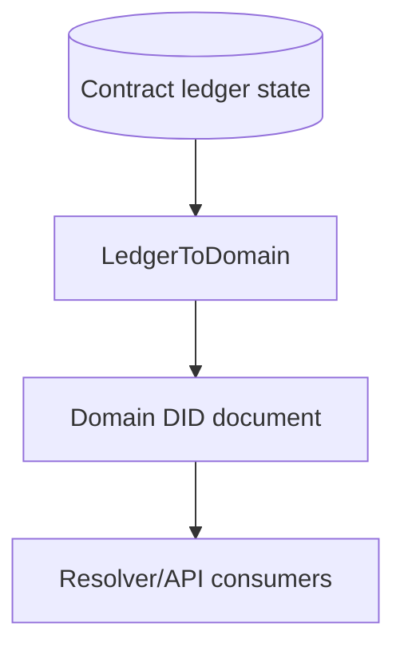
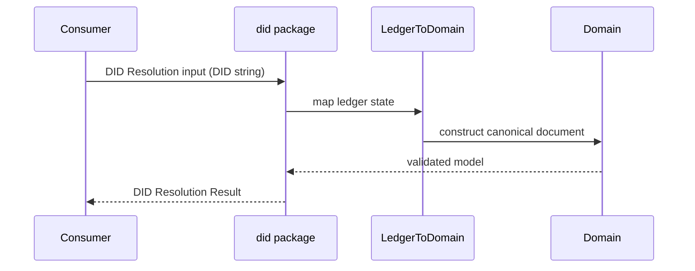
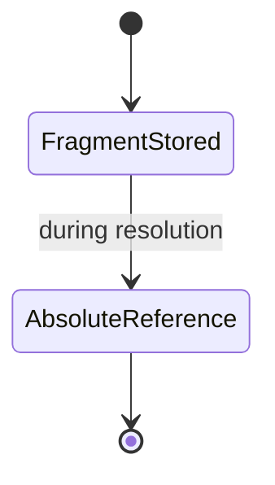

# @midnight-ntwrk/midnight-did

Mapping layer between on-ledger contract state and DID Core-compatible domain documents.

## Responsibilities

- Convert contract ledger data to domain DID documents
- Resolve canonical absolute DID URLs from stored fragment identifiers
- Provide network/identifier utilities for `did:midnight`

## Architecture

## Resolution Sequence

## Identifier Canonicalization

Resolution output uses absolute DID URL references where required by DID Core,
while compact fragment identifiers may still be used in ledger storage.

## Build & Test

- Build: `npm run build -w ./packages/did`
- Test: `npm run test -w ./packages/did -- --pool=threads`
- Coverage: `npm run coverage -w ./packages/did`
