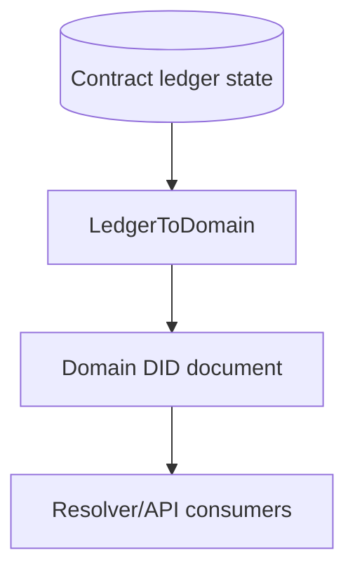
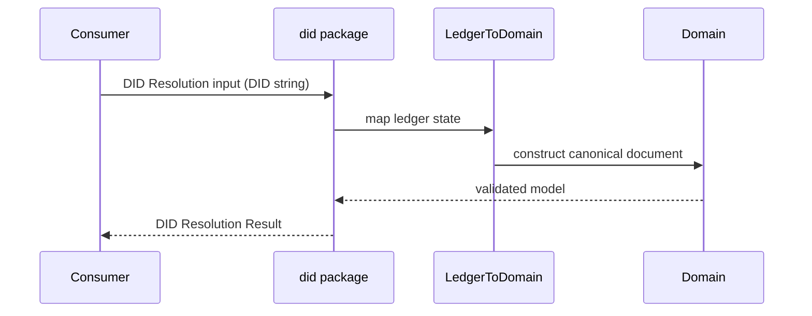
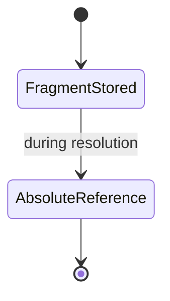

# @midnight-ntwrk/midnight-did

Mapping layer between on-ledger contract state and DID Core-compatible domain documents.

## Responsibilities

- Convert contract ledger data to domain DID documents
- Resolve canonical absolute DID URLs from stored fragment identifiers
- Provide network/identifier utilities for `did:midnight`

## Architecture

## Resolution Sequence

## Resolution Result Shape

`MidnightDIDResolver.resolveDIDResolutionResult` returns a DID Core Resolution
Result envelope with `didDocument`, `didDocumentMetadata`, and
`didResolutionMetadata`. Successful abstract `resolve` results return an empty
`didResolutionMetadata` object and do not set `contentType`. Missing ledger
state returns `didResolutionMetadata.error = "notFound"`.

The `resolve` and `resolveResult` methods remain convenience APIs for callers
that want a DID Document directly or a nullable document-plus-metadata pair.

Use `contentType` only for `resolveRepresentation`-style responses where the
body is a DID Document byte stream. Midnight DID Document representations should
be reported as `application/did+ld+json` for JSON-LD streams or
`application/did+json` for DID Core JSON streams.

`MidnightDIDResolver.resolveRepresentation(did, { accept })` returns a
transport-neutral `Uint8Array | null` stream and DID Core resolution metadata.
The stream is null on resolution errors. The
default representation is `application/did+ld+json`; callers may request
`application/did+json`. Unsupported media types return
`representationNotSupported` without reading ledger state. A downstream HTTP
resolver should use this result for its response body and map only the result's
metadata/error to HTTP behavior.

## Identifier Canonicalization

Resolution output uses absolute DID URL references where required by DID Core,
while compact fragment identifiers may still be used in ledger storage.

## Build & Test

- Build: `pnpm --filter ./packages/did build`
- Test: `pnpm --filter ./packages/did test -- --pool=threads`
- Coverage: `pnpm --filter ./packages/did coverage`
