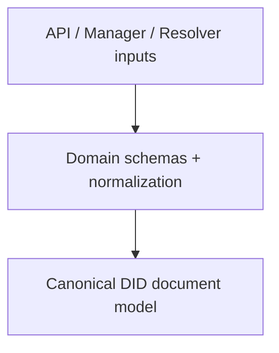
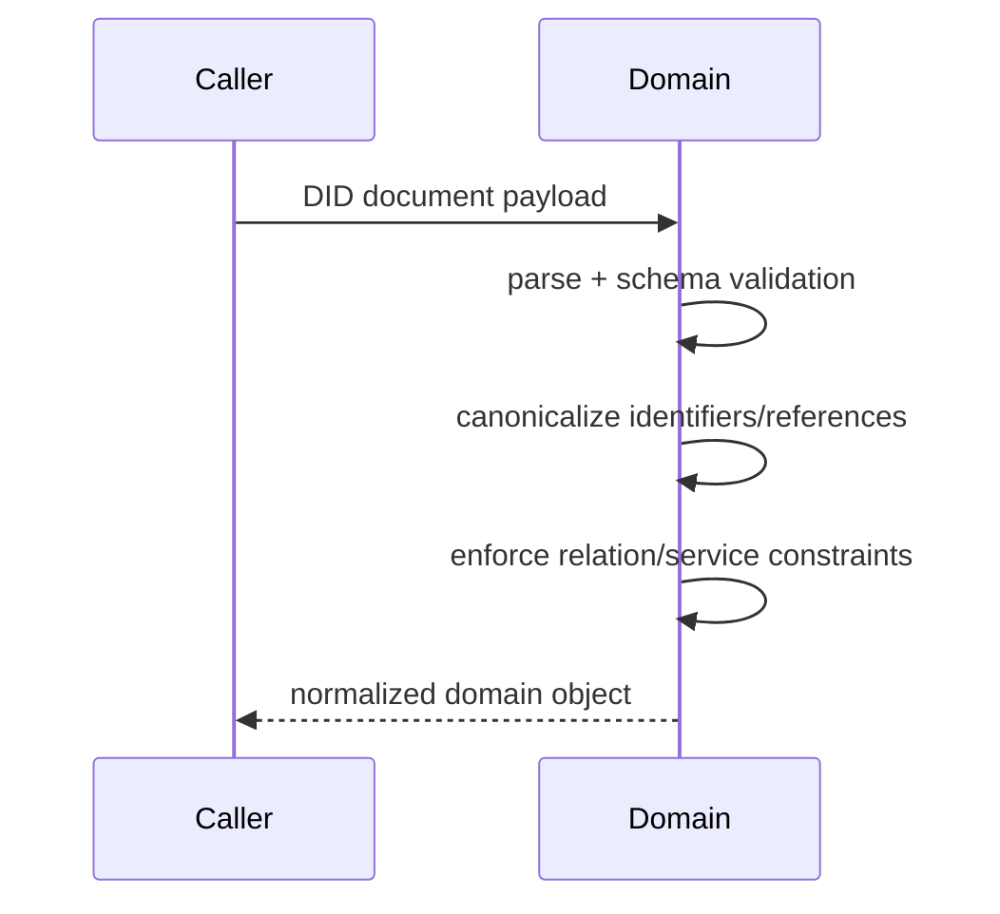
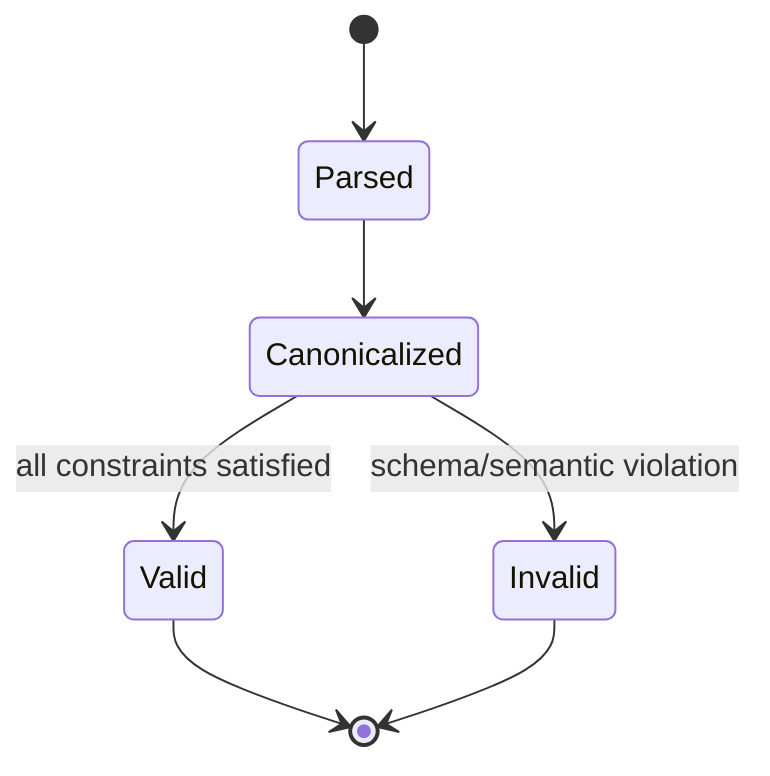

# @midnight-ntwrk/midnight-did-domain

Domain model and validation layer for Midnight DID documents and metadata.

## Responsibilities

- DID/DID URL parsing and validation
- DID Document schemas and normalization
- Canonical reference handling (fragment vs absolute DID URL)
- Service endpoint and key schema constraints

## Architecture

## Normalization Sequence

## DID Document Validation State (conceptual)

## Build & Test

- Build: `pnpm --filter ./packages/domain build`
- Test: `pnpm --filter ./packages/domain test`
- Coverage: `pnpm --filter ./packages/domain coverage`

## Notes

- Domain is pure TypeScript and intentionally runtime-agnostic.
- API/Manager/Resolver depend on this package for consistent behavior.
