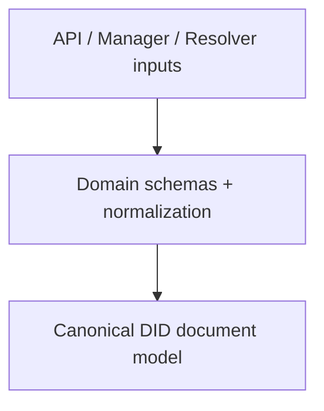
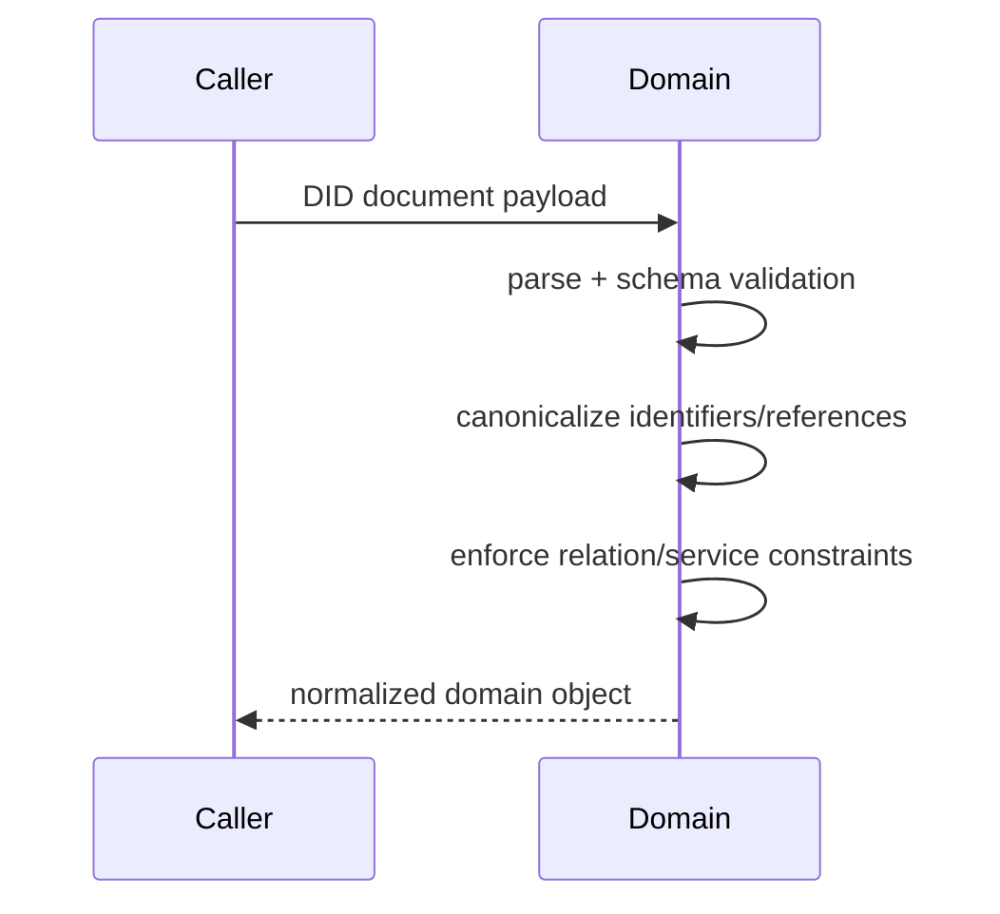
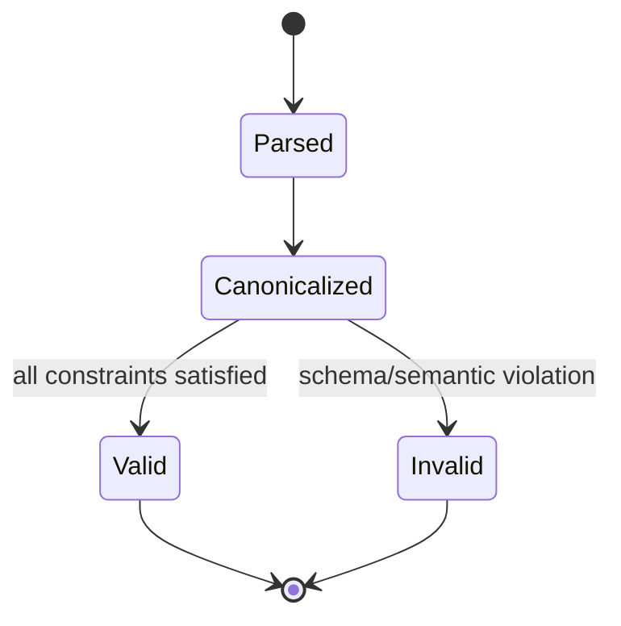

# @midnight-ntwrk/midnight-did-domain

Domain model and validation layer for Midnight DID documents and metadata.

## Responsibilities

- DID/DID URL parsing and validation
- DID Document schemas and normalization
- Lossless RFC3986 DID URL reference resolution
- Service endpoint and key schema constraints

## Architecture



## Normalization Sequence



## DID Document Validation State (conceptual)



## Identifier/reference normalization

`resolveDIDURLReference` accepts an absolute URL/DID or a relative DID URL
reference and resolves it against the bare DID subject. Canonical identities
are absolute and preserve path, query, and fragment components:

```text
#svc                  -> did:midnight:...#svc
/routing              -> did:midnight:.../routing
?service=messaging    -> did:midnight:...?service=messaging
/a#svc                != did:midnight:.../b#svc
```

Use the resolved value for ledger keys, duplicate checks, API mutations, and
resolver output. Do not reduce a path or query reference to its fragment.

## Resolution Metadata

`DIDResolutionResultSchema` accepts DID Core resolution envelopes so resolver
services can validate abstract resolution payloads and accept
representation-response metadata. For successful abstract `resolve` responses,
`didResolutionMetadata.contentType` should be omitted. For
`resolveRepresentation` responses, `contentType` describes the returned DID
Document stream and should be `application/did+ld+json` or
`application/did+json`.

When resolution fails, `didResolutionMetadata.error` should use DID Core's
registered keywords such as `invalidDid`, `notFound`,
`representationNotSupported`, `methodNotSupported`, or `internalError`.
Extension keywords remain valid when they are a single ASCII keyword.
Resolution error keywords must start with a letter.

## Build & Test

- Build: `pnpm --filter ./packages/domain build`
- Test: `pnpm --filter ./packages/domain test`
- Coverage: `pnpm --filter ./packages/domain coverage`

## Notes

- Domain is pure TypeScript and intentionally runtime-agnostic.
- API/Manager/Resolver depend on this package for consistent behavior.
