# Lace Wallet + Midnight Passport DApp: BRD / FRD

Version: `0.1-draft`

Status: Draft

Date: 2026-04-20

---

## Table of Contents

1. [Executive Summary and Business Context](#1-executive-summary-and-business-context)
2. [Actors and Stakeholders](#2-actors-and-stakeholders)
3. [Architecture Overview](#3-architecture-overview)
4. [Use Case 1 — Wallet Initialization](#4-use-case-1--wallet-initialization)
5. [Use Case 2 — Passkey Registration](#5-use-case-2--passkey-registration)
6. [Use Case 3 — Credential Issuance via Midnight Passport DApp](#6-use-case-3--credential-issuance-via-midnight-passport-dapp)
7. [Use Case 4 — Wallet Connect, Investment, and Proof-Gated Fund Transfer](#7-use-case-4--wallet-connect-investment-and-proof-gated-fund-transfer)
8. [Data Models](#8-data-models)
9. [Privacy and Security Considerations](#9-privacy-and-security-considerations)
10. [Non-Functional Requirements](#10-non-functional-requirements)

---

## 1. Executive Summary and Business Context

### 1.1 Purpose

This document defines the business requirements (BRD) and functional requirements (FRD) for user flows in the **Lace Wallet** (web and mobile) interacting with the **Midnight Passport DApp** — a regulated DeFi investment application that uses Midnight Verifiable Credentials to enforce identity and compliance gating without over-disclosing personal data.

The document covers four end-to-end use cases:

1. Wallet initialization: creating a Midnight DID and key pairs
2. Passkey registration: unlocking the wallet via biometrics
3. Credential issuance: obtaining a Digital ID VC and a Sanction Screening VC from trusted issuers
4. Proof-gated investment: connecting an external crypto wallet, browsing investment products, and completing a fund transfer after presenting ZK-verified age and sanctions proofs on-chain

### 1.2 Business Motivation

Regulated DeFi and digital financial services require compliance with KYC/AML rules. Traditional approaches either require full identity disclosure (exposing personal data to the verifier) or provide no compliance guarantees at all.

The Midnight Credentials stack resolves this tension:

- Users prove compliance predicates (age ≥ 18, not sanctioned) using **zero-knowledge proofs** derived from issuer-attested credentials
- Verifier smart contracts receive only the proof outcome — never the underlying personal data
- Holder privacy is protected by **blinded holder-secret binding**: no stable public DID is disclosed to issuers or verifiers
- The same credentials can be reused across multiple DApps without creating a cross-DApp tracking surface

### 1.3 Target Platforms

| Platform | Notes |
|---|---|
| **Lace Web Wallet** | Browser extension + web app; uses browser WebAuthn API for passkeys |
| **Lace Mobile Wallet** | iOS and Android; uses platform authenticator (Face ID / Touch ID / fingerprint) |

Where a flow differs between web and mobile, both variants are described explicitly.

### 1.4 Relationship to Existing Specifications

This document describes the **user and business flows** that sit on top of the underlying technical specifications. It does not redefine the cryptographic or circuit-level model. Readers should consult:

- `research/midnight-credentials.md` — canonical Midnight VC/VP specification
- `research/midnight-credentials-for-dummies.md` — narrative guide to the credential layers
- `research/midnight-credentials-test-strategy.md` — credential family claim structures and test matrix
- `research/lace-wallet-midnight-dapp-gap-analysis.md` — implementation gap and prototype coverage review for this BRD/FRD
- `w3c-spec/midnight-method.md` — Midnight DID method specification

---

## 2. Actors and Stakeholders

### 2.1 Actor Definitions

| Actor | Role | Platform |
|---|---|---|
| **User / Holder** | The individual who owns a Midnight DID, holds credentials in the wallet, and interacts with the DApp | Web browser or mobile device |
| **Lace Wallet** | The Midnight-native wallet application that manages DIDs, cryptographic key pairs, credentials, and passkeys | Web extension + mobile app |
| **National ID Issuer** | A regulated trusted issuer that scans a national identity document and performs live face verification, then issues a `NationalIdCredential` VC | DApp-embedded or redirect-based issuance service |
| **Sanction Screening Issuer** | A regulated trusted issuer that accepts a selective Digital ID VP, runs the holder's data against major sanctions lists and PEP databases, and issues a `SanctionScreeningCredential` VC | DApp-embedded or redirect-based issuance service |
| **Midnight Passport DApp** | The web DApp that presents the trusted issuer directory, displays investment products, requests compliance proofs, and coordinates fund transfers | Web browser (desktop and mobile) |
| **External Crypto Wallet** | MetaMask, Coinbase Wallet, WalletConnect-compatible wallet, or Rabby Wallet; provides existing crypto holdings that the user wishes to invest through the DApp | Browser extension or mobile app |
| **Midnight Smart Contract** | The on-chain verifier and fund custody contract deployed on the Midnight network; enforces age and sanctions screening proofs before accepting a fund transfer | Midnight blockchain (Compact smart contract) |
| **Midnight Network** | The underlying blockchain infrastructure providing DID resolution, proof verification, and ledger state | Midnight preprod / mainnet nodes |
| **Device Biometric Layer** | The operating system or browser WebAuthn implementation that handles passkey creation and authentication | iOS Secure Enclave, Android StrongBox, or browser platform authenticator |

### 2.2 Actor Relationships

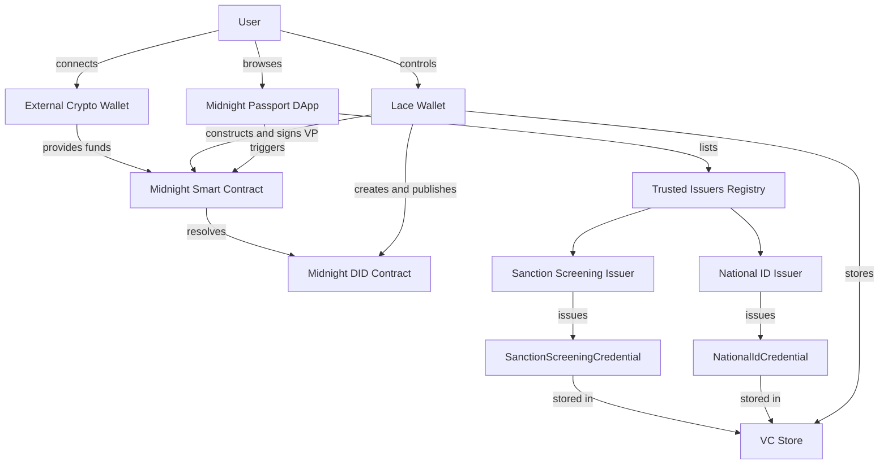

---

## 3. Architecture Overview

### 3.1 Midnight Credentials Layered Stack

The Midnight Credentials system is organized in five layers. This document describes flows that span all five layers.

| Layer | Packages / Components | Responsibility |
|---|---|---|
| **Layer 0 — ISO Registry** | `credentials-iso-registry` | Shared numeric ISO code types: country, gender, currency, region |
| **Layer 1 — Generic Capabilities** | `credentials`, `credentials-same-holder` | Generic VC/VP envelopes, proof circuits, holder-binding profiles, same-holder composition |
| **Layer 2 — Credential Families** | Target: `credentials-national-id`, `credentials-compliance`; current executable proxy: `credentials-passport-secret` | Concrete claim structures, disclosure layouts, ZK predicates per credential type |
| **Layer 3 — Business Contract** | Midnight Smart Contract (investment DApp) | On-chain proof verification, fund custody, eligibility state, capability issuance |
| **Layer 4 — Application Orchestration** | Lace Wallet, DApp frontend, `credentials-protocol` | Off-chain protocol coordination, VP construction, wallet connect, UI flows |
| **Layer 5 — Governance** | Trusted Issuers Registry | Issuer accreditation, schema version policy, DApp trust rules |

### 3.2 Component Architecture Diagram

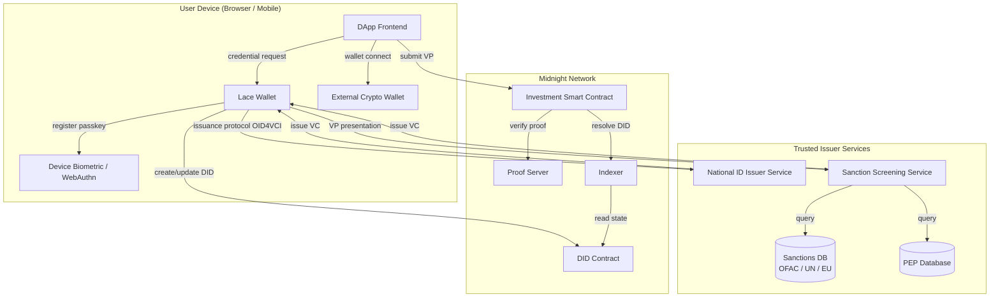

### 3.3 Key Architectural Decisions

**Holder privacy via BlindedSecretHolderBinding.** No stable public DID is disclosed to issuers or to the investment smart contract. The holder is bound to credentials through a hidden holder secret. The contract receives a ZK proof of credential validity and predicate satisfaction — not an identifier.

**Verifier-scoped pseudonyms.** The Sanction Screening Issuer may request a verifier-scoped pseudonym derived from the holder's hidden secret and the screener's domain hash. This allows the screener to correlate re-screening requests from the same user without obtaining a global tracking handle.

**Same-holder composition.** The investment contract requires proofs from two different credentials (National ID for age, Screening VC for sanctions status) and verifies that both belong to the same holder using a shared hidden holder secret witness and a shared verifier challenge.

**Compact-first on-chain verification.** The smart contract uses Compact circuits directly to verify the presentation. No JSON-LD or JWT processing happens on-chain. The canonical model is Midnight-native.

---

## 4. Use Case 1 — Wallet Initialization

### 4.1 Overview

| Attribute | Value |
|---|---|
| **ID** | UC-1 |
| **Name** | Wallet Initialization |
| **Primary Actor** | User |
| **Supporting Actors** | Lace Wallet, Midnight Network |
| **Trigger** | User opens Lace for the first time or creates a new identity profile |
| **Pre-conditions** | Lace wallet application is installed; user has a Midnight network connection |
| **Post-conditions** | A Midnight DID is published on-chain; Ed25519 and JubJub key pairs exist in the secret store; both verification methods are registered in the DID document under the `assertionMethod` relationship |

### 4.2 Functional Requirements

| ID | Requirement |
|---|---|
| FR-1.1 | The wallet MUST generate a new Midnight DID by deploying a DID contract on the Midnight network |
| FR-1.2 | The wallet MUST generate an **Ed25519** key pair and store the private key in the device secret store |
| FR-1.3 | The wallet MUST generate a **JubJub** key pair and store the private key in the device secret store |
| FR-1.4 | The wallet MUST add the Ed25519 public key as a verification method to the DID document (e.g. fragment `#key-ed25519`) |
| FR-1.5 | The wallet MUST add the JubJub public key as a verification method to the DID document (e.g. fragment `#key-jubjub`) |
| FR-1.6 | Both verification methods MUST be registered under the `assertionMethod` verification relationship in the DID document |
| FR-1.7 | The wallet MUST display the resolved DID identifier to the user after successful publication |
| FR-1.8 | The wallet MUST handle network failures during DID contract deployment with a clear error message and a retry option |

**Key type rationale:**
- **Ed25519** is used for off-chain signing operations (detached payload signing, DIDComm-style messages, OID4VCI proof-of-possession)
- **JubJub** is used for on-chain ZK circuit operations (VC/VP proof generation and verification in Compact)

### 4.3 Web Wallet Flow

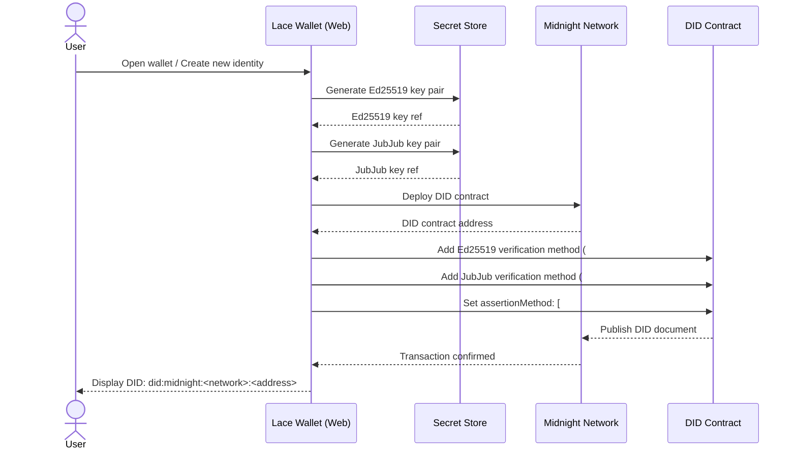

### 4.4 Mobile Wallet Flow

The mobile flow mirrors the web flow with two differences:

- Key generation uses the device's secure element (iOS Secure Enclave / Android StrongBox) where available for enhanced key protection
- The network connection may use a mobile-optimized indexer endpoint

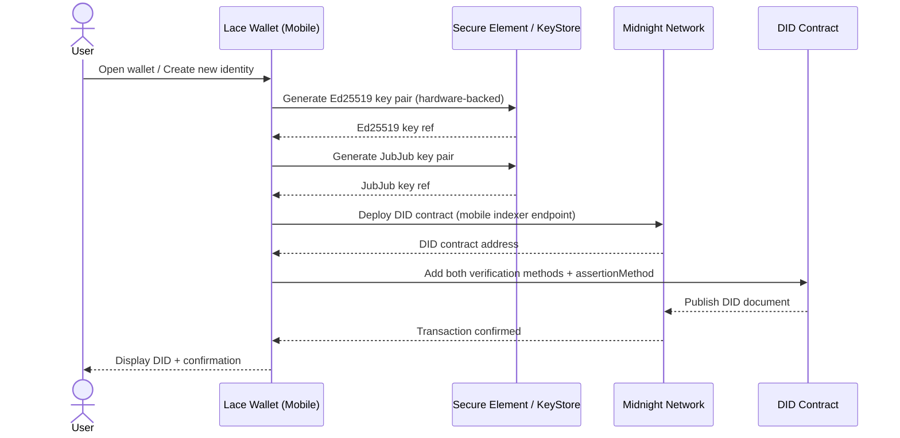

### 4.5 Error Conditions

| Condition | Handling |
|---|---|
| Network unreachable during DID deployment | Show error banner; persist generated keys locally; retry when connection restored |
| Key generation failure in secure element | Fall back to software key store; warn user that hardware protection is unavailable |
| DID contract already exists for this profile | Skip deployment; resolve existing DID and display |

---

## 5. Use Case 2 — Passkey Registration

### 5.1 Overview

| Attribute | Value |
|---|---|
| **ID** | UC-2 |
| **Name** | Passkey Registration |
| **Primary Actor** | User |
| **Supporting Actors** | Lace Wallet, Device Biometric Layer |
| **Trigger** | User navigates to Security Settings and initiates passkey setup |
| **Pre-conditions** | UC-1 is complete; the local secret store is encrypted and contains the Ed25519 and JubJub key pairs; the device supports WebAuthn (platform authenticator or security key) |
| **Post-conditions** | A passkey credential is registered on the device; the user can unlock the wallet session and the local secret store using biometrics; **no DID document change occurs** |

### 5.2 Design Rationale

The WebAuthn P-256 private key is **non-exportable and hardware-bound** to the specific device and Relying Party ID. It cannot sign JubJub or Ed25519 payloads and has no role in Midnight VC/VP operations. Adding it to the DID document would create a verification method the wallet can never use for on-chain credential proofs.

The passkey's correct role is a **cryptographic prerequisite to store decryption**, not merely a UI gate. The two platforms achieve this through different mechanisms:

**Web — WebAuthn PRF extension.** The [WebAuthn PRF extension](https://www.w3.org/TR/webauthn-3/#prf-extension) (available in Chrome 116+, Safari 16.4+, Firefox 119+) allows a relying party to request a deterministic pseudo-random output from the authenticator during any assertion. The wallet supplies a locally stored `salt`; the authenticator returns `PRF(salt)` — 32 bytes derived from the hardware-bound credential — only after a successful biometric or PIN check. The wallet feeds this output into HKDF to derive separate key-encryption keys (KEKs) for the secret store and the VC store. Both stores are encrypted with AES-256-GCM. Without a successful passkey assertion the PRF output is unavailable, so the stores cannot be decrypted. The PRF output and derived KEKs are cleared from memory immediately after decryption.

**Mobile — OS-managed biometric key protection.** On iOS, the KEK is stored as a Keychain item guarded by `kSecAccessControlBiometryCurrentSet`; Face ID or Touch ID is the gate for retrieval, enforced by the Secure Enclave. On Android, the KEK is wrapped by a Keystore-backed AES key created with `setUserAuthenticationRequired(true)` and `PURPOSE_DECRYPT`; a `BiometricPrompt` challenge is the gate. In both cases the OS releases the KEK only after the biometric assertion passes; the app never has custody of the raw KEK outside an authenticated session.

In both models, all VC/VP signing and ZK circuit operations continue to use the Ed25519 and JubJub keys exclusively.

### 5.3 Functional Requirements

| ID | Requirement |
|---|---|
| FR-2.1 | The wallet MUST trigger `navigator.credentials.create()` with `userVerification: "required"`, `residentKey: "required"`, and `extensions: { prf: {} }` to request PRF support at registration time |
| FR-2.2 | The wallet MUST store the passkey `credentialId` and a randomly generated `prf_salt` (32 bytes) in local app storage; the P-256 private key is retained in hardware and never accessible to the app |
| FR-2.3 | The wallet MUST NOT add the P-256 public key to the Midnight DID document |
| FR-2.4 | **(Web)** Immediately after registration (and on every subsequent unlock), the wallet MUST call `navigator.credentials.get()` with `extensions: { prf: { eval: { first: prf_salt } } }`; the returned `prf.results.first` (32-byte PRF output) MUST be used as HKDF input to derive `KEK = HKDF(prf_output, "lace-secret-store-v1")` and `KEK_vc = HKDF(prf_output, "lace-vc-store-v1")`; both stores MUST be encrypted with AES-256-GCM using their respective KEKs |
| FR-2.5 | **(Mobile — iOS)** The wallet MUST store the KEK as a Keychain item protected by `kSecAccessControlBiometryCurrentSet`; the KEK MUST only be retrievable after a successful Face ID or Touch ID assertion enforced by the Secure Enclave |
| FR-2.6 | **(Mobile — Android)** The wallet MUST wrap the KEK using an Android Keystore-backed AES key created with `PURPOSE_ENCRYPT \| PURPOSE_DECRYPT` and `setUserAuthenticationRequired(true)`; the KEK MUST only be unwrappable after a `BiometricPrompt` assertion |
| FR-2.7 | The KEK and PRF output MUST be cleared from memory immediately after the stores are decrypted; only the decrypted Ed25519 and JubJub keys remain in session memory |
| FR-2.8 | The VC store MUST be decrypted in the same authenticated session as the secret store, using its own derived `KEK_vc` |
| FR-2.9 | The wallet MUST clear all session key material from memory and re-lock the stores after a configurable idle timeout |
| FR-2.10 | If PRF is not supported by the authenticator (web), the wallet MUST fall back to a PIN-derived KEK using `PBKDF2(pin, salt, iterations=600000, hash=SHA-256)`; the wallet MUST warn the user that hardware-backed store protection is unavailable |
| FR-2.11 | The wallet MUST support a PIN or password fallback for unlock if biometric authentication is unavailable or fails three consecutive times |

### 5.4 Web Wallet Flow

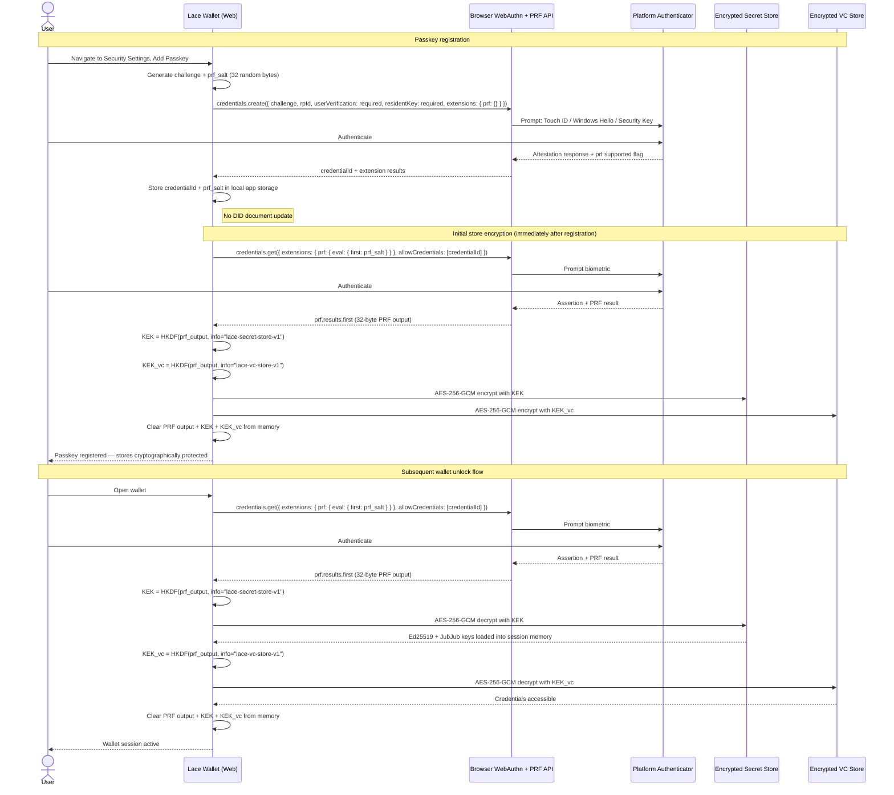

### 5.5 Mobile Wallet Flow

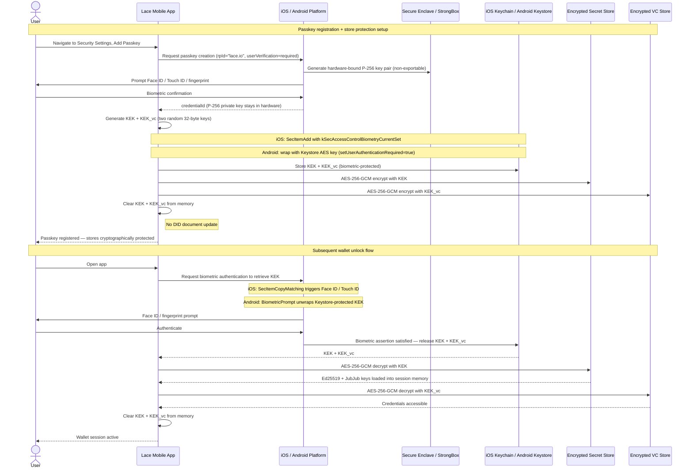

### 5.6 Error Conditions

| Condition | Handling |
|---|---|
| Device has no platform authenticator | Offer PIN/password fallback with PBKDF2-derived KEK; warn user that hardware-backed protection is unavailable |
| PRF extension not supported by authenticator (web) | Fall back to PBKDF2(pin, salt) KEK derivation; show warning |
| Biometric enrollment not configured on device | Deep-link to OS biometric settings (Face ID / fingerprint setup) |
| Biometric authentication fails 3 times | Lock to PIN/password fallback; do not expose PRF output or Keychain entry |
| PRF output changes unexpectedly (authenticator reset) | Store decryption fails; prompt user to restore from backup or re-initialise wallet |
| Keychain / Keystore item inaccessible (device restore, biometry change) | Prompt user to restore from backup seed phrase; all biometric-protected material is invalidated on biometry change by OS design |
| KEK derivation or AES decryption fails | Do not expose error details; force PIN/password fallback; log internally |
| Idle timeout reached | Lock wallet; clear all key material from memory; require re-authentication |
| User cancels WebAuthn prompt during registration | Return to settings; no credential or KEK stored; no changes made |

---

## 6. Use Case 3 — Credential Issuance via Midnight Passport DApp

### 6.1 Overview

| Attribute | Value |
|---|---|
| **ID** | UC-3 |
| **Name** | Credential Issuance |
| **Primary Actor** | User |
| **Supporting Actors** | Lace Wallet, National ID Issuer, Sanction Screening Issuer, Midnight Passport DApp |
| **Trigger** | User navigates to the Trusted Issuers section of the Midnight Passport DApp |
| **Pre-conditions** | UC-1 and UC-2 are complete; wallet session is active (secret store and VC store are unlocked); the user has a physical national identity document available |
| **Post-conditions** | User holds a `NationalIdCredential` VC and a `SanctionScreeningCredential` VC in the wallet; both are bound to the same hidden holder secret; the user's Midnight DID was never disclosed to either issuer |

This use case contains two sub-flows executed sequentially. The Sanction Screening issuance depends on the National ID credential being held first.

---

### 6.2 Sub-Flow 3a — National ID Issuance

#### 6.2.1 Design Rationale

The National ID issuance does not start inside the DApp. It starts on the **issuer's own website**, where the user completes identity verification before a credential offer is ever generated. This is the correct OID4VCI Pre-Authorized Code Flow model: the pre-authorized code is the issuer's way of saying "this session has been verified — now let the wallet claim the credential."

Critically, **the user's Midnight DID is never disclosed to the issuer**. The OID4VCI protocol is used purely as an issuance transport. Authentication to the issuer happens through physical identity verification (document + liveness), not through a DID-authenticated login. The wallet binds the issued credential to the holder through a `midnight_holder_commitment` — a blinded cryptographic commitment to the holder's hidden secret — rather than through a DID reference.

**Why not SIOP 2.0?** SIOP 2.0 is a DID-authenticated login protocol and would expose the holder's Midnight DID to the issuer. For a National ID issuance where the physical identity check is the authoritative authentication event, SIOP 2.0 adds correlation risk without adding security value.

**Ephemeral key for proof-of-possession.** OID4VCI requires a proof at the Credential Endpoint to prevent token replay. The wallet fulfills this with a JWT signed by a **fresh, single-use Ed25519 key pair** generated solely for this exchange. The `kid` claim in the JWT carries the base64url-encoded ephemeral public key — not a DID URL. The issuer uses this only to verify the `c_nonce` was freshly signed; it does not learn a persistent wallet identifier. The ephemeral key is discarded immediately after the credential is received.

#### 6.2.2 Functional Requirements

| ID | Requirement |
|---|---|
| FR-3a.1 | The DApp MUST display a list of available trusted issuers with credential type descriptions and a "Get this credential" link that navigates the user to the issuer's website |
| FR-3a.2 | The issuance flow MUST use OID4VCI Pre-Authorized Code Flow; the flow begins on the issuer's website, not inside the DApp |
| FR-3a.3 | The issuer's website MUST create an anonymous verification session for the user without requiring a pre-existing account or a Midnight DID |
| FR-3a.4 | The issuer's website MUST perform a document scan of the user's national identity card (NFC chip read or optical OCR scan) |
| FR-3a.5 | The issuer's website MUST perform a live face verification (liveness check + face match against the document photo) |
| FR-3a.6 | After successful verification, the issuer MUST generate a `pre_authorized_code` bound to the verified session |
| FR-3a.7 | The issuer MUST present the credential offer as both a **QR code** (for cross-device scanning with a mobile wallet) and a **deep link / redirect URI** (for same-device wallet activation, e.g. `openid-credential-offer://`) |
| FR-3a.8 | The wallet MUST parse the credential offer and exchange the `pre_authorized_code` for an access token at the issuer's token endpoint using standard OAuth 2.0; no DID is involved in this exchange |
| FR-3a.9 | The issuer's token endpoint MUST return an access token and a `c_nonce` for anti-replay binding |
| FR-3a.10 | The wallet MUST generate or reuse the hidden holder secret and derive the blinding factor; it MUST compute `midnight_holder_commitment = blindedSecretHolderCommitment(holderSecretCommitment, issuerNonce, blindingFactor)` |
| FR-3a.11 | The wallet MUST generate a fresh **ephemeral Ed25519 key pair** solely for this issuance exchange; the key MUST be single-use and discarded after the credential is received |
| FR-3a.12 | The wallet MUST construct a JWT proof signed by the ephemeral key over the `c_nonce`; the `kid` claim MUST be the base64url-encoded ephemeral public key and MUST NOT be a DID URL |
| FR-3a.13 | The wallet MUST send the credential request with `{ format: "midnight_compact", proof: { proof_type: "jwt", jwt: <signed_jwt> }, midnight_holder_commitment: <blinded_commitment> }` |
| FR-3a.14 | The issuer MUST verify the JWT proof for anti-replay (c_nonce correctly signed), then build the `NationalIdCredential` from the verified document data and bind it to `midnight_holder_commitment` using `BlindedSecretHolderBinding` |
| FR-3a.15 | The issuer MUST sign the credential with its JubJub key under `assertionMethod` semantics |
| FR-3a.16 | The wallet MUST verify the issuer proof, discard the ephemeral key, and store the VC in the credential store |
| FR-3a.17 | The DApp MUST show a confirmation screen when the user returns from the issuance flow |

#### 6.2.3 Web Wallet Flow — Same Device

The user visits the issuer's website in the same browser where the Lace extension is installed. After identity verification, the issuer redirects to a `openid-credential-offer://` URI that the Lace extension intercepts.

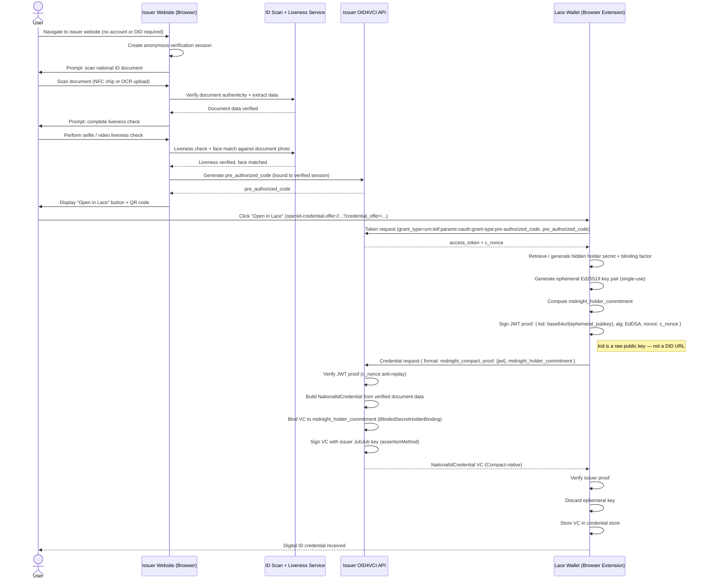

#### 6.2.4 Web Wallet Flow — Cross Device (Desktop + Mobile Wallet)

The user completes verification on a desktop browser. The issuer displays a QR code that the user scans with the Lace mobile wallet.

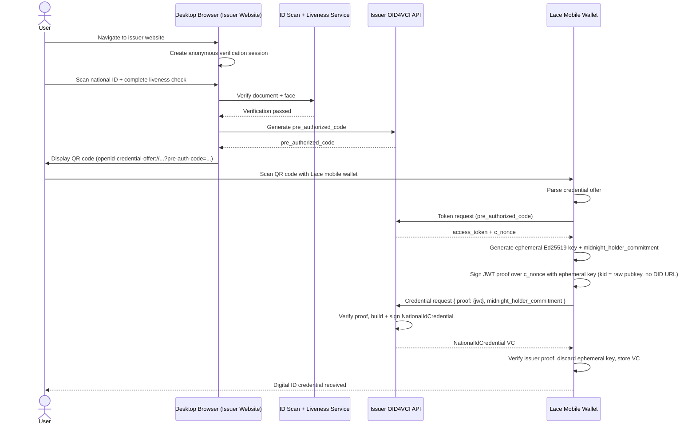

#### 6.2.5 Mobile Wallet Flow — Same Device

The user visits the issuer's mobile-optimized website or native app on the same phone as the Lace wallet. After verification, the issuer redirects to the Lace app deep link.

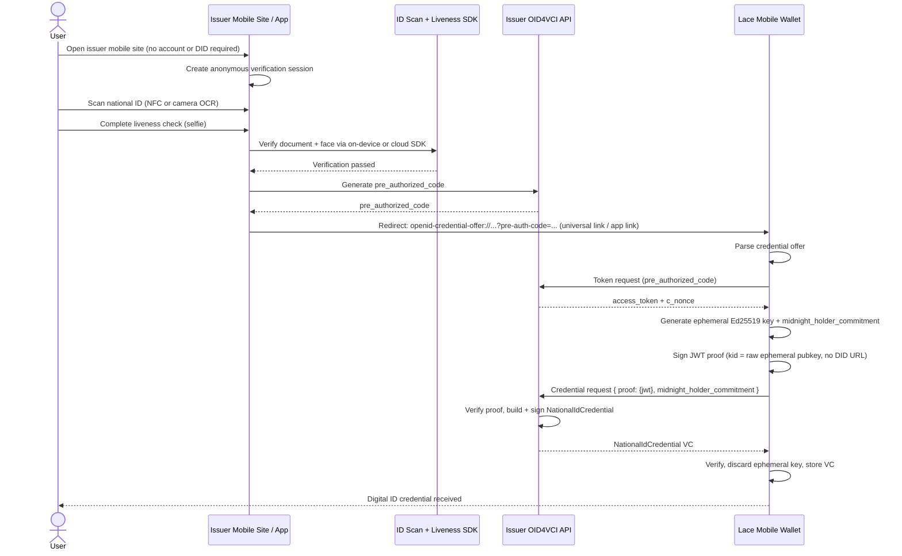

#### 6.2.6 Error Conditions

| Condition | Handling |
|---|---|
| Document scan fails (poor image quality, unsupported document type) | Issuer website shows retry prompt; pre-authorized code not generated |
| Liveness check fails (spoof detected) | Issuer website blocks issuance; user advised to retry in better lighting |
| `pre_authorized_code` expires before wallet scans QR | Token request returns error; user directed back to issuer website to restart |
| `c_nonce` mismatch in credential request | Issuer rejects credential request; wallet shows error; user retries credential request |
| Issuer rejects `midnight_holder_commitment` (unrecognized format) | Wallet shows "issuer does not support Midnight credentials"; DApp shows guidance |
| Network failure during credential request | Wallet retries up to 3 times with exponential backoff; shows error if all fail |

---

### 6.3 Sub-Flow 3b — Sanction Screening Issuance

#### 6.3.1 Business Context

The Sanction Screening Issuer is a regulated AML/KYC provider. It does not issue credentials to anonymous holders. It requires the user to present a selective disclosure of their National ID credential to confirm the holder's identity is real and that the holder's country is not in a sanctioned jurisdiction. It then screens the individual against OFAC, EU, and UN sanctions lists and a PEP (Politically Exposed Person) database.

Critically, the screening issuer does NOT need to know the holder's global DID. The holder uses the Midnight advanced VC features to present only the required fields while preserving holder privacy.

#### 6.3.2 Advanced Midnight VC Options Used

| Option | Why It Is Used Here |
|---|---|
| **BlindedSecretHolderBinding** | The holder's DID is never disclosed to the screening issuer; binding is via the hidden holder secret shared with the National ID credential |
| **Selective Disclosure** | Only `firstName`, `familyName`, `dateOfBirth`, and `residenceCountry` are revealed; `documentNumber` and other fields remain hidden |
| **Verifier-Scoped Pseudonym** | The screening issuer derives a pairwise pseudonym from the holder secret + screener domain hash; allows re-screening correlation without global holder tracking |
| **Same-Holder Anchor** | The screening issuer can verify that the VP is bound to the same hidden holder secret used in the National ID credential (via matching blinded holder commitments) |

#### 6.3.3 Functional Requirements

| ID | Requirement |
|---|---|
| FR-3b.1 | The Sanction Screening Issuer MUST send a typed `NationalIdPresentationRequest` to the wallet via the OID4VCI credential offer flow |
| FR-3b.2 | The presentation request MUST specify: `requireGivenNameDisclosure: true`, `requireFamilyNameDisclosure: true`, `requireDateOfBirthDisclosure: true`, `requireResidenceCountryDisclosure: true`, `requireVerifierScopedPseudonym: true`, and a `verifierDomainHash` and `verifierChallengeHash` |
| FR-3b.3 | The wallet MUST construct a VP that satisfies the request: disclosing only the requested fields and generating the verifier-scoped pseudonym |
| FR-3b.4 | The wallet MUST sign the VP with the holder's JubJub key under presentation semantics (using `presentationProofChallenge`) |
| FR-3b.5 | The Sanction Screening Issuer MUST check the disclosed `residenceCountry` against a blocklist of sanctioned jurisdictions before proceeding |
| FR-3b.6 | The Sanction Screening Issuer MUST screen the disclosed `firstName`, `familyName`, and `dateOfBirth` against OFAC SDN List, EU Consolidated List, and UN Security Council Sanctions List |
| FR-3b.7 | The Sanction Screening Issuer MUST check the individual against a PEP database |
| FR-3b.8 | On a PASS result, the issuer MUST issue a `SanctionScreeningCredential` with the claim set defined in Section 8.2, bound to the same hidden holder secret as the National ID credential |
| FR-3b.9 | On a FAIL result, the issuer MUST return a clear rejection message; the wallet MUST display the reason category without exposing raw screening data |
| FR-3b.10 | The issued `SanctionScreeningCredential` MUST be stored in the wallet's credential store |

#### 6.3.4 Issuance Sequence (Web and Mobile)

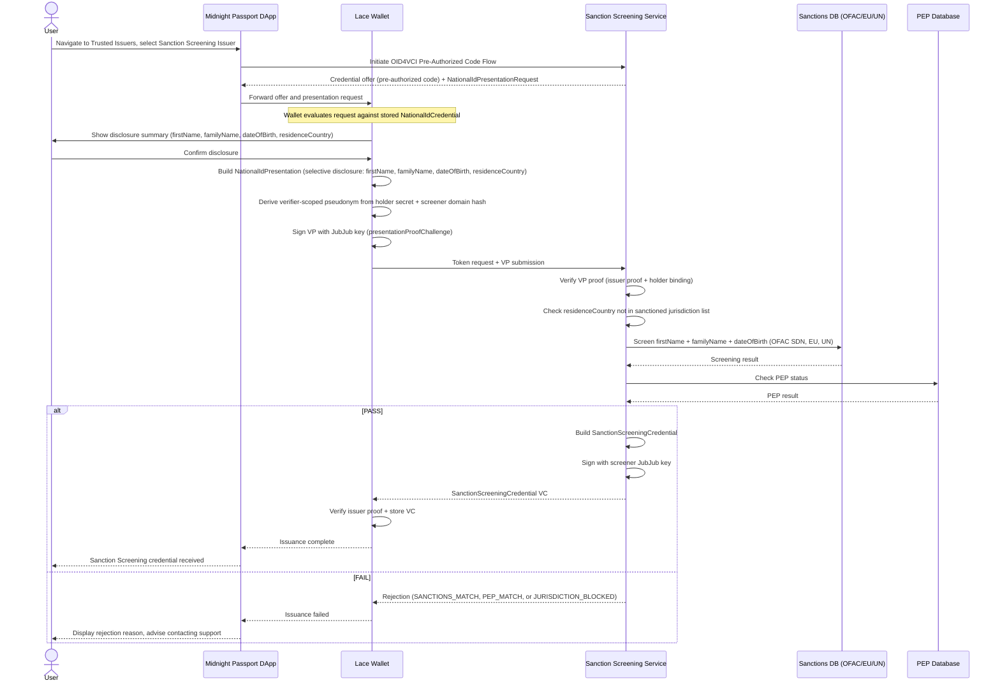

---

## 7. Use Case 4 — Wallet Connect, Investment, and Proof-Gated Fund Transfer

### 7.1 Overview

| Attribute | Value |
|---|---|
| **ID** | UC-4 |
| **Name** | Wallet Connect, Investment, and Proof-Gated Fund Transfer |
| **Primary Actor** | User |
| **Supporting Actors** | Lace Wallet, External Crypto Wallet, Midnight Smart Contract, Midnight Passport DApp |
| **Trigger** | User navigates to the DApp home page and clicks "Add Wallet" |
| **Pre-conditions** | UC-1 through UC-3 are complete; user holds a valid `NationalIdCredential` and a `SanctionScreeningCredential` in the wallet |
| **Post-conditions** | Funds are transferred to the Midnight investment smart contract; the contract records the user's eligibility and issues a participation capability; the user holds a capability token for the investment |

This use case contains three sub-flows executed sequentially.

---

### 7.2 Sub-Flow 4a — External Wallet Connection

#### 7.2.1 Functional Requirements

| ID | Requirement |
|---|---|
| FR-4a.1 | The DApp MUST display a "Add Wallet" button on the home page |
| FR-4a.2 | Clicking "Add Wallet" MUST open a modal dialog listing at least four external wallet options: **MetaMask**, **Coinbase Wallet**, **WalletConnect** (generic), and **Rabby Wallet** |
| FR-4a.3 | Each wallet option MUST display the wallet logo, name, and a brief connection description |
| FR-4a.4 | Selecting **MetaMask** MUST initiate an EIP-1193 `eth_requestAccounts` request via the injected `window.ethereum` provider |
| FR-4a.5 | Selecting **WalletConnect** MUST initiate a WalletConnect v2 session via QR code (desktop) or deep link (mobile) |
| FR-4a.6 | Selecting **Coinbase Wallet** or **Rabby Wallet** MUST use the respective wallet's EIP-1193 provider or WalletConnect v2 |
| FR-4a.7 | The selected wallet MUST present an authentication / trust confirmation prompt to the user showing the DApp name, URL, and requested permissions |
| FR-4a.8 | After successful authentication, the DApp MUST display the connected account address and available crypto balances |
| FR-4a.9 | On mobile, wallet connection MUST use WalletConnect deep link or the respective mobile app universal link |

#### 7.2.2 Wallet Connection Sequence (Web)

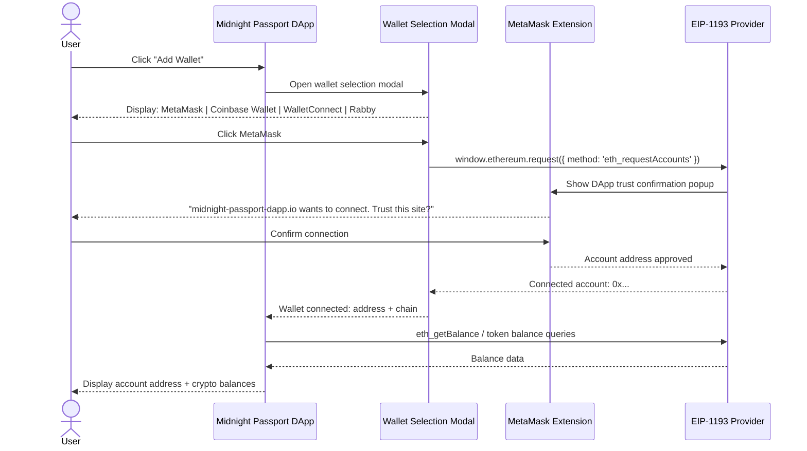

#### 7.2.3 Wallet Connection Sequence (Mobile — WalletConnect)

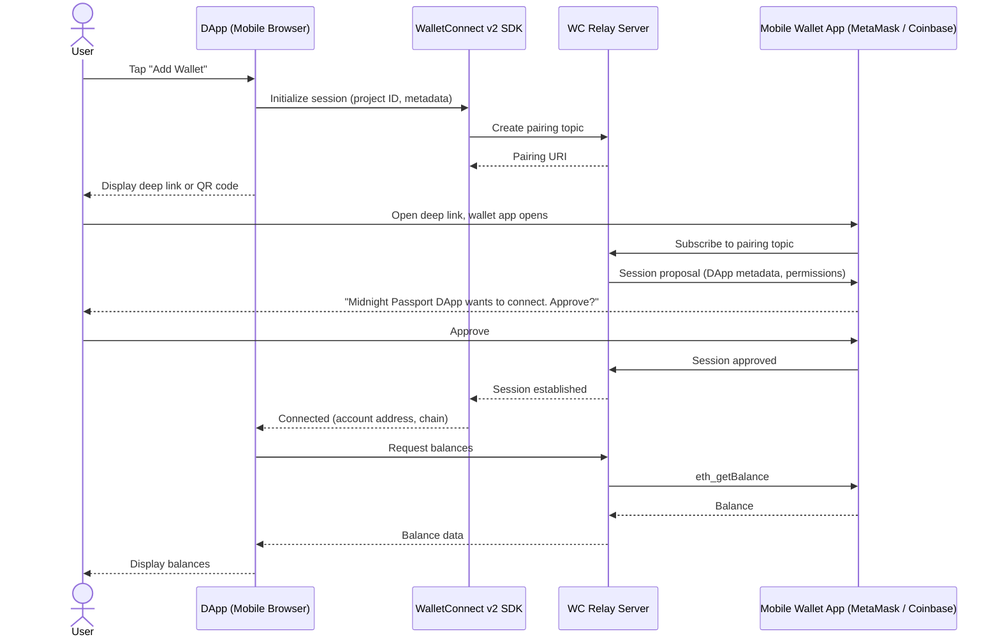

---

### 7.3 Sub-Flow 4b — Investment Product Selection

#### 7.3.1 Functional Requirements

| ID | Requirement |
|---|---|
| FR-4b.1 | The DApp MUST display available investment products with APY rate, minimum deposit, term, and risk summary |
| FR-4b.2 | The DApp MUST clearly display the 4.5% APY product as a featured option with a "Invest" call-to-action |
| FR-4b.3 | The user MUST be able to input a deposit amount within the available balance |
| FR-4b.4 | The DApp MUST display a fee and slippage summary before the user confirms |
| FR-4b.5 | Clicking "Confirm Investment" MUST trigger the compliance proof request flow (Sub-Flow 4c) |
| FR-4b.6 | The DApp MUST display a clear indication that identity verification is required to complete the investment |

#### 7.3.2 Investment Selection Flow

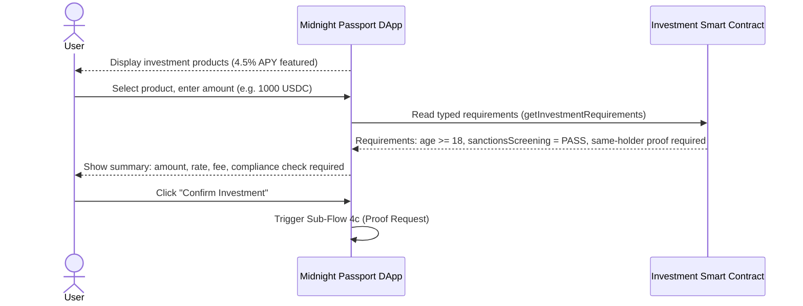

---

### 7.4 Sub-Flow 4c — Proof-Gated Fund Transfer

#### 7.4.1 Business Context

The investment smart contract enforces two compliance requirements before accepting the fund transfer:

1. **Age predicate**: The user must prove `age >= 18` using a ZK predicate derived from the `dateOfBirth` commitment in the `NationalIdCredential`. The raw birth date is never disclosed on-chain.
2. **Sanctions screening**: The user must disclose `screeningResult = PASS` from the `SanctionScreeningCredential`.

Both proofs must be accompanied by a **same-holder proof** that demonstrates both credentials are bound to the same hidden holder secret. This prevents a user from combining their own age proof with someone else's screening credential.

The contract uses a **single composed verification circuit** (Pattern 1 from the Midnight Credentials spec): both credential families are verified atomically in one contract call.

#### 7.4.2 Functional Requirements

| ID | Requirement |
|---|---|
| FR-4c.1 | The investment contract MUST expose a `getInvestmentRequirements()` function returning a typed requirements structure |
| FR-4c.2 | The requirements structure MUST specify: required credential families, issuer restrictions, required disclosures, required predicates, required holder-binding profile, and a `verifierChallengeHash` |
| FR-4c.3 | The wallet MUST read the requirements and present the user with a clear summary of what will be proven and what (if anything) will be disclosed |
| FR-4c.4 | The wallet MUST construct two presentations: one from `NationalIdCredential` (age predicate, no birth date disclosed) and one from `SanctionScreeningCredential` (screeningResult disclosure) |
| FR-4c.5 | Both presentations MUST share the same `verifierChallengeHash` issued by the contract |
| FR-4c.6 | The wallet MUST include the same-holder proof using `assertSameBlindedSecretHolderBindingWitnesses` to bind both presentations to one holder secret |
| FR-4c.7 | The wallet MUST sign both presentations with the holder's JubJub key under presentation semantics |
| FR-4c.8 | The contract MUST verify: (a) NationalId age predicate ≥ 18, (b) SanctionScreening result = PASS, (c) same-holder binding, (d) issuer restrictions for both credentials |
| FR-4c.9 | On successful verification, the contract MUST accept the fund transfer and emit a participation capability commitment |
| FR-4c.10 | On failed verification, the contract MUST return a typed denial code (AGE_PREDICATE_FAILED / SANCTIONS_CHECK_FAILED / HOLDER_BINDING_MISMATCH) without reverting the transaction entirely |
| FR-4c.11 | The DApp MUST display a success confirmation with the transaction hash and participation capability reference |
| FR-4c.12 | On mobile, the wallet MUST support the same VP construction and signing flow; proof generation uses the same `credentials-protocol` orchestration layer |

#### 7.4.3 Proof Request and VP Construction Sequence

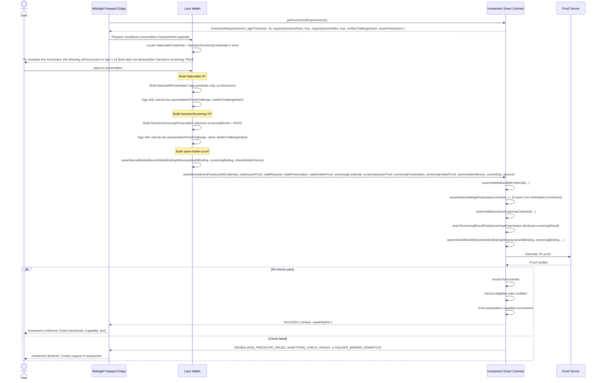

#### 7.4.4 Mobile Wallet Flow

On mobile, the proof construction and contract submission proceed identically. The UX differences are:

- The wallet displays a native bottom sheet (iOS) or bottom dialog (Android) with the proof summary instead of a modal
- The user confirms via the same biometric unlock if the session has expired
- WalletConnect v2 is used to route the fund transfer transaction from the external crypto wallet to the smart contract

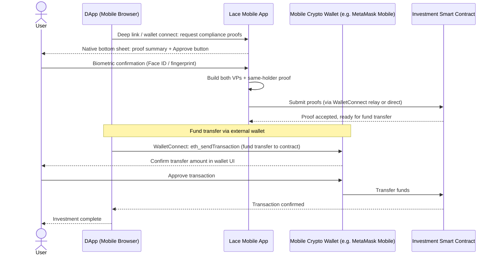

---

## 8. Data Models

### 8.1 NationalIdCredential

Corresponds to the `credentials-national-id` credential family. All sensitive fields are stored as Pedersen commitments in the credential body. Public fields are stored in plain form.

```
NationalIdCredential {
  // Credential envelope (generic layer)
  version:                    Uint<8>
  schema:                     SchemaRef { packageId, schemaId, major, minor }
  issuerVerificationMethodRef: VerificationMethodRef { didContractAddress, methodId }
  holderBinding:              BlindedSecretHolderBinding
  issuedAt:                   Uint<32>          // Unix day
  expiresAt:                  Uint<32>          // Unix day

  // Claims (NationalId family — all committed unless marked public)
  claims {
    documentNumberCommitment:  Bytes<32>        // committed
    issuingCountry:            CountryCode      // PUBLIC — ISO 3166-1 numeric
    givenNameCommitment:       Bytes<32>        // committed
    familyNameCommitment:      Bytes<32>        // committed
    dateOfBirthCommitment:     Bytes<32>        // committed — Uint<32> days since epoch
    residenceCountryCommitment: Bytes<32>       // committed — CountryCode
    idIssuerCommitment:        Bytes<32>        // committed — issuing authority name
    issuanceDateCommitment:    Bytes<32>        // committed
    expirationDate:            Uint<32>         // PUBLIC — document expiry day
  }
  claimRoot: Bytes<32>                          // root over all claim commitments
}
```

**Selective disclosure layout** (NationalIdPresentation.disclosed):

| Field | Disclosure Type | Used In |
|---|---|---|
| `givenName` | value + opening | UC-3b (to screener) |
| `familyName` | value + opening | UC-3b (to screener) |
| `dateOfBirth` | value + opening | UC-3b (to screener) |
| `residenceCountry` | value + opening | UC-3b (to screener) |
| `age >= threshold` | ZK predicate | UC-4c (to investment contract) |

### 8.2 SanctionScreeningCredential

Corresponds to the `credentials-compliance` credential family.

```
SanctionScreeningCredential {
  // Credential envelope (generic layer)
  version:                    Uint<8>
  schema:                     SchemaRef
  issuerVerificationMethodRef: VerificationMethodRef
  holderBinding:              BlindedSecretHolderBinding  // same holder secret as NationalId
  issuedAt:                   Uint<32>
  expiresAt:                  Uint<32>

  // Claims
  claims {
    subjectIdCommitment:       Bytes<32>        // committed — links to screened subject
    screeningResult:           Uint<8>          // PUBLIC — 0=FAIL, 1=PASS
    isPEP:                     Boolean          // PUBLIC
    sanctionsListsChecked:     Uint<8>          // PUBLIC — bitmask: OFAC=1, EU=2, UN=4
    jurisdiction:              CountryCode      // PUBLIC — issuer jurisdiction (ISO 3166-1)
    riskLevel:                 Uint<8>          // PUBLIC — 0=LOW, 1=MEDIUM, 2=HIGH
    screeningDateCommitment:   Bytes<32>        // committed — Uint<32> day of screening
    validUntilDay:             Uint<32>         // PUBLIC — credential validity
  }
  claimRoot: Bytes<32>
}
```

**Selective disclosure layout** (SanctionScreeningPresentation.disclosed):

| Field | Disclosure Type | Used In |
|---|---|---|
| `screeningResult = PASS` | public field check | UC-4c (to investment contract) |
| `isPEP = false` | public field check | UC-4c (optional additional check) |
| `freshness predicate` | `currentDay - screeningDate <= 90 days` | UC-4c (optional freshness gate) |

### 8.3 InvestmentRequirements (Smart Contract)

The typed requirements structure returned by `getInvestmentRequirements()`:

```
InvestmentRequirements {
  nationalIdRequirement {
    schemaRef:                 SchemaRef        // NationalId schema
    issuerRestriction:         VerificationMethodRef  // approved issuer
    requireAgeOverThreshold:   Boolean
    requestedAgeThresholdYears: Uint<8>         // 18
  }
  screeningRequirement {
    schemaRef:                 SchemaRef        // Compliance schema
    issuerRestriction:         VerificationMethodRef  // approved screener
    requireScreeningResultPass: Boolean
    requireIsPEPFalse:         Boolean
    maxScreeningAgeDays:       Uint<32>         // e.g. 90
  }
  requireSameHolder:           Boolean          // true — same hidden holder secret
  verifierChallengeHash:       Bytes<32>        // anti-replay challenge
  verifierDomainHash:          Bytes<32>        // for pseudonym derivation if needed
}
```

---

## 9. Privacy and Security Considerations

### 9.1 Data Minimization Table

The following table summarizes what each actor sees across all four use cases.

| Actor | Sees | Does NOT See |
|---|---|---|
| **National ID Issuer** | Scanned document data; face match result; blinded holder commitment (not raw secret) | Holder DID; holder secret; how credentials are later used |
| **Sanction Screening Issuer** | `firstName`, `familyName`, `dateOfBirth`, `residenceCountry` (disclosed via VP); verifier-scoped pseudonym (stable for screener domain only) | Holder DID; holder secret; document number; other credential fields; how the credential is used in the DApp |
| **Investment Smart Contract** | Age predicate result (true/false — no birth date); sanction screening result (PASS/FAIL — no name/date); same-holder proof outcome; credential claim roots (no raw claim values) | Holder DID; holder name; birth date; document number; any raw personal data |
| **Midnight Network / Indexer** | DID contract state; transaction proofs (ZK — no witness data in public transcript) | Private credential contents; holder secrets; disclosed claim values |
| **External Crypto Wallet** | User account address; balance | Midnight DID; credentials; proof contents |

### 9.2 Holder Binding Privacy Guarantees

**BlindedSecretHolderBinding** ensures:

- No stable public DID method reference appears in any credential or presentation
- The holder is bound through a commitment to a hidden secret: `blindedCommitment = hash(holderSecretCommitment, issuerNonce, blindingFactor)`
- The issuer signs over the blinded commitment, not the raw holder identity
- Cross-verifier correlation requires knowing the raw holder secret — computationally infeasible without holder cooperation

**Verifier-scoped pseudonym** ensures:

- The Sanction Screening Issuer receives `pseudonym = hash(holderSecret, screenerDomainHash)` — stable for this domain only
- A different verifier receives a different pseudonym from the same holder
- The pseudonym cannot be linked across domains without the holder secret

**Same-holder proof** ensures:

- The investment contract can confirm both credentials belong to the same person
- This is achieved without any common identifier appearing in the proof transcript
- The circuit `assertSameBlindedSecretHolderBindingWitnesses` checks that both blinded bindings satisfy the same underlying holder secret

### 9.3 Anti-Replay

- All presentation proofs are bound to the `verifierChallengeHash` supplied by the verifier (contract or issuer)
- Challenges are single-use: the investment contract records a nullifier after a successful proof submission to prevent replay
- The issuer `c_nonce` in the OID4VCI flow provides anti-replay for the credential request proof-of-possession

### 9.4 Key Separation

| Key | Algorithm | Used For |
|---|---|---|
| **Ed25519** | OKP/EdDSA | Off-chain signing: OID4VCI proof-of-possession, DIDComm, payload signing |
| **JubJub** | EC/Jubjub | On-chain ZK circuits: VC/VP proof generation and verification in Compact |
| **P-256** | EC/ES256 | Passkey / WebAuthn: wallet session authentication, DID-based login |

These key types must not be used interchangeably. The JubJub key is the only key type valid in Compact on-chain circuits. The P-256 key is bound to the device biometric and cannot be exported.

### 9.5 Security Requirements

| ID | Requirement |
|---|---|
| SR-1 | The hidden holder secret MUST never be transmitted to any issuer or verifier in clear form |
| SR-2 | The P-256 passkey private key MUST be device-bound and non-exportable; it MUST NOT be added to the DID document or used to sign Midnight VC/VP payloads |
| SR-3 | The wallet MUST require a successful passkey assertion (or PIN/password fallback) before decrypting the secret store and constructing any VP |
| SR-4 | The investment contract MUST record a nullifier per successful proof submission to prevent replay |
| SR-5 | All network communication between wallet, DApp, and issuance services MUST use TLS 1.3 or higher |
| SR-6 | The DApp MUST display the issuer DID and credential schema to the user before any issuance is accepted |
| SR-7 | The smart contract MUST reject presentations with an expired `verifierChallengeHash` |

---

## 10. Non-Functional Requirements

### 10.1 Performance

| Requirement | Target |
|---|---|
| DID contract deployment (UC-1) | < 30 seconds end-to-end on Midnight preprod |
| Passkey registration round-trip (UC-2) | < 5 seconds (biometric prompt excluded) |
| National ID issuance — identity verification | < 120 seconds (face scan + liveness check) |
| Sanction screening VP construction | < 3 seconds on wallet device |
| Sanctions screening service response | < 10 seconds |
| Investment VP construction (two credentials + same-holder) | < 5 seconds on wallet device |
| On-chain proof verification (Compact circuit) | < 30 seconds (Midnight proof server) |

### 10.2 Platform Support

| Platform | Minimum Version |
|---|---|
| Chrome (Web Wallet) | 120+ (WebAuthn platform authenticator support) |
| Firefox (Web Wallet) | 120+ |
| Safari (Web Wallet) | 17+ |
| iOS (Mobile Wallet) | 16+ (Passkeys / FIDO2 platform authenticator) |
| Android (Mobile Wallet) | 10+ (FIDO2 platform authenticator via Google Play Services) |

### 10.3 Wallet Compatibility

| External Wallet | Connection Method |
|---|---|
| MetaMask | EIP-1193 (browser extension); WalletConnect v2 (mobile) |
| Coinbase Wallet | EIP-1193 (browser extension); WalletConnect v2 (mobile) |
| WalletConnect | WalletConnect v2 (QR code desktop; deep link mobile) |
| Rabby Wallet | EIP-1193 (browser extension); WalletConnect v2 (mobile) |

### 10.4 Network Requirements

| Environment | Description |
|---|---|
| Midnight Preprod | Used for development and testing; DID contracts and investment contracts deployed here |
| Midnight Mainnet | Production target; same flow applies |
| Indexer Endpoint | Required for DID resolution and contract state reads; mobile uses mobile-optimized endpoints |
| Proof Server | Required for on-chain ZK proof generation; must be reachable from the wallet device |

### 10.5 Standards Alignment

| Standard | How It Is Used |
|---|---|
| **W3C DID Core 1.0** | DID document structure; verification method relationships (`assertionMethod`, `authentication`) |
| **W3C VCDM 2.0** | Issuer / holder / verifier role semantics; credential and presentation envelope structure |
| **W3C VC Data Integrity** | Proof purpose separation (issuance vs. presentation context); challenge binding |
| **OpenID4VCI 1.0 Final** | Issuance transport protocol: Pre-Authorized Code Flow, credential offer, `c_nonce` |
| **WebAuthn / FIDO2** | Passkey creation and assertion; P-256 key binding to device |
| **RFC 8785 JCS** | JSON canonicalization for off-chain payload signing (Sign & Verify tab) |
| **EIP-1193** | Ethereum wallet connection API used by MetaMask, Coinbase Wallet, Rabby |
| **WalletConnect v2** | Cross-platform wallet session protocol for mobile connections |
| **ISO 3166-1 numeric** | Country codes in credential claims (via `credentials-iso-registry`) |
| **ISO 5218** | Gender codes in credential claims (via `credentials-iso-registry`) |

### 10.6 Accessibility

- All wallet UI flows MUST meet WCAG 2.1 AA standards
- Biometric prompts MUST include a fallback text-based (PIN) alternative
- Credential disclosure summaries MUST use plain language, not technical identifiers
- Proof denial messages MUST provide a human-readable reason category without technical jargon

---

## Appendix A: Use Case Summary

| UC | Name | Actors | Pre-condition | Key Output |
|---|---|---|---|---|
| UC-1 | Wallet Initialization | User, Lace Wallet, Midnight Network | Wallet installed, network reachable | Midnight DID with Ed25519 + JubJub keys |
| UC-2 | Passkey Registration | User, Lace Wallet, Device Biometric | UC-1 complete, device supports WebAuthn | Passkey registered on device; biometric wallet unlock + secret store decryption |
| UC-3a | National ID Issuance | User, Issuer Website, National ID Issuer, Lace Wallet | UC-2 complete, wallet session active, physical ID document available | `NationalIdCredential` in wallet; Midnight DID not disclosed to issuer |
| UC-3b | Sanction Screening Issuance | User, DApp, Screening Issuer | UC-3a complete | `SanctionScreeningCredential` in wallet |
| UC-4a | External Wallet Connect | User, DApp, External Wallet | UC-3 complete | External wallet connected; balance visible |
| UC-4b | Investment Selection | User, DApp | UC-4a complete | User selects product and amount |
| UC-4c | Proof-Gated Fund Transfer | User, Wallet, DApp, Smart Contract | UC-4b complete, two credentials in wallet | Funds transferred; participation capability issued |

## Appendix B: Credential Capability Profile Matrix

The following maps each use case to the Midnight VC capability profiles defined in `research/midnight-credentials.md`.

| Use Case | Credential Family | Holder Binding | Disclosures | Predicates | Pseudonym | Same-Holder | Verifier Mode |
|---|---|---|---|---|---|---|---|
| UC-3a issuance | NationalId | BlindedSecret | — | — | No | No | Issuer (off-chain); ephemeral key proof-of-possession; DID not disclosed |
| UC-3b presentation request | NationalId | BlindedSecret | firstName, familyName, dateOfBirth, residenceCountry | — | Yes (screener domain) | Single credential | Off-chain screener |
| UC-3b VC issuance | SanctionScreening | BlindedSecret | — | — | No | No | Issuer (off-chain) |
| UC-4c proof submission | NationalId + SanctionScreening | BlindedSecret | screeningResult (from screening VC) | age >= 18 (from NationalId) | No | Two-credential (shared holder secret) | On-chain contract |

## Appendix C: Trusted Issuer Registry (Layer 5 Reference)

The Midnight Passport DApp maintains a **Trusted Issuers Registry** (Layer 5) that governs which issuers are recognized for each credential family. For the flows described in this document, the registry contains:

| Issuer Role | Credential Family | Trust Basis |
|---|---|---|
| National ID Issuer | `NationalIdCredential` | Accredited by the DApp operator; issuer DID published in registry contract |
| Sanction Screening Issuer | `SanctionScreeningCredential` | Accredited by the DApp operator; certified against OFAC/EU/UN screening standards |

The investment smart contract enforces issuer restrictions via `issuerVerificationMethodRef` checks in the Compact verification circuits. A credential issued by an unrecognized issuer is rejected at the circuit level.

---

*This document is a living draft. Updates to the Midnight Credentials specification, the DID method, or the wallet platform capabilities may require corresponding revisions here.*
