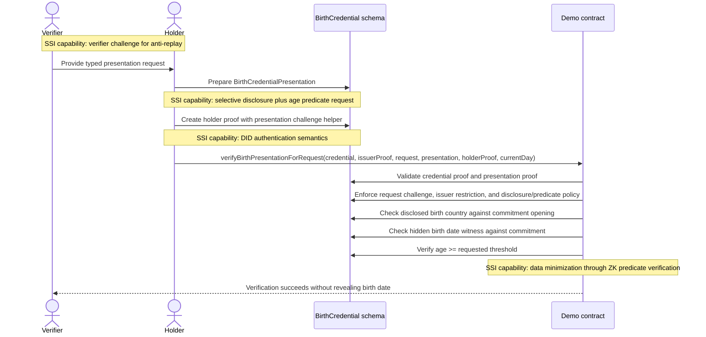

# Midnight Verifiable Credentials and Presentations

## Status
Proposed and partially prototyped in Compact.

## Scope
This document records the current design direction for Midnight-native Verifiable Credentials (VCs) and Verifiable Presentations (VPs) in the `midnight-did` repository.

It is not a production standard. It is the architecture record for the current PoC.

## Goal
Define a credential model that:

- is directly consumable by Midnight Compact contracts
- supports selective disclosure
- supports zero-knowledge predicates such as `age >= threshold`
- uses Midnight DID verification methods cleanly
- stays reasonably aligned with general SSI recommendations from DID Core, VCDM 2.0, and VC Data Integrity

## Core decision
Use a Midnight-native Compact representation as the canonical VC/VP model.

W3C JSON-LD, JWT, SD-JWT, or other exchange representations can exist later as adapters, but they are not the source of truth for contract execution.

Reasoning:

- Compact is strongly typed and bounded
- the contract-facing model cannot depend on dynamic JSON
- schema-specific fixed layouts are easier to verify in circuits
- selective disclosure on Midnight is a circuit problem, not just a transport-format problem

## Why `BirthCredential` replaced `AgeCredential`
The first draft was centered on an age-style credential. That was the wrong semantic layer.

A reusable SSI credential should carry an issuer-attested source fact, not a moving derived property.

`BirthCredential` is the better base credential because it can attest to claims such as:

- subject identifier commitment
- legal name commitment
- birth-date commitment
- birth-country commitment

From that source credential, the holder can later prove predicates such as:

- age is over 18
- age is over 21
- age is over any supported threshold

This is both more reusable and more privacy-preserving than issuing a separate credential for each age threshold.

## Compact-first constraints
The current design follows the Compact model rather than a web-first model.

The practical constraints are:

- bounded structs and fixed-size fields
- deterministic claim ordering
- no runtime-defined claim maps
- no unbounded disclosure sets
- algorithm-specific proof types
- explicit disclosure boundaries

This pushes the architecture toward:

- schema-specific credential bodies
- schema-specific presentation bodies
- fixed disclosure layouts
- typed DID method references
- proof validation circuits that are explicit about what is signed

## Current PoC model
The current implementation lives in:

- [`../credentials/src/credentials.compact`](../credentials/src/credentials.compact)
- [`../credentials-birth/src/birth-credential.compact`](../credentials-birth/src/birth-credential.compact)
- [`../credentials-birth-secret/src/secret-birth-credential.compact`](../credentials-birth-secret/src/secret-birth-credential.compact)
- [`../credentials-demo-contract/src/demo.compact`](../credentials-demo-contract/src/demo.compact)

The package split is now intentional:

- `credentials` owns the generic VC/VP envelope and proof core
- `credentials-birth` owns the explicit DID-bound birth-credential specialization
- `credentials-birth-secret` owns the hidden holder-secret birth-credential specialization
- `credentials-demo-contract` owns the executable issuer, holder, verifier flow

### Generic credential body
The generic `VC<TClaims, TDisclosures, THolderBinding>.Credential` envelope contains:

| Field | Meaning |
| --- | --- |
| `version` | schema version for the credential body |
| `schema` | package and schema identity |
| `issuerVerificationMethodId` | issuer DID method reference in Compact-native form |
| `holderBinding` | specialization-defined holder binding, such as an explicit DID method or a hidden holder-secret commitment |
| `issuedAt` / `expiresAt` | validity window |
| `claims` | schema-specific claim payload |
| `claimRoot` | root commitment over the schema-defined claim commitments |

For the birth specialization, `claims` is a struct of four claim commitments.

### Claim commitments
The current claim set is:

| Claim | Public representation |
| --- | --- |
| Subject identifier | `subjectIdCommitment` |
| Legal name | `legalNameCommitment` |
| Birth date | `birthDateCommitment` |
| Birth country | `birthCountryCodeCommitment` |

The credential body carries commitments, not raw claim values.

### Generic presentation body
The generic `VC<TClaims, TDisclosures, THolderBinding>.Presentation` envelope contains:

| Field | Meaning |
| --- | --- |
| `version` | schema version for the presentation body |
| `schema` | schema identity matching the credential |
| `credentialClaimRoot` | anchor back to the issued credential claim set |
| `issuerVerificationMethodId` | issuer DID method reference copied for verification context |
| `holderBinding` | specialization-defined holder binding carried forward into the presentation |
| `disclosed` | schema-specific bounded disclosure and predicate-request layout |

For the birth specialization, the current `disclosed` layout supports:

- optional disclosure of the subject identifier commitment
- optional disclosure of the birth-country value together with its opening
- an age-over-threshold predicate request

### Presentation request model

The current birth specialization now includes a typed verifier-defined presentation request:

- `BirthCredentialPresentationRequest`

It contains:

| Field | Meaning |
| --- | --- |
| `version` | request schema version |
| `schema` | required schema identity |
| `issuerVerificationMethodId` | issuer restriction for the credential to be presented |
| `requireSubjectIdCommitmentDisclosure` | whether the subject commitment must be disclosed |
| `requireBirthCountryDisclosure` | whether the birth-country claim must be disclosed |
| `requireAgeOverThreshold` | whether an age predicate proof is required |
| `requestedAgeThresholdYears` | exact requested threshold for the current profile |
| `verifierChallengeHash` | verifier-provided anti-replay challenge |

Current design intent:

- verifier policy is explicit and typed
- the presentation proof must bind to the request challenge
- the presentation must satisfy the requested disclosure and predicate policy

This is the first adopted AnonCreds-inspired capability in the PoC.

### Proof model
The PoC uses a single canonical proof type: `Proof`.

For the current Midnight VC/VP profile, that canonical proof suite is Jubjub.

It contains:

| Field | Meaning |
| --- | --- |
| `signerVerificationMethodId` | DID method reference for the signer |
| `createdAt` | proof timestamp |
| `challengeHash` | anti-replay interaction binding |
| `publicKey` | public key needed by the Compact verifier |
| `signature` | signature components for the canonical Jubjub proof suite |

Important design point:

- proof is outside the VC or VP body
- the VC or VP body is the semantic payload
- the proof is the cryptographic statement over that payload

The proof does not carry a stored `purpose` field.

That was removed because it duplicated context the verifier already has. The verifier already knows whether it is validating:

- an issuance proof over a credential body
- a presentation proof over a presentation body

So the current decision is:

- remove the stored enum from the proof object
- keep explicit domain separation in challenge derivation
- expose that separation through named helpers such as `issuanceProofChallenge(...)` and `presentationProofChallenge(...)`

### ADR: canonical proof suite is Jubjub

The current profile fixes Jubjub as the signature suite for Midnight VC/VP.

That is why the API now uses generic names such as:

- `Proof`
- `Signature`
- `verifySignature(...)`

instead of repeating the curve name in every type and circuit.

This is a readability choice, not an abstraction over multiple active proof suites.

If the project later adds another canonical proof suite, it should do so by introducing a new profile or a new specialization rather than overloading the current generic names silently.

### In-circuit proof challenge derivation
The verifier does not trust a precomputed challenge field inside the proof.

Instead, the verifier derives the signing challenge in-circuit from:

1. the VC or VP body root
2. the verification context tag (issuance or presentation)
3. proof metadata (signer method id, `createdAt`, `challengeHash`)
4. the signer public key
5. the signature nonce point `r`

This makes the proof-to-body binding explicit and removes redundant proof state.

## Generic VC/VP circuit reference

This section documents the generic circuits in [`../credentials/src/credentials.compact`](../credentials/src/credentials.compact) as the current canonical reusable VC/VP core.

The goal is to make each circuit understandable in terms of:

- what it proves or enforces
- why it exists as a separate circuit
- how it compares to typical W3C VC/VP verification behavior

### Envelope and rooting circuits

| Circuit | Purpose | Logic | Pros vs W3C VC/VP | Cons / trade-offs |
| --- | --- | --- | --- | --- |
| `credentialBodyRoot(credential)` | Produce the canonical digest for a credential body | hashes the entire typed credential envelope with `persistentHash` | deterministic and circuit-native; no JSON canonicalization or RDF normalization step | only works for Compact-native typed payloads; not interoperable with JSON-LD or JWT proof inputs |
| `presentationBodyRoot(presentation)` | Produce the canonical digest for a presentation body | hashes the typed presentation envelope with `persistentHash` | same determinism and boundedness benefits as the credential root | same serialization lock-in as above |
| `assertValidCredentialEnvelope(credential, expectedClaimRoot)` | Validate generic credential invariants before schema-specific business rules | checks version, checks that `claimRoot` matches the schema-provided expected root, checks expiration ordering | pushes core consistency checks into the reusable layer; easier to audit than ad hoc verifier logic | versioning is intentionally rigid; evolution requires explicit schema/version updates instead of looser web-style extension |
| `assertValidPresentationEnvelope(credential, presentation)` | Validate that a presentation is anchored to a credential envelope | checks presentation version, references the credential `claimRoot`, matches issuer method | stronger contract-time anchoring than many web verifiers perform by default; removes ambiguity about which credential the VP is about | holder binding is no longer hardcoded here, so each profile must add its own binding checks explicitly |

### Proof-verification circuits

| Circuit | Purpose | Logic | Pros vs W3C VC/VP | Cons / trade-offs |
| --- | --- | --- | --- | --- |
| `verifySignature(pk, signature, challenge)` | Verify the canonical Midnight VC/VP signature primitive | checks the Jubjub signature equation in-circuit | native to Midnight proving model; no external verifier dependency | intentionally not proof-suite agnostic; unlike W3C ecosystems, suite negotiation is outside the generic core |
| `assertValidCredentialProof(credential, proof)` | Enforce issuer-side proof binding for a credential | checks signer DID method equals `issuerVerificationMethodId`, then validates an issuance-context proof over `credentialBodyRoot` | makes issuer authorization explicit and mandatory in reusable logic | assumes the issuer method reference is already the right DID verification relationship; DID-document-level policy enforcement sits outside this package |
| `assertValidIssuanceContextProof(bodyRoot, proof)` | Verify a proof under issuance semantics | derives issuance-specific challenge domain and verifies signature | keeps issuance/presentation separation without redundant proof state | the distinction is Compact-native, not a serializable `proofPurpose` field |
| `assertValidPresentationContextProof(bodyRoot, proof)` | Verify a proof under presentation semantics | derives presentation-specific challenge domain and verifies signature | same explicit domain separation benefit | same trade-off as above |

### Holder-binding helper circuits

The generic core now exposes two reusable holder-binding helper sets instead of hardcoding one profile into the envelope validators.

| Circuit | Purpose | Logic | Pros vs W3C VC/VP | Cons / trade-offs |
| --- | --- | --- | --- | --- |
| `assertValidExplicitHolderBinding(binding)` | Validate the explicit DID-bound holder profile | checks the holder verification method index is set | very simple and auditable for DID-bound operational flows | explicit holder DID references are more correlatable across verifiers |
| `assertMatchingExplicitHolderBindings(credentialBinding, presentationBinding)` | Ensure the presentation reuses the issued explicit holder binding | compares DID contract address and method index | straightforward DID-authenticated holder model | intentionally not privacy-preserving |
| `assertProofMatchesExplicitHolderBinding(binding, presentationProof)` | Bind a presentation proof to the explicit holder DID method | checks the proof signer matches the explicit holder binding | maps cleanly to DID-authenticated holder control | requires a stable holder DID verification method in the presentation |
| `secretHolderBindingCommitment(holderSecret, opening)` | Commit to a hidden holder secret at issuance time | creates a commitment over the holder secret and opening | closer to AnonCreds-style hidden holder binding | still a simple commitment, not full blind issuance |
| `secretHolderBindingChallengeResponse(holderSecret, verifierChallengeHash)` | Produce a verifier-challenge-bound response from the hidden holder secret | hashes the secret together with the verifier challenge | demonstrates holder knowledge without revealing an explicit DID method | current prototype is single-credential and does not yet provide pairwise pseudonyms |
| `assertValidSecretHolderCredentialBinding(binding)` | Validate the issuance-time secret holder binding shape | requires the credential copy to carry a sentinel instead of a request response | keeps issuance and presentation semantics distinct | relies on convention rather than a richer issuance protocol |
| `assertValidSecretHolderPresentationBinding(binding)` | Validate the presentation-time secret holder binding shape | requires a real request-bound response value | makes the verifier challenge mandatory in the presentation flow | still assumes the verifier challenge is supplied out-of-band or by request object |
| `assertMatchingSecretHolderBindings(credentialBinding, presentationBinding)` | Ensure the presentation stays anchored to the issued hidden holder binding | compares holder-secret commitments | enables hidden holder binding without leaking a DID method | same commitment reused across verifiers can still be correlatable if exposed directly |
| `assertSecretHolderBindingWitness(binding, verifierChallengeHash, holderSecret, opening)` | Verify the holder’s private witness against the stored commitment and request challenge | recomputes commitment and challenge response from private witness data | moves holder authentication into a ZK-friendly witness model | does not yet include blind issuance or same-holder multi-credential composition |

### Context and challenge-derivation circuits

| Circuit | Purpose | Logic | Pros vs W3C VC/VP | Cons / trade-offs |
| --- | --- | --- | --- | --- |
| `issuanceContextTag()` | Provide the issuance domain-separation constant | returns a fixed padded string tag | explicit and auditable domain separation | profile-specific constant, not a standards-defined external value |
| `presentationContextTag()` | Provide the presentation domain-separation constant | returns a fixed padded string tag | same as above | same as above |
| `issuanceProofPayloadRoot(bodyRoot, proof)` | Build the canonical issuance proof payload | hashes body root, issuance tag, signer method, timestamp, challenge | smaller proof shape than a W3C proof object while preserving purpose separation | less self-describing outside the verifier because the context is selected by the verifier, not carried by the proof |
| `presentationProofPayloadRoot(bodyRoot, proof)` | Build the canonical presentation proof payload | same as above, but with presentation tag | same deterministic and bounded benefits | same external readability trade-off |
| `issuanceProofChallenge(bodyRoot, proof)` | Derive the Fiat-Shamir challenge for issuance | hashes issuance payload root, public key, and nonce point `r`, then degrades to `Field` | verifier computes the signed challenge itself; no trust in caller-provided challenge bytes beyond `challengeHash` input | harder to map one-to-one onto web proofs that expose canonicalized bytes rather than circuit-level challenge derivation |
| `presentationProofChallenge(bodyRoot, proof)` | Derive the Fiat-Shamir challenge for presentation | same as above, but with presentation tag | same | same |

### Internal helper circuits

The following are intentionally internal building blocks, not the preferred public API:

- `proofPayloadRootForContext(...)`
- `proofChallengeForContext(...)`
- `assertValidProofForContext(...)`

They exist to avoid duplication inside the generic core. Downstream packages should normally use the named issuance/presentation wrappers because those encode the intended VC/VP semantics directly.

## Anonymity, unlinkability, and binding analysis

### What this model does well for anonymity

- Raw claim values do not need to appear in the credential body. The credential can carry commitments only.
- The presentation can disclose only selected fields and keep others hidden.
- Predicate verification such as `age >= threshold` can be done from a hidden witness, which is materially stronger for privacy than plain selective disclosure.
- The proof challenge is verifier-bound via `challengeHash`, which reduces replay and re-use of an observed presentation artifact.

### Where anonymity is intentionally limited

- `holderBinding` is required in the current model. That means the credential is wallet-bound rather than bearer-style.
- The presentation carries a holder DID verification method identifier. If the same holder method is reused across many verifiers, presentations become linkable at the identifier layer.
- The proof also carries the public key required for verification. That is operationally convenient, but it reinforces linkability unless the holder uses pairwise or credential-specific verification methods.

### Holder binding compared to W3C VC/VP

Compared to the broader W3C ecosystem:

- this model is stronger on explicit holder binding because the generic VC envelope requires it
- this model is weaker on anonymity-by-default because holder binding is mandatory, not optional
- this model is better suited to non-transferable, wallet-bound credentials
- this model is less suited to anonymous bearer credentials unless a separate unbound profile is defined

Practical implication:

- if the product goal is pairwise privacy, the DID layer should issue or derive verifier-specific holder methods instead of reusing one stable holder method everywhere

### Issuer binding compared to W3C VC/VP

Compared to W3C VC/VP verification:

- issuer binding is very explicit and compact: `issuerVerificationMethodId` plus the issuer proof must match exactly
- there is less ambiguity than in web verifiers that sometimes rely on broader DID-document policy interpretation outside the proof verifier
- the trade-off is that this Compact package does not itself resolve DID documents or inspect richer verification relationship metadata; it assumes the referenced method id is already the correct business choice

### Summary of the privacy posture

The current profile is best described as:

- privacy-preserving for claim contents
- replay-resistant for presentation exchange
- strongly bound to issuer and holder identities
- not anonymous by default at the relationship layer

That is a valid trade-off for Midnight contract execution, but it should be stated explicitly so adopters do not confuse selective disclosure of claims with full unlinkability of the holder.

## SSI capabilities used in the PoC

| SSI capability | How it is used | Standards alignment |
| --- | --- | --- |
| DID-based issuer authorization | issuer proof is bound to `issuerVerificationMethodId` | aligned with DID Core verification relationships and VC issuer proof verification |
| DID-based holder authentication | presentation proof is bound to `holderBinding.holderVerificationMethodId` | aligned with DID Core `authentication` semantics for proving holder control |
| Holder binding | the credential is issued to a specific holder DID method reference | stricter than generic VCDM, but valid and useful for wallet-bound credentials |
| Selective disclosure | the presentation may reveal specific claim material instead of the full claim set | aligned with SSI privacy goals; implemented here through commitments and openings rather than web-format framing |
| ZK predicate proof | age is checked from a hidden birth-date witness | aligned with SSI data minimization goals and Midnight's circuit model |
| Anti-replay challenge | `challengeHash` binds issuance and presentation to a concrete interaction | aligned with VC Data Integrity challenge-style guidance |
| Schema-bound verification | the verifier checks explicit schema package and schema identifiers | aligned with strong schema governance, though implemented in Compact-native form |

## Sequence diagrams

### Issuance flow

### Presentation and verification flow

## Standards alignment review
This section checks the current design against general SSI recommendations, not byte-for-byte format interoperability.

### DID Core alignment
DID Core distinguishes verification relationships such as `assertionMethod` and `authentication`.

Current mapping:

- issuer proof on the credential maps to assertion-style semantics
- holder proof on the presentation maps to authentication-style semantics
- both issuer and holder are referenced through Compact-native DID method identifiers: `{ didContractAddress, methodIndex }`

Assessment:

- aligned in intent
- serialized differently because the canonical model is Compact-native, not DID URL string based inside the contract

Reference:

- W3C DID Core 1.0: https://www.w3.org/TR/did-1.0/

### VC Data Integrity alignment
VC Data Integrity emphasizes proof verification inputs such as:

- `verificationMethod`
- `proofPurpose`
- `challenge`
- optionally `domain`

Current mapping:

- `signerVerificationMethodId` is the Compact-native `verificationMethod` equivalent
- `issuanceProofChallenge(...)` and `presentationProofChallenge(...)` provide the Compact-native `proofPurpose` equivalent through explicit challenge-domain separation
- `challengeHash` is the Compact-native `challenge` equivalent
- there is currently no explicit `domain` equivalent in the proof

Assessment:

- aligned on proof-purpose semantics and verifier-provided challenge
- partially aligned because `domain` binding is not modeled yet
- the omission is acceptable for a PoC, but a production profile should add a domain or audience binding

Reference:

- W3C VC Data Integrity 1.0: https://www.w3.org/TR/vc-data-integrity/

### VCDM 2.0 alignment
VCDM 2.0 expects verifiable credentials and presentations to model issuer and holder semantics clearly, and it encourages privacy-preserving use by minimizing unnecessary disclosure.

Current mapping:

- issuer and holder roles are explicit
- the presentation is distinct from the credential
- the holder can reveal only the birth-country claim while keeping the birth date hidden
- age verification is done as a predicate over the hidden claim

Assessment:

- aligned with the general privacy and role-separation guidance
- not wire-format interoperable with generic VCDM wallets because the canonical representation is not JSON-LD based
- compatible in architecture, not in serialization

Reference:

- W3C Verifiable Credentials Data Model 2.0: https://www.w3.org/TR/vc-data-model-2.0/

## Innovations introduced by this VC type

### 1. Source-claim credential, derived predicate presentation
The main innovation is conceptual.

The credential is not an `AgeCredential`. It is a `BirthCredential`.

That means:

- the issuer attests to stable source facts
- age becomes a verifier-specific derived predicate
- the same credential supports multiple age policies without reissuance

This is a better fit for both SSI and ZK systems.

### 2. Compact-native selective disclosure
The disclosure model is not borrowed from web serialization formats.

Instead, it is modeled directly for Compact through:

- bounded disclosure slots
- claim commitments
- openings when a raw disclosed value must be rebound to a commitment
- fixed predicate hooks for hidden claims

### 3. DID references optimized for circuits
The credential does not rely on free-form DID URL processing in-circuit.

It uses a Compact-native verification method identifier:

- `didContractAddress`
- `methodIndex`

That is much easier to verify inside Compact while still preserving DID semantics.

### 4. Shared schema package plus executable business contract
The PoC cleanly separates:

- reusable schema and validation logic in `credentials`
- business workflow and on-ledger anchoring in `credentials-demo-contract`

This separation is important if multiple parties or applications need to share the schema package but not the same business logic.

### 5. Explicit proof-to-body binding inside the circuit
The proof challenge is derived inside the verifier circuit rather than treated as opaque external state.

That reduces ambiguity and makes the signed payload auditable from the contract logic itself.

## ADR: one proof per VC or VP
### Decision
Keep exactly one canonical proof per VC or VP in the base model.

### Rationale
A previous idea was to support multiple proofs on the same VC, such as Jubjub and Ed25519 together.

That is not the right default for this repository.

It is cleaner to issue separate credentials when multiple ecosystems require different proof suites.

Benefits:

- simpler credential shape
- simpler Compact verification logic
- clearer trust semantics
- no proof-composition ambiguity in the base schema

## Compliance summary
The current PoC is compliant with the general direction of SSI recommendations in the following sense:

- it uses issuer and holder roles cleanly
- it maps proof purposes cleanly
- it uses verifier challenges for anti-replay
- it supports selective disclosure and data minimization
- it enables predicate verification over hidden claims

The current PoC is not fully interoperable with general-purpose W3C VC stacks because:

- the canonical representation is Compact-native
- there is no JSON-LD or JWT adapter yet
- there is no revocation/status model yet
- there is no explicit proof `domain` binding yet

That is an acceptable trade-off for this phase because the goal is contract-native correctness first.

## Recommended next steps

1. Add an explicit `domain` or audience binding to the proof profile.
2. Define a revocation or status mechanism.
3. Decide whether pairwise holder verification methods are required to reduce cross-verifier correlation.
4. Decide whether the project needs a second profile without mandatory holder binding for bearer-style use cases.
5. Decide whether a W3C adapter should target JSON-LD, SD-JWT VC, or another exchange format.
6. Extend the schema package with more selective disclosures and predicates only when they have a clear contract use case.
7. Keep the schema package separate from business contracts.

## Appendix A: Comparison with AnonCreds

This appendix compares the current Midnight VC/VP direction against the AnonCreds v1.0 draft specification:

- AnonCreds specification: https://anoncreds.github.io/anoncreds-spec/

The goal is not to copy AnonCreds mechanically. The goal is to identify which privacy and holder-binding properties are valuable for Midnight, and which parts should remain specific to the Midnight execution model.

### High-level comparison

| Topic | Current Midnight VC/VP PoC | AnonCreds | Assessment |
| --- | --- | --- | --- |
| Canonical model | Compact-native typed structs and circuits | Data model and flows defined around AnonCreds objects and ZKP protocols | Midnight is stronger for contract execution; AnonCreds is stronger for portable privacy-preserving credential exchange |
| Signature / proof suite | Jubjub-based proof over Compact body roots | AnonCreds-specific blind-signature and ZKP construction | The exact cryptography should not be copied blindly; the protocol ideas are more reusable than the concrete scheme |
| Holder binding | explicit `holderBinding` to a DID verification method | hidden `link secret` known by the holder and proven in ZK | Midnight is simpler and more explicit; AnonCreds is materially better for unlinkability |
| Issuance privacy | issuer sees the holder binding used in the credential body | blind issuance lets issuer sign over holder-bound data without learning the final secret value | This is one of the biggest privacy gaps in the current Midnight profile |
| Selective disclosure | supported through commitments and bounded disclosure structs | supported through ZK proofs derived from source credentials | Both models support minimization, but Midnight is schema-specific and Compact-native |
| Predicate proofs | supported for schema-defined predicates such as age thresholds | supported, including inequality predicates | Conceptually aligned |
| Multi-credential presentation | not yet modeled in the generic core | first-class: one presentation can source attributes and predicates from multiple credentials | AnonCreds is ahead here; Midnight should likely adopt a compact multi-credential presentation model |
| Same-holder proof across credentials | not yet supported without revealing a stable holder identifier | supported through the shared hidden link secret | High-value feature to adapt into Midnight |
| Revocation privacy | not yet modeled | non-revocation proofs with accumulator-based privacy | Worth considering later, but not required for the current PoC |
| Presentation request model | typed request prototype added for the birth credential family; current scope covers issuer restriction, requested disclosures, predicate threshold, and verifier challenge | explicit presentation request with requested attributes, predicates, restrictions, and optional non-revocation intervals | Midnight has adopted the pattern at a smaller schema-specific scope and should generalize it later |

### What AnonCreds does especially well

Based on the AnonCreds specification:

- it uses blind issuance so the issuer signs holder-bound data without learning the holder’s final secret in the clear
- it uses a hidden `link secret` to bind credentials to the holder without disclosing a correlatable identifier to verifiers
- it supports presentations that draw from multiple credentials while still proving they belong to the same holder
- it supports verifier-driven presentation requests with restrictions and predicates
- it supports non-revocation proofs without disclosing a stable revocation identifier

Those are strong privacy properties, especially for unlinkability across verifiers.

### Where Midnight is currently better

The current Midnight PoC is stronger in a different dimension:

- the canonical representation is already shaped for Compact and on-ledger verification
- schemas, envelopes, and proofs are strongly typed and bounded
- verification logic is directly auditable as contract/circuit code
- DID integration is explicit and compact through `{ didContractAddress, methodIndex }`

So the Midnight model is currently better suited for:

- direct smart-contract consumption
- package-level schema reuse in Compact
- explicit DID-oriented trust relationships

### The main privacy gap relative to AnonCreds

The biggest difference is holder binding.

Current Midnight profile:

- the holder is bound by an explicit DID verification method reference
- that is simple and useful for wallet-bound credentials
- but it makes correlation easier if the same holder method is reused across many verifiers

AnonCreds:

- binds credentials to a hidden holder secret
- proves knowledge of that secret without revealing it
- allows same-holder proofs across multiple credentials without disclosing a stable holder identifier

This means AnonCreds separates:

- credential-to-holder binding
- verifier-visible holder identity

better than the current Midnight profile.

### Features from AnonCreds that Midnight should seriously consider

#### 1. Hidden holder-binding secret

This is the highest-value feature to import conceptually.

Possible Midnight adaptation:

- add a hidden holder secret commitment to the VC body or issuance flow
- require the holder to prove knowledge of that secret in the VP
- optionally derive pairwise pseudonyms from that secret when the verifier needs stable local correlation without global correlation

Benefits:

- preserves holder binding
- reduces verifier-visible correlation
- creates a path to multi-credential same-holder proofs

Trade-off:

- weaker direct DID visibility in the base proof unless a DID-based profile is layered on top

#### 2. Blind issuance of the holder secret

AnonCreds blind issuance is one of the most interesting protocol ideas for Midnight.

Possible Midnight adaptation:

- during issuance, the holder sends a commitment to a hidden holder secret
- the issuer signs the commitment together with the claim commitments
- the final credential is still bound to the holder secret, but the issuer never learns the raw secret

Benefits:

- improves privacy against issuer-side tracking
- reduces the amount of holder-specific identifying material visible during issuance

Trade-off:

- more protocol complexity than the current “issuer signs explicit holder binding” model
- may require additional Compact-friendly commitment and correctness-proof circuits

#### 3. Multi-credential presentation with same-holder proof

AnonCreds treats this as a first-class capability. Midnight should too if the project wants realistic SSI flows.

Possible Midnight adaptation:

- define a generic `PresentationBundle` that can contain proofs sourced from multiple credentials
- require a shared hidden holder witness across included credentials
- let the verifier request claims and predicates from more than one credential family in one proof session

Benefits:

- much closer to real-world credential workflows
- enables composition such as “age from one credential, residency from another”

Trade-off:

- significantly more complex presentation and request modeling

#### 4. Typed presentation requests

AnonCreds presentation requests are a useful protocol pattern even if the exact format is not adopted.

Current Midnight status:

- adopted in the birth-credential specialization as `BirthCredentialPresentationRequest`
- current request fields cover:
  - schema restriction
  - issuer restriction
  - requested disclosures
  - requested predicate threshold
  - verifier challenge

Benefits:

- cleaner separation between verifier policy and holder response
- easier to reason about which claims and predicates are being requested

Current limitation:

- the request model is schema-specific, not yet generalized in the reusable core
- the current threshold matching rule is exact for data minimization; richer predicate negotiation is still future work

#### 5. Privacy-preserving revocation

AnonCreds non-revocation proofs are out of scope for the current PoC, but the design direction is relevant.

Possible Midnight adaptation:

- later introduce accumulator-based or other privacy-preserving revocation proofs
- keep revocation state resolvable without forcing holder “call home” behavior at presentation time

Benefits:

- preserves privacy while still enabling revocation checks

Trade-off:

- substantial cryptographic and operational complexity

### Features from AnonCreds that Midnight probably should not copy directly

#### 1. Exact AnonCreds cryptographic suite

Midnight should not adopt AnonCreds cryptography just because the privacy properties are attractive.

Reason:

- Midnight already has its own proving environment and circuit model
- the correct question is which properties to preserve, not which legacy primitive to transplant

#### 2. Self-attested attributes as a contract-facing primitive

AnonCreds presentation requests can allow self-attested attributes when restrictions are absent.

That is useful in agent-mediated exchange, but it is a poor fit for contract-native trust logic unless explicitly isolated from attested claims.

#### 3. Full dependence on an external registry-centric object model

AnonCreds uses public schema objects, credential definitions, revocation registry definitions, status lists, and related registry data.

Midnight should borrow the governance pattern where useful, but keep the canonical executable model centered on Compact packages and resolvable network state rather than adopting the full AnonCreds object stack wholesale.

### Proposed profile strategy for Midnight

Instead of choosing one model, Midnight should likely support two profiles over time:

#### Profile 1: DID-bound wallet profile

This is close to the current PoC:

- explicit issuer DID method
- explicit holder DID method
- straightforward contract verification
- lower privacy, simpler implementation

Best for:

- administrative wallets
- managed agents
- demos and operational systems where explicit holder identity is acceptable

#### Profile 2: privacy-oriented holder-secret profile

Inspired by AnonCreds:

- hidden holder secret binding
- optional pairwise pseudonyms
- same-holder multi-credential proof without revealing a global holder identifier
- potentially blind issuance

Best for:

- privacy-sensitive presentations
- personhood and compliance checks
- selective-disclosure and predicate-heavy workflows

### Bottom line

Yes, Midnight VC/VP can and should borrow ideas from AnonCreds.

The most important features to adapt are:

1. hidden holder-binding secrets
2. blind issuance of holder-bound material
3. same-holder proofs across multiple credentials
4. request-driven presentations
5. privacy-preserving revocation later

The parts that should remain Midnight-specific are:

1. Compact-native typed schemas
2. Compact-native verification circuits
3. the canonical on-ledger execution model
4. the ability to expose multiple privacy profiles rather than one universal VC format
