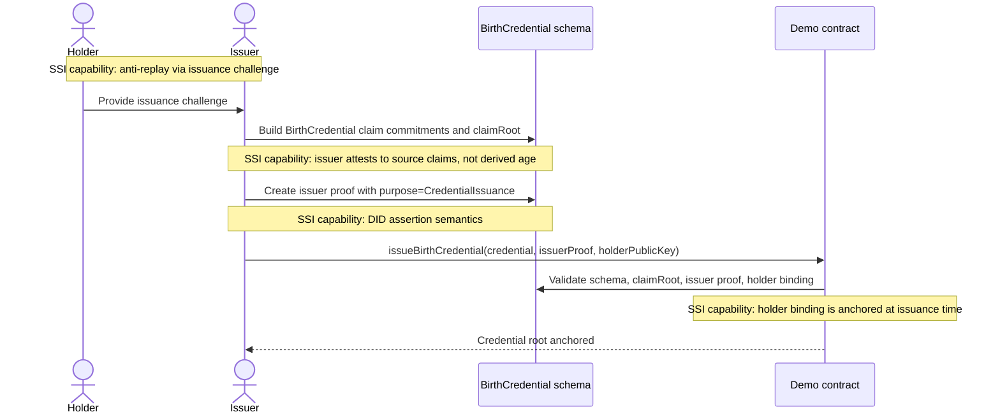
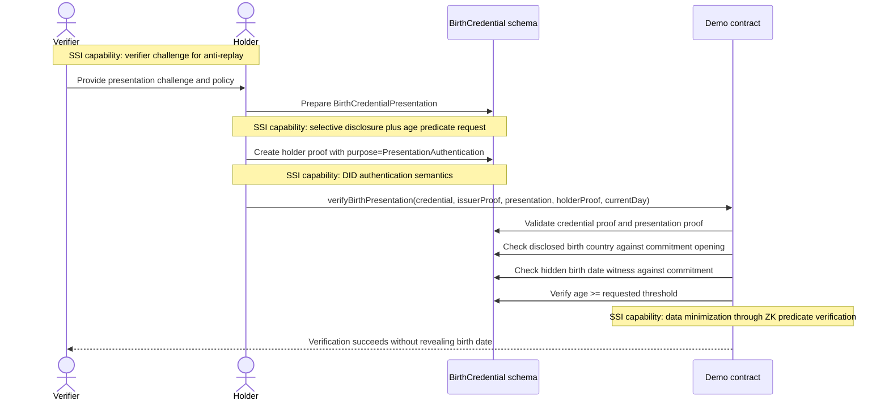

# Midnight Verifiable Credentials and Presentations

## Status
Proposed and partially prototyped in Compact.

## Scope
This document records the current design direction for Midnight-native Verifiable Credentials (VCs) and Verifiable Presentations (VPs) in the `midnight-did` repository.

It is not a production standard. It is the architecture record for the current PoC.

## Goal
Define a credential model that:

- is directly consumable by Midnight Compact contracts
- supports selective disclosure
- supports zero-knowledge predicates such as `age >= threshold`
- uses Midnight DID verification methods cleanly
- stays reasonably aligned with general SSI recommendations from DID Core, VCDM 2.0, and VC Data Integrity

## Core decision
Use a Midnight-native Compact representation as the canonical VC/VP model.

W3C JSON-LD, JWT, SD-JWT, or other exchange representations can exist later as adapters, but they are not the source of truth for contract execution.

Reasoning:

- Compact is strongly typed and bounded
- the contract-facing model cannot depend on dynamic JSON
- schema-specific fixed layouts are easier to verify in circuits
- selective disclosure on Midnight is a circuit problem, not just a transport-format problem

## Why `BirthCredential` replaced `AgeCredential`
The first draft was centered on an age-style credential. That was the wrong semantic layer.

A reusable SSI credential should carry an issuer-attested source fact, not a moving derived property.

`BirthCredential` is the better base credential because it can attest to claims such as:

- subject identifier commitment
- legal name commitment
- birth-date commitment
- birth-country commitment

From that source credential, the holder can later prove predicates such as:

- age is over 18
- age is over 21
- age is over any supported threshold

This is both more reusable and more privacy-preserving than issuing a separate credential for each age threshold.

## Compact-first constraints
The current design follows the Compact model rather than a web-first model.

The practical constraints are:

- bounded structs and fixed-size fields
- deterministic claim ordering
- no runtime-defined claim maps
- no unbounded disclosure sets
- algorithm-specific proof types
- explicit disclosure boundaries

This pushes the architecture toward:

- schema-specific credential bodies
- schema-specific presentation bodies
- fixed disclosure layouts
- typed DID method references
- proof validation circuits that are explicit about what is signed

## Current PoC model
The current implementation lives in:

- [`../credentials/src/credentials.compact`](../credentials/src/credentials.compact)
- [`../credentials-demo-contract/src/demo.compact`](../credentials-demo-contract/src/demo.compact)

### Credential body
`BirthCredential` contains:

| Field | Meaning |
| --- | --- |
| `version` | schema version for the credential body |
| `credentialType` | fixed type discriminator |
| `schema` | package and schema identity |
| `issuerVerificationMethodId` | issuer DID method reference in Compact-native form |
| `holderBinding` | required holder DID method reference |
| `issuedAt` / `expiresAt` | validity window |
| `claims` | per-claim commitments |
| `claimRoot` | root commitment over the ordered claim commitments |

### Claim commitments
The current claim set is:

| Claim | Public representation |
| --- | --- |
| Subject identifier | `subjectIdCommitment` |
| Legal name | `legalNameCommitment` |
| Birth date | `birthDateCommitment` |
| Birth country | `birthCountryCodeCommitment` |

The credential body carries commitments, not raw claim values.

### Presentation body
`BirthCredentialPresentation` contains:

| Field | Meaning |
| --- | --- |
| `schema` | schema identity matching the credential |
| `credentialClaimRoot` | anchor back to the issued credential claim set |
| `issuerVerificationMethodId` | issuer DID method reference copied for verification context |
| `holderBinding` | expected holder DID method reference |
| `disclosed` | bounded disclosure and predicate-request layout |

The current `disclosed` layout supports:

- optional disclosure of the subject identifier commitment
- optional disclosure of the birth-country value together with its opening
- an age-over-threshold predicate request

### Proof model
The PoC uses a single algorithm-specific proof type: `JubjubCredentialProof`.

It contains:

| Field | Meaning |
| --- | --- |
| `purpose` | issuance or presentation authentication |
| `signerVerificationMethodId` | DID method reference for the signer |
| `createdAt` | proof timestamp |
| `challengeHash` | anti-replay interaction binding |
| `publicKey` | public key needed by the Compact verifier |
| `signature` | Jubjub signature components |

Important design point:

- proof is outside the VC or VP body
- the VC or VP body is the semantic payload
- the proof is the cryptographic statement over that payload

### In-circuit proof challenge derivation
The verifier does not trust a precomputed challenge field inside the proof.

Instead, the verifier derives the Jubjub signing challenge in-circuit from:

1. the VC or VP body root
2. proof metadata (`purpose`, signer method id, `createdAt`, `challengeHash`)
3. the signer public key
4. the signature nonce point `r`

This makes the proof-to-body binding explicit and removes redundant proof state.

## SSI capabilities used in the PoC

| SSI capability | How it is used | Standards alignment |
| --- | --- | --- |
| DID-based issuer authorization | issuer proof is bound to `issuerVerificationMethodId` | aligned with DID Core verification relationships and VC issuer proof verification |
| DID-based holder authentication | presentation proof is bound to `holderBinding.holderVerificationMethodId` | aligned with DID Core `authentication` semantics for proving holder control |
| Holder binding | the credential is issued to a specific holder DID method reference | stricter than generic VCDM, but valid and useful for wallet-bound credentials |
| Selective disclosure | the presentation may reveal specific claim material instead of the full claim set | aligned with SSI privacy goals; implemented here through commitments and openings rather than web-format framing |
| ZK predicate proof | age is checked from a hidden birth-date witness | aligned with SSI data minimization goals and Midnight's circuit model |
| Anti-replay challenge | `challengeHash` binds issuance and presentation to a concrete interaction | aligned with VC Data Integrity challenge-style guidance |
| Schema-bound verification | the verifier checks explicit schema package and schema identifiers | aligned with strong schema governance, though implemented in Compact-native form |

## Sequence diagrams

### Issuance flow

### Presentation and verification flow

## Standards alignment review
This section checks the current design against general SSI recommendations, not byte-for-byte format interoperability.

### DID Core alignment
DID Core distinguishes verification relationships such as `assertionMethod` and `authentication`.

Current mapping:

- issuer proof on the credential maps to assertion-style semantics
- holder proof on the presentation maps to authentication-style semantics
- both issuer and holder are referenced through Compact-native DID method identifiers: `{ didContractAddress, methodIndex }`

Assessment:

- aligned in intent
- serialized differently because the canonical model is Compact-native, not DID URL string based inside the contract

Reference:

- W3C DID Core 1.0: https://www.w3.org/TR/did-1.0/

### VC Data Integrity alignment
VC Data Integrity emphasizes proof verification inputs such as:

- `verificationMethod`
- `proofPurpose`
- `challenge`
- optionally `domain`

Current mapping:

- `signerVerificationMethodId` is the Compact-native `verificationMethod` equivalent
- `purpose` is the Compact-native `proofPurpose` equivalent
- `challengeHash` is the Compact-native `challenge` equivalent
- there is currently no explicit `domain` equivalent in the proof

Assessment:

- aligned on proof purpose and verifier-provided challenge
- partially aligned because `domain` binding is not modeled yet
- the omission is acceptable for a PoC, but a production profile should add a domain or audience binding

Reference:

- W3C VC Data Integrity 1.0: https://www.w3.org/TR/vc-data-integrity/

### VCDM 2.0 alignment
VCDM 2.0 expects verifiable credentials and presentations to model issuer and holder semantics clearly, and it encourages privacy-preserving use by minimizing unnecessary disclosure.

Current mapping:

- issuer and holder roles are explicit
- the presentation is distinct from the credential
- the holder can reveal only the birth-country claim while keeping the birth date hidden
- age verification is done as a predicate over the hidden claim

Assessment:

- aligned with the general privacy and role-separation guidance
- not wire-format interoperable with generic VCDM wallets because the canonical representation is not JSON-LD based
- compatible in architecture, not in serialization

Reference:

- W3C Verifiable Credentials Data Model 2.0: https://www.w3.org/TR/vc-data-model-2.0/

## Innovations introduced by this VC type

### 1. Source-claim credential, derived predicate presentation
The main innovation is conceptual.

The credential is not an `AgeCredential`. It is a `BirthCredential`.

That means:

- the issuer attests to stable source facts
- age becomes a verifier-specific derived predicate
- the same credential supports multiple age policies without reissuance

This is a better fit for both SSI and ZK systems.

### 2. Compact-native selective disclosure
The disclosure model is not borrowed from web serialization formats.

Instead, it is modeled directly for Compact through:

- bounded disclosure slots
- claim commitments
- openings when a raw disclosed value must be rebound to a commitment
- fixed predicate hooks for hidden claims

### 3. DID references optimized for circuits
The credential does not rely on free-form DID URL processing in-circuit.

It uses a Compact-native verification method identifier:

- `didContractAddress`
- `methodIndex`

That is much easier to verify inside Compact while still preserving DID semantics.

### 4. Shared schema package plus executable business contract
The PoC cleanly separates:

- reusable schema and validation logic in `credentials`
- business workflow and on-ledger anchoring in `credentials-demo-contract`

This separation is important if multiple parties or applications need to share the schema package but not the same business logic.

### 5. Explicit proof-to-body binding inside the circuit
The proof challenge is derived inside the verifier circuit rather than treated as opaque external state.

That reduces ambiguity and makes the signed payload auditable from the contract logic itself.

## ADR: one proof per VC or VP
### Decision
Keep exactly one canonical proof per VC or VP in the base model.

### Rationale
A previous idea was to support multiple proofs on the same VC, such as Jubjub and Ed25519 together.

That is not the right default for this repository.

It is cleaner to issue separate credentials when multiple ecosystems require different proof suites.

Benefits:

- simpler credential shape
- simpler Compact verification logic
- clearer trust semantics
- no proof-composition ambiguity in the base schema

## Compliance summary
The current PoC is compliant with the general direction of SSI recommendations in the following sense:

- it uses issuer and holder roles cleanly
- it maps proof purposes cleanly
- it uses verifier challenges for anti-replay
- it supports selective disclosure and data minimization
- it enables predicate verification over hidden claims

The current PoC is not fully interoperable with general-purpose W3C VC stacks because:

- the canonical representation is Compact-native
- there is no JSON-LD or JWT adapter yet
- there is no revocation/status model yet
- there is no explicit proof `domain` binding yet

That is an acceptable trade-off for this phase because the goal is contract-native correctness first.

## Recommended next steps

1. Add an explicit `domain` or audience binding to the proof profile.
2. Define a revocation or status mechanism.
3. Decide whether a W3C adapter should target JSON-LD, SD-JWT VC, or another exchange format.
4. Extend the schema package with more selective disclosures and predicates only when they have a clear contract use case.
5. Keep the schema package separate from business contracts.
