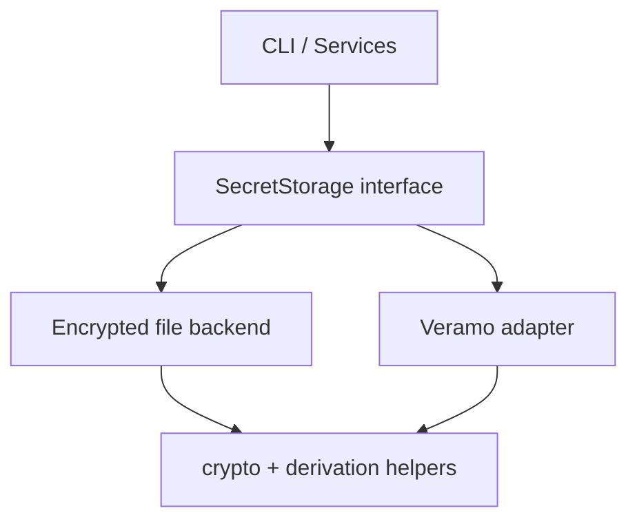
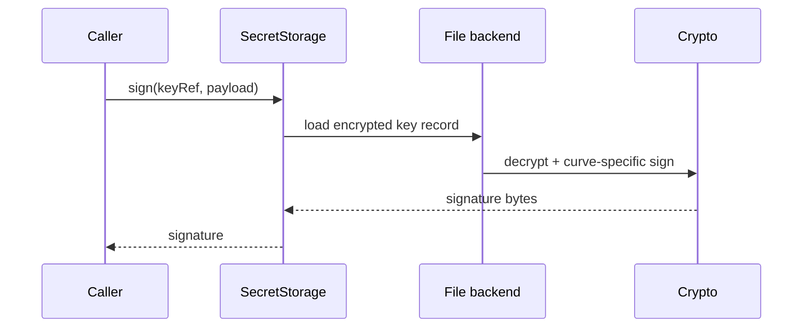
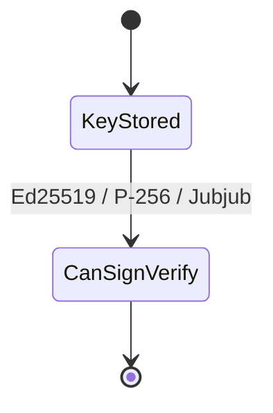

# @midnight-ntwrk/midnight-did-secret-storage

Reusable encrypted secret storage for Midnight DID key lifecycle operations.

## Responsibilities

- Generate/import/list/delete keys
- Derive keys from seed (HD-style derivation)
- Sign and verify payloads
- Keep private key material encrypted at rest

## Architecture

## Signing Flow

## Key/Curve Capability State

## Supported Curves

- Ed25519
- P-256
- Jubjub

Jubjub signing/verification is aligned with contract-compatible verification paths used in this repository.

## Security Model (file backend)

- encrypted JSON envelope
- `scrypt` key derivation from passphrase
- AES-256-GCM encryption
- minimal metadata in plaintext; private key bytes encrypted

## Build & Test

- Build: `npm run build -w secret-storage`
- Lint: `npm run lint -w secret-storage`
- Typecheck: `npm run typecheck -w secret-storage`
- Tests are currently exercised via CLI suite:
  - `npm run test:cli-api -w cli`
